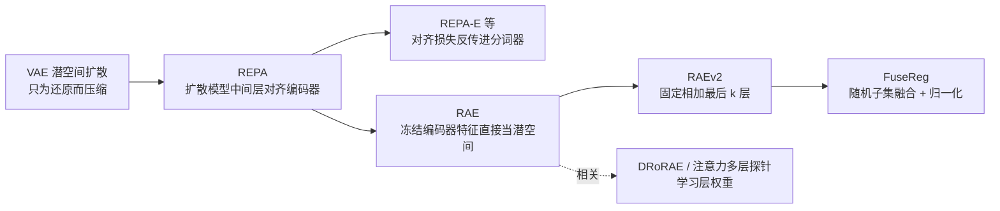
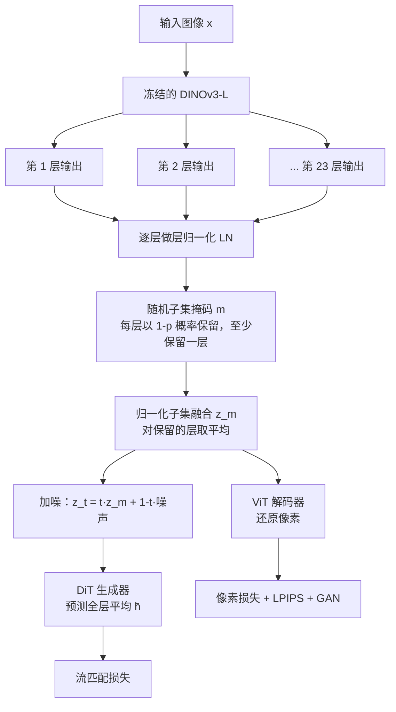
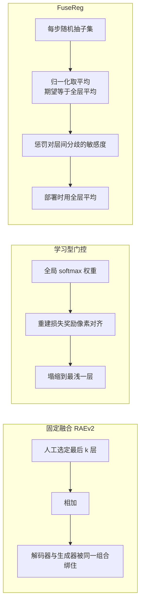
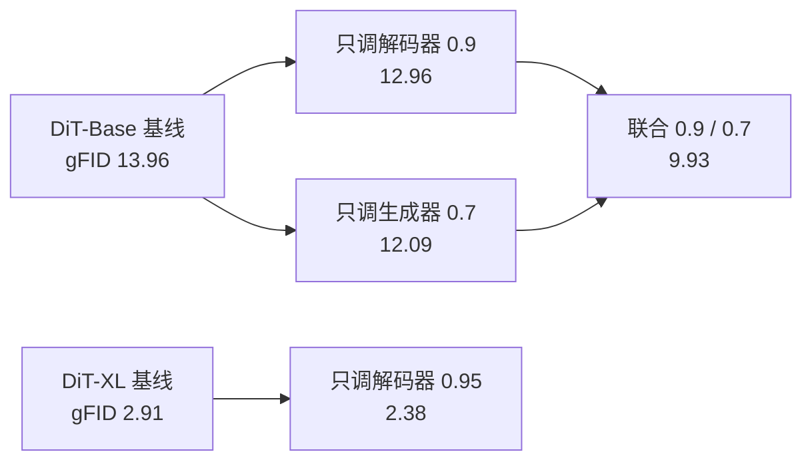

# FuseReg：用层融合正则化缩小表征自编码器的重建与生成鸿沟

> **原题**：FuseReg: Regularizing Layer Fusion Mitigates the Reconstruction-Generation Gap in Representation Autoencoders
> **作者**：Hongyang Du, Yunfei Xie, Junjie Ye, Jiawei Yang, Xiaoyan Cong, Haodong Zhang, Yongchao Huang, Haiyu Wu, Zongxia Li, Shihang Gui, Dawei Liu, Runhao Li, Jingcheng Ni, Chen Wei, Randall Balestriero, Yue Wang
> **机构**：南加州大学 PSI 实验室、布朗大学、莱斯大学、阿伯丁大学、圣母大学、马里兰大学帕克分校、宾夕法尼亚大学
> **年份**：2026（arxiv ID 2609.31620）
> **分类**：cs.CV
> **链接**：https://arxiv.org/abs/2609.31620
> **精读日期**：2026-09-28

## 阅读须知

### 这篇在领域里的位置

这篇论文属于图像生成里「潜空间该长什么样」这一支。自从潜空间扩散模型成为主流，生成模型大多不直接在像素上工作，而是先用一个自编码器把图像压缩成一组紧凑的潜变量，再让扩散模型在这组潜变量上学习生成。于是，潜空间的好坏同时决定了两件事：图像能不能被还原得清楚，以及扩散模型学起来是否容易。

过去两三年，这一支经历了一个明显的转向。早期的做法是专门训练一个变分自编码器来充当压缩器；后来人们发现，让扩散模型的内部特征去对齐一个预训练视觉编码器的特征，能显著加快训练；再往后，表征自编码器干脆把预训练视觉编码器本身冻结起来，直接用它的特征当潜空间。这篇论文位于最后一步之后：它不换编码器，而是研究在已经冻结的编码器里，到底该取哪几层特征、又该怎样训练下游模型去使用这些层。

### 读完能回答什么

1. 表征自编码器为什么会出现「重建更好、生成反而更差」的现象，这个现象和编码器的层深有什么关系？
2. 为什么让一个可学习的门控去自动挑选层，结果会塌缩到最浅的那一层？
3. FuseReg 的随机子集融合为什么必须做归一化，归一化之后在期望意义上保住了什么？
4. 为什么说随机子集融合的效果，不可能被任何一个固定的层权重组合所复现？
5. 解码器和生成器为什么偏好不同强度的正则化，这一点在实验里表现为怎样的最优组合？

### 阅读前置

本文假定读者熟悉 Transformer 与视觉 Transformer 的基本结构，知道扩散模型大致如何从噪声逐步还原数据，也见过 PSNR、FID 这类指标。本文不假定读者专门做过图像分词器或潜空间扩散，也不假定读者读过表征自编码器的前作；这些内容会在正文里先铺垫再展开。论文里的理论部分只用到期望、协方差和矩阵的迹，读者有本科线性代数与概率的基础即可。

### 缩写表

- **RAE**（Representation Autoencoder，表征自编码器）：用冻结的预训练视觉编码器充当压缩器，只训练解码器，并在编码器特征上训练扩散模型的一类方法。
- **RAEv2**：RAE 的改进版，把编码器最后若干层的输出相加，作为共享的潜空间。
- **DINOv3-L**：Meta 的自监督视觉编码器 DINOv3 的大号版本，本文把它当作冻结的特征来源，候选层共 23 层。
- **DiT**（Diffusion Transformer，扩散 Transformer）：用 Transformer 做主干的扩散模型，本文用到 DiT-Base 与 DiT-XL 两个规模。
- **REPA**（Representation Alignment，表征对齐）：训练扩散模型时，让它的中间层特征去对齐预训练编码器特征的一种辅助损失。
- **VAE**（Variational Autoencoder，变分自编码器）：传统潜空间扩散里负责压缩图像的模型。
- **LN**（Layer Normalization，层归一化）：把每个 token 的特征标准化到相近尺度的操作。
- **LPIPS**（Learned Perceptual Image Patch Similarity）：用深度网络特征衡量两张图在感知上差多少的损失。
- **GAN**（Generative Adversarial Network，生成对抗网络）：这里指解码器训练中附加的对抗损失，用来让还原的图像更锐利。
- **PSNR**（Peak Signal-to-Noise Ratio，峰值信噪比）：衡量像素级还原精度，越高越好。
- **SSIM**（Structural Similarity，结构相似度）：衡量结构层面的还原相似度，越高越好。
- **rFID / gFID**：分别指重建图像与生成图像的 FID（Fréchet Inception Distance），衡量图像分布与真实分布的距离，越低越好。
- **IS**（Inception Score）：衡量生成图像清晰度与多样性的指标，越高越好。

## 一、问题

图像生成模型的训练成本，很大一部分花在「学会潜空间长什么样」上。如果潜空间本身就带着清楚的语义结构，扩散模型便可以少走很多弯路；反过来，如果潜空间只是为了像素还原而被压缩出来的一团数字，扩散模型就得从头去发现哪些方向代表猫、哪些方向代表背景。这正是业界这几年不断去改造潜空间的原因：同样的算力，潜空间更好，生成质量就更高，训练也收敛得更快。

表征自编码器是目前这条路线上走得最激进的一步。它的思路是，既然 DINO 这类自监督编码器已经在海量图像上学到了很好的视觉表征，那就直接拿它的特征当潜空间，只额外训练一个解码器把特征还原成像素。于是，编码器不再需要为压缩而训练，扩散模型也一上来就站在强表征上。然而，一个视觉编码器有二十多层，每一层的特征都不一样，「拿它的特征」这句话本身就留下了一个没有回答的问题：拿哪一层，或者拿哪几层？

### 从 VAE 到表征自编码器

先交代潜空间扩散的基本分工。潜空间扩散（Latent Diffusion）把生成拆成两个阶段：第一阶段是一个自编码器，负责把图像压缩成潜变量并能还原回来；第二阶段是扩散模型，只在潜变量上学习生成。传统做法里第一阶段是 VAE，它的训练目标只关心还原，因此潜空间的语义结构并不理想。

第一波改进来自表征对齐。REPA 在训练扩散模型时加一个辅助损失，让扩散模型中间层的特征去贴近一个预训练视觉编码器的特征，结果训练速度大幅提升。之后 REPA-E 等工作又把这个对齐损失反传进分词器本身，让压缩器也朝语义化的方向调整。

第二波改进则更直接。RAE 把预训练编码器冻结，特征直接当潜空间，只训练一个解码器负责从特征还原像素，扩散模型则在这些特征上训练。这样一来，潜空间天然就是语义化的，问题只剩下解码器能不能从语义特征里把像素细节还原出来。

RAEv2 在此基础上做了一个具体的工程决定：把编码器最后 k 层的输出相加，作为共享的潜空间。这个决定看似平常，却把重建与生成两个阶段捆在了同一个层组合上。下面这张图把这条演进路线串起来。



### 重建与生成的鸿沟

RAEv2 的层选择里藏着一个此消彼长的关系。论文开篇给出的数字是：把融合的层数从 k=7 扩大到 k=23，重建的 PSNR 从 22.58 dB 升到 27.04 dB，但无引导生成的 gFID 却从 1.65 变差到 3.01。换句话说，解码器喜欢的层组合，恰恰是生成器不喜欢的。

这个现象背后的原因并不难理解。视觉编码器的浅层保留了较多与像素位置对齐的细节，适合还原；深层则更抽象、更语义化，对扩散模型来说更容易学。k=7 只取了第 11、13、15 直到第 23 层这几个偏深的层，k=23 则把所有层都加了进来。于是，任何一个固定的层组合，都等于强迫两个阶段接受同一份并不适合双方的信息。

### 为什么不能让模型自己学层权重

一个自然的想法是：既然固定组合不好，那就给每一层一个可学习的权重，让训练自己去找最优组合。DRoRAE 和注意力式多层探针就属于这一类思路。论文在图 1 里专门做了这个实验，结论却很不乐观。

用一个全局的 softmax 门控去学层权重，训练的结果是最浅的那一层权重越来越大，其余更深的层逐渐衰减到零；而且一旦打开对抗损失，这种塌缩还会加速。原因在于重建损失直接奖励与像素对齐的特征，浅层正好提供了一条捷径。换句话说，学出来的门控并没有学会「综合利用各层」，而是学会了「只用最方便的那一层」，深层里对生成有用的信息被完全浪费掉。

于是，这篇论文要回答的技术问题可以陈述得很清楚：在编码器冻结、不改动编码器的前提下，能否训练出一个解码器和一个生成器，使它们都能利用分布在各个深度上的信息，而不被某一个固定的层组合或某一条浅层捷径绑住？

## 二、方法

FuseReg 的核心想法可以用一句话概括：不要替模型挑层，而是在训练时每次随机抽一组层，让下游模型学会面对任何层组合都能工作。这个想法与 Dropout 一脉相承。Dropout 随机丢掉神经元，LayerDrop 与随机深度随机丢掉网络层，Matryoshka 表征学习让模型在截断的维度上也能工作；FuseReg 把同样的原则用在「编码器的哪几层参与融合」这件事上。

### 整体架构

先看整个系统的结构。图像先经过冻结的 DINOv3-L，得到 23 个候选层的输出，每一层都先做层归一化；接着按随机掩码抽出一个子集，对子集取平均，得到本次训练用的潜变量；这个潜变量一路送给解码器去还原像素，另一路加噪后送给 DiT 去学习生成。



### 归一化融合的定义

在讲随机化之前，先把「融合」这个动作写清楚。论文把任何一种层融合都写成各层特征的加权和，并要求权重之和为 1：

$$z_a = \sum_{k=1}^{K} a_k h_k,\qquad \sum_k a_k = 1$$

这里每个符号的含义如下。

- $K$：候选层的数量，本文用 DINOv3-L 时取 23。
- $h_k$：第 k 个候选层的输出经过层归一化后的特征，形状是 N 个图像块乘以 d 维特征。
- $a_k$：第 k 层的权重，它不依赖于具体输入，对所有图像都一样。

固定融合就是权重取常数，例如 RAEv2 对最后 k 层直接求和；学习型全局门控则是把这组权重当参数优化一次，之后对所有输入通用。

### 随机子集采样

FuseReg 用一个丢弃率 p 来控制随机化的强度，p 取值在 0 到 1 之间。每一步训练的采样分三步进行。

第一步，给每一层独立抛一枚硬币，以 1-p 的概率保留，以 p 的概率丢掉，得到一个 0 与 1 组成的掩码。第二步，如果这次恰好所有层都被丢掉，就重新抽，也就是只在「至少保留一层」的条件下取样。第三步，对被保留的层取平均：

$$z_m = \frac{\sum_k m_k h_k}{\sum_k m_k}$$

这里 $m_k$ 是第 k 层的掩码取值，保留为 1，丢掉为 0。只要 p 严格介于 0 和 1 之间，所有 $2^K-1$ 个非空子集都有正的概率被抽到。

到了推理阶段，所有层都保留，$z_m$ 就变成了全部 23 层的平均 $\bar h = \frac{1}{K}\sum_k h_k$。这一点很关键：FuseReg 部署时用的潜空间是全层平均，它并不在推理时引入任何随机性，也不增加任何计算。

值得停下来算一笔账，看看高丢弃率在实践中意味着什么。当 K=23、p=0.95 时，每层只有百分之五的概率被保留，未加条件时平均只保留约 1.15 层；在「至少保留一层」的条件下，平均也只有约 1.7 层。换句话说，论文里表现最好的解码器，训练时绝大多数时候看到的是一两层的融合，部署时却要面对 23 层的平均，而它恰恰在部署条件下重建得最好。

### 为什么归一化必不可少

分母上的 $\sum_k m_k$ 看似只是一个技术细节，其实是整个方法成立的前提。论文强调，由于各层被保留的机会对称，取平均之后，随机融合在期望意义上正好等于全层平均：

$$\mathbb{E}_m[z_m \mid x] = \bar h$$

这意味着，调大或调小 p，只改变训练时潜变量围绕 $\bar h$ 的抖动幅度，而不会把潜变量的中心挪走。如果不做归一化，保留的层越多潜变量就越大，训练分布与部署分布的中心会随 p 漂移，正则化就变成了一种系统性的偏差。

### 理论分析：随机化到底惩罚了什么

论文的理论部分回答一个问题：这种随机子集训练，相当于在原本的损失上额外加了什么约束？答案分三步给出。

第一步是一个关于均值与协方差的引理。给定一张图像，各层特征彼此之间并不完全一致，论文把这种层间差异定义为「层间分歧协方差」：

$$V(x) = \frac{1}{K}\sum_k (h_k - \bar h)(h_k - \bar h)^\top$$

引理 1 说，随机子集融合的均值是 $\bar h$，而它围绕均值的协方差恰好是 $c_K(p)\,V(x)$。这里 $c_K(p) = \mathbb{E}\!\left[\frac{K-R}{R(K-1)}\right]$，其中 R 是这次抽到的层数。当 p 趋近于 0，几乎每层都被保留，R 接近 K，这个系数接近 0；当 p 趋近于 1，R 接近 1，这个系数接近 1。换句话说，p 并不是在「抹掉信号」，而是在沿着层间分歧的方向放大扰动。

第二步是命题 1，它把这个扰动翻译成损失上的惩罚项。在线性预测器、平方损失的简化设定下，解码器的期望重建损失可以拆成两项：

$$\mathcal{L}^{dec}_p(D) = \mathbb{E}_x\|D\bar h - y\|^2 + c_K(p)\,\mathrm{tr}(D\,\Gamma\,D^\top)$$

第一项是用全层平均去还原目标图像的普通误差；第二项里 $\Gamma = \mathbb{E}_x[V(x)]$ 是平均的层间分歧，$\mathrm{tr}(D\Gamma D^\top)$ 衡量解码器对层间分歧有多敏感。于是，随机子集训练等价于告诉解码器：不要依赖那些各层说法不一致的方向，要学会从各层都认可的信息里还原图像。这恰好对应前面门控塌缩的反面，因为只盯着最浅一层的解码器，对层间分歧是最敏感的。

对生成器，命题 1 给出了类似但带时间权重的结论。DiT 在流匹配训练里看到的是加噪后的子集融合 $z_{t,S} = t\,z_S + (1-t)\,\varepsilon$，要预测的是全层平均 $\bar h$。它的额外惩罚项是 $\rho(t)\,t^2\,c_K(p)\,\mathrm{tr}(W\Gamma W^\top)$，其中 $\rho(t) = \max(1-t, 0.05)^{-2}$。由于 t 越接近 1 噪声越少，这一项主要作用在低噪声的时间步上，在高噪声时几乎不起作用。

这就解释了一个实验上的现象：解码器和生成器受到的惩罚形状不同，所以它们偏好的丢弃率也不同，两个阶段需要分开调参。

第三步是命题 2，它排除了一种可能的质疑：会不会随机子集只是在变相地找一个更好的固定权重？论文证明，随机子集权重的二阶矩是 $\frac{1}{K^2}\mathbf{1}\mathbf{1}^\top + \frac{c_K(p)}{K}P$，其中 P 是投影到「层与层之间对比方向」上的投影矩阵。这个矩阵的秩是 K，而任何固定融合的权重二阶矩秩最多为 1。因此，没有任何一个固定的全局融合能同时匹配随机子集的一阶矩和二阶矩，随机化带来的训练信号是固定权重无法提供的。

下面这张图把三种融合策略的差别并排放在一起。



### 解码器与生成器的训练

解码器是一个从零训练的 ViT，输入是随机子集融合，输出是还原的图像。它的训练目标由三部分组成：像素级的平方误差、LPIPS 感知损失，以及对抗损失，三者按系数加权。论文的附录还提到一项分类器替代损失，正文没有展开。

生成器是在编码器特征上训练的 DiT。它看到的是加噪后的随机子集融合，学习目标始终是预测全层平均。解码器用自己的丢弃率 $p_{dec}$，生成器用另一个丢弃率 $p_{dit}$，两者可以独立设置，也可以同时开启，论文称后者为联合正则化。

```mermaid
flowchart TB
    subgraph 阶段一：解码器
    S1[采样子集，丢弃率 p_dec] --> S2[归一化融合 z_m]
    S2 --> S3[ViT 解码器还原像素]
    S3 --> S4[像素 + LPIPS + GAN 损失]
    end
    subgraph 阶段二：生成器
    T1[采样子集，丢弃率 p_dit] --> T2[归一化融合后加噪]
    T2 --> T3[DiT 预测全层平均 h̄]
    T3 --> T4[流匹配损失]
    end
    subgraph 推理
    U1[DiT 从噪声生成潜变量] --> U2[解码器还原图像]
    end
    S4 -.训练好的解码器.-> U2
    T4 -.训练好的生成器.-> U1
```

## 三、实验

### 实验设置

所有实验都在 ImageNet 256×256 分辨率上进行，编码器是冻结的 DINOv3-L，候选层共 23 层。解码器训练 16 个 epoch，各变体的结构与参数量保持一致。生成器用类别条件的 DiT-Base 与 DiT-XL，采用流匹配训练；生成实验的训练预算是 40 个 epoch，采样用 50 步欧拉法，每个设置评估五万张样本。

有引导的生成使用 RAEv2 自带的内部引导。它的做法是把完整预测与 REPA 头的预测做外推，写成 $x_{guided} = x_{full} + w(x_{full} - x_{repa})$，其中 w 是引导强度。

### 一个解码器，任意层组合

第一个实验检验解码器的鲁棒性：同一个解码器，分别在 k=7 的融合、k=23 的全层融合，以及只用第 11 层这三种输入上做重建。

| 解码器 | PSNR k=7 | PSNR k=23 | PSNR 仅 ℓ11 | SSIM k=7 | SSIM k=23 | SSIM 仅 ℓ11 | rFID k=7 | rFID k=23 | rFID 仅 ℓ11 |
|---|---|---|---|---|---|---|---|---|---|
| RAEv2，按 k=7 训练 | 22.58 | 18.37 | 17.50 | 0.626 | 0.531 | 0.491 | 0.30 | 1.62 | 6.35 |
| RAEv2，按 k=23 训练 | 12.51 | 27.04 | 14.31 | 0.369 | 0.806 | 0.447 | 16.10 | 0.18 | 11.21 |
| FuseReg，p=0.95 | 23.77 | 27.52 | 25.13 | 0.678 | 0.826 | 0.735 | 0.60 | 0.42 | 0.45 |

表里最醒目的是对角线以外的格子。按固定组合训练的解码器，一旦输入换成它没见过的组合，重建就急剧崩坏，例如按 k=23 训练的解码器在 k=7 输入上 PSNR 只剩 12.51 dB，rFID 高达 16.10。

FuseReg 的单个解码器则在三种输入上都保持在 23.77 到 27.52 dB 之间，而且在 k=7 和 k=23 两种输入上的 PSNR 都略高于专门为它们训练的解码器。不过需要注意，在全层输入上它的 rFID 是 0.42，仍比专门训练的 0.18 差一些。

论文的图 4 进一步看解码器对各层的依赖程度。FuseReg 的解码器只给一层输入时，PSNR 也能达到 19 到 22 dB，而 RAEv2 的解码器只有 14 到 15 dB；逐层去掉一层时，FuseReg 的性能曲线也更平坦。另外，FuseReg 大约用到 12 层时收益就趋于饱和，RAEv2 则要用满 23 层。换句话说，FuseReg 的解码器确实学会了从多个深度分别取用信息，而不是依赖某一层。

### 只换解码器，生成就变好

第二个实验把生成器固定住，只替换解码器，以此隔离解码器本身对生成质量的贡献。固定的生成器是一个复现的 RAEv2 DiT-XL，训练时不做任何子集随机化。

| 条件 | 解码器 | 无引导 gFID | 有引导 gFID |
|---|---|---|---|
| 原生 k=23 融合 | 基线 p_dec=0 | 3.01 | 1.25 |
| 原生 k=23 融合 | FuseReg p_dec=0.95 | 2.21 | 1.25 |
| 错位的 k=7 融合 | 基线 p_dec=0 | 27.73 | 16.35 |
| 错位的 k=7 融合 | FuseReg p_dec=0.95 | 1.92 | 1.42 |

在原生条件下，仅仅更换解码器，无引导 gFID 就从 3.01 降到 2.21，下降约百分之二十七；有引导的 gFID 则维持在 1.25 不变。在融合口径与生成器训练时不一致的错位条件下，基线解码器几乎失效，FuseReg 的解码器仍然给出 1.92 与 1.42。

这组结果说明，生成质量的一部分损失其实来自解码器「读不懂」生成器产出的潜变量；把解码器训练得对层组合更宽容，生成器一行代码都不用改，画面就变好了。

### 联合正则化：两个丢弃率分开调

第三个实验在 DiT-Base 上扫描两个丢弃率的网格，各取 0、0.05、0.1、0.3、0.5、0.7、0.9。下表摘出最关键的几个点。

| 设置 | p_dec | p_dit | 无引导 gFID | IS |
|---|---|---|---|---|
| 基线 | 0 | 0 | 13.96 | 107.5 |
| 只正则化解码器 | 0.9 | 0 | 12.96 | 111.5 |
| 只正则化生成器 | 0 | 0.7 | 12.09 | 116.8 |
| 联合正则化 | 0.9 | 0.7 | **9.93** | **125.7** |

联合正则化的 gFID 比基线低约百分之二十九，IS 从 107.5 升到 125.7。更重要的是，两种正则化的收益是互补的：单独开解码器降到 12.96，单独开生成器降到 12.09，一起开则降到 9.93，比任何一种单独使用都好得多。

在更大的 DiT-XL 上，图景有所不同。基线 gFID 为 2.91，最好的结果 2.38 来自只把解码器丢弃率开到 0.95、生成器不做正则化，降幅约百分之十八；如果以 IS 为准，则生成器也开高丢弃率时更好，IS 最高可到 221.1。这说明最优组合会随模型规模和评价指标变化。



### 反直觉的结果

第一个反直觉之处是，轻微的正则化比不做还差。在 DiT-Base 的网格里，解码器丢弃率取 0.05 或 0.1 时，gFID 反而升到 17 左右，明显差于基线的 13.96；只有把丢弃率开到 0.9 这样的高位，收益才显现出来。论文把中间区域的非单调归因于层间分歧方差被放大，但读者据此应当记住：这个超参数不能「稍微开一点试试」。

第二个反直觉之处是，丢弃率高达 0.95 并没有摧毁信号。按直觉，一次只保留一两层，训练出来的解码器应该很难利用全部 23 层；但由于归一化保证了期望不变，高丢弃率只是放大了沿层间分歧方向的扰动，反而迫使解码器学会在每一层里都能找到还原所需的信息。

第三个反直觉之处在引导生成上。无引导的 gFID 随解码器丢弃率单调改善，有引导的 gFID 却在中间丢弃率上暂时变差。论文的解释是，内部引导依赖 REPA 头与完整预测之间的对齐，层组合的扰动会让这两者暂时错位。

## 四、局限

### 作者承认的局限

作者明确说明，全部实验只在 ImageNet 256 分辨率、冻结的 DINOv3-L 编码器、DiT-Base 与 DiT-XL 两种生成器上进行，而且训练预算是对齐的。换到其他编码器的层级结构、其他分辨率、其他数据领域，或者更长的训练，结论是否成立，还需要进一步验证。

作者也承认，解码器与生成器对正则化的反应不同，最优丢弃率取决于模型规模、评价指标和是否使用引导。因此在新的场景里使用 FuseReg，需要分别为两个阶段挑选丢弃率。

在理论方面，作者说明，均值与协方差的恒等式以及与固定融合的二阶分离，对论文规定的采样分布是精确成立的；但损失的分解假设了线性预测器与平方损失。它刻画的是随机化带来了什么样的训练信号，而非线性模型里的实际收益，仍是靠实验确立的。

### 读完能看出的潜在问题

第一，最受关注的指标没有改善。社区在比较生成模型时通常报告有引导的 gFID，而在固定生成器的实验里，FuseReg 把有引导 gFID 维持在 1.25，没有进一步降低。论文的主要收益集中在无引导的设置上，这一点在引用它的结论时需要说清楚。

第二，引言里援引的 k=7 配置，无引导 gFID 为 1.65，比 FuseReg 在原生全层条件下换解码器后的 2.21 更低。论文的论证重点是缩小 k=23 时的鸿沟，但并没有正面说明在同等训练预算下，FuseReg 能否全面超过 RAEv2 最好的固定配置。

第三，比较对象较窄。论文没有与 SD-VAE、VA-VAE、REPA-E 等其他分词器做数字上的并排比较，也没有与 DRoRAE 这类学习层权重的方法做实验对比，只在相关工作里提及。因此它在整个潜空间扩散版图里的相对位置，读者还无法从论文本身判断。

第四，规模越大，收益越小。DiT-Base 上联合正则化带来约百分之二十九的改善，到 DiT-XL 上最好的改善约百分之十八，而且生成器正则化几乎不再贡献 gFID。训练只有 40 个 epoch，更长训练与更大模型下收益是否继续收窄，是值得追问的问题。

第五，调参成本不低。两个丢弃率需要分别扫描，而且小丢弃率区间会比不做更差，这意味着真正落地时要跑一个二维网格。好在这个成本只发生在训练阶段：推理时使用全层平均，没有任何额外开销，编码器也不需要改动。

最后是一些细节上的不一致。DINOv3-L 通常有 24 个 Transformer 块，论文说候选层为 23 层，正文没有解释少了哪一层；DiT-XL 网格里的基线 2.91 与固定生成器实验里复现的 3.01 也来自不同的训练设置。这些都不影响主要结论，但复现时需要查阅附录对齐口径。

## 一句话

训练时随机抽取并归一化融合编码器的若干层，让解码器与生成器都学会利用各个深度的信息，从而缩小表征自编码器的重建与生成鸿沟。
