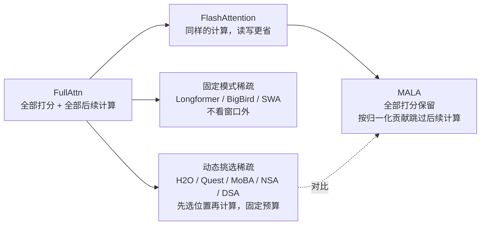
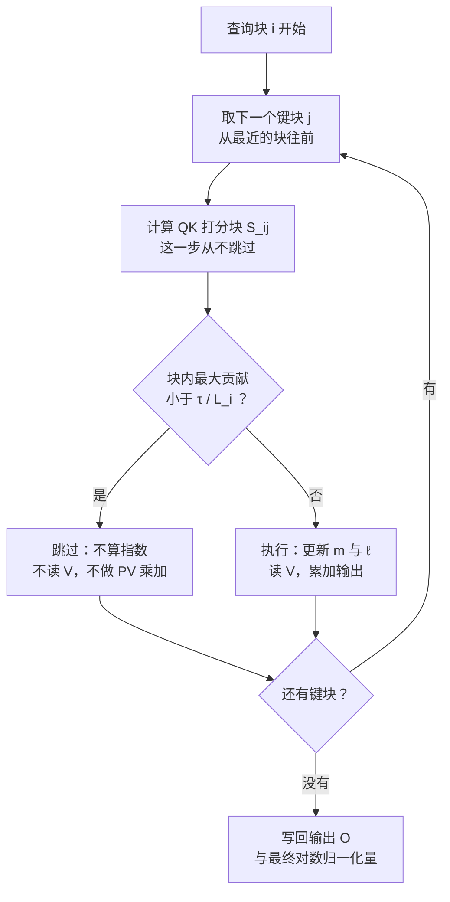
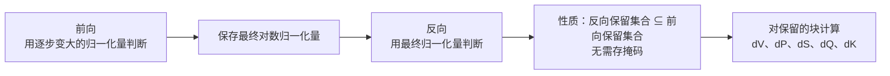
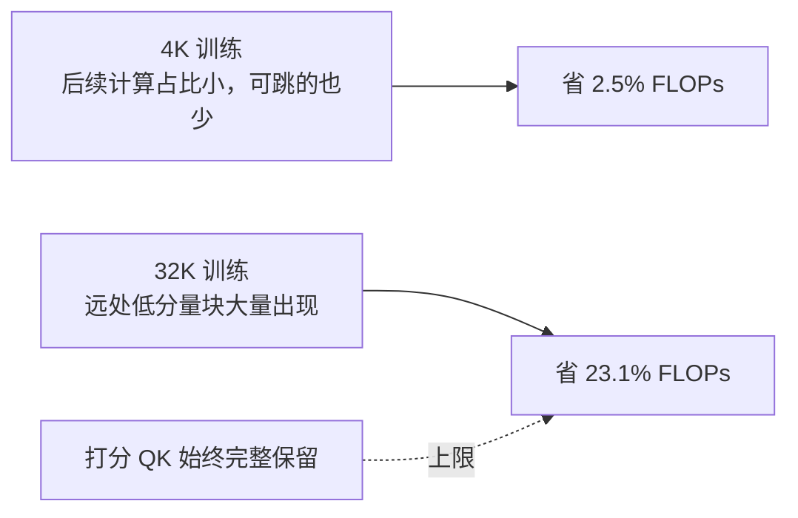

# MassAlloc 注意力：让注意力自己分配算力

> **原题**：MassAlloc Attention: Let Attention Allocate Its Own Compute
> **作者**：Jingze Shi, Zhangyang Peng, Xianduo Li, Yanlin Qi, Xiaotian Lin, Haoxian Chen, Liangdong Wang, Guang Liu, Yuyu Luo
> **机构**：香港科技大学（广州）、北京智源人工智能研究院、巴黎西岱大学
> **年份**：2026（arxiv ID 2609.32712）
> **分类**：cs.AI / cs.CL
> **链接**：https://arxiv.org/abs/2609.32712
> **精读日期**：2026-09-29

## 阅读须知

### 这篇在领域里的位置

这篇论文属于「让注意力算得更省」这一支。自从 Transformer 成为大模型的标准结构，注意力的计算量随序列长度平方增长，长上下文训练与推理的大部分时间都花在它身上。过去几年，这一支大致沿两条路走：一条是 FlashAttention 这类工作，不改变算什么，只把同样的计算安排得更省显存读写；另一条是各种稀疏注意力，干脆不算一部分位置，从固定窗口一路发展到按内容动态挑选的 MoBA、NSA 和 DeepSeek 稀疏注意力。

MALA 站在这两条路的中间。它保留了每一对合法位置之间的打分，也就是说「看」仍然是完整的，但在打分之后，只对真正有分量的那部分继续做后续计算。换句话说，它不替模型提前决定看哪里，而是让注意力分数本身决定哪里值得多花算力。

### 读完能回答什么

1. 注意力计算里的「打分之后的计算」具体指哪几步，为什么它们值得单独拿出来省？
2. MALA 在前向里怎样只凭正在累积的 softmax 归一化量，就能判断一个块可以跳过？
3. 反向传播为什么能直接复用前向最后的归一化量，而且保证跳过的范围只会更大、不会更小？
4. 和固定预算的稀疏注意力相比，MALA 在关联回忆任务上为什么几乎不掉分？
5. 它的加速从哪里来、上限在哪里，为什么在 4K 训练里只省 2.5%，到 32K 能省 23.1%？

### 阅读前置

本文假定读者熟悉 Transformer 注意力的基本公式，知道 softmax 和矩阵乘法在 GPU 上大致怎么执行，也听说过 FlashAttention。本文不假定读者读过 FlashAttention 的在线 softmax 细节，也不假定读者熟悉各类稀疏注意力；这些内容会在正文里先铺垫再展开。

### 缩写表

- **FullAttn**：完整的 softmax 注意力，本文用来指不做任何跳过的基线。
- **MALA**（MassAlloc Attention）：本文方法，按归一化后的注意力贡献分配后续计算。
- **QK**：查询向量 Q 与键向量 K 的点积打分，结果称为注意力分数。
- **PV**：把 softmax 后的概率 P 与值向量 V 相乘、累加成输出的一步。
- **Online softmax（在线 softmax）**：分块计算 softmax 时，一边读块一边更新最大值与求和，不必先看到整行。
- **Tile（块）**：GPU 内核一次处理的一小片查询与键的组合。
- **DSA**（DeepSeek Sparse Attention）：DeepSeek 的动态稀疏注意力。
- **MoBA**（Mixture of Block Attention）：按块路由的稀疏注意力。
- **NSA**（Native Sparse Attention）：原生可训练的稀疏注意力。
- **SWA**（Sliding Window Attention）：滑动窗口注意力。
- **TP**（Tensor Parallelism，张量并行）：把一层的计算切到多张 GPU 上。
- **RULER**：长上下文检索与理解的评测集。
- **YaRN**：一种把模型上下文长度外推到训练长度以外的方法。
- **FLOPs**：浮点运算次数，衡量计算量。

## 一、问题

长上下文是现在大模型最烧钱的地方之一。一个模型要读完一份几十万字的合同、一个大型代码仓库，注意力这一层的计算量随长度平方增长，训练时要反复算、推理时每生成一个字也要算。于是，无论是训练团队还是做推理服务的团队，都在想办法把注意力算得更便宜，而且最好不以损失模型能力为代价。

过去的路线各有取舍。FlashAttention 让同样的计算快了很多，但它算的东西一点没少；稀疏注意力真正少算了，却要在算之前就决定「不看哪些位置」，一旦选错，远处的关键信息就丢了。这篇论文要问的是：有没有一种办法，既不提前放弃任何位置，又能把明显不重要的那部分计算省下来？

### 注意力的计算分成两段

先把注意力的一次计算拆开看。对一个查询位置，第一段是「打分」：用它的查询向量去和之前每个位置的键向量做点积，得到一排分数。第二段是「打分之后」：对分数做 softmax 变成概率，读入对应的值向量，再把概率和值向量相乘、累加成输出。论文把第二段统称为 post-score computation，本文译作「打分之后的计算」。

反向传播同样分两段。打分之后的部分包括从保存的归一化量重建概率，以及计算概率、分数和 Q、K、V 各自的梯度，这部分往往比前向更重。

### 注意力的分量其实很集中

大量研究观察到，注意力的概率分布非常不均匀：分量往往集中在当前位置附近、少数「注意力汇聚点」（sink token）以及少数真正相关的远处位置上，剩下的大多数位置只分到几乎为零的概率。

问题在于，现有的稠密内核对这些几乎为零的位置，照样把打分之后的整套计算执行一遍：算指数、读值向量、做乘加。这些计算对最终输出几乎没有贡献，却实实在在占用了时间。

### 前人路线：少算打分，还是少算打分之后

第一类是 FlashAttention。它把注意力切成小块，在片上完成 softmax 与乘加，避免把整个注意力矩阵写回显存，显著减少了读写开销。但每一块的计算照旧全部执行，稠密的计算模式没有改变。

第二类是固定模式的稀疏注意力，比如 Longformer、BigBird 和滑动窗口注意力。它们事先规定每个位置只看附近的窗口或少数固定位置，被排除的位置连打分都不做。这样很省，但规则是死的，远处真正重要的信息可能恰好落在窗口外。

第三类是按内容动态挑选的稀疏注意力，比如 H2O、Quest、SnapKV、SeerAttention、MoBA、NSA 和 DeepSeek 稀疏注意力。它们用一个轻量的路由或检索步骤先选出一部分位置，再只对这些位置做完整计算。它们比固定模式灵活，但选择发生在真正打分之前，依据的是近似信号；而且通常给每个查询一个固定的预算，不管这一行注意力是集中还是分散。

于是，这篇论文要解决的技术问题可以陈述为：在保留每一对合法因果位置打分的前提下，能否在融合内核里，只凭注意力计算本来就有的中间量，实时判断哪些块的后续计算可以省掉，并且让训练和推理用同一个容差、在各种长度下误差都可控？

## 二、方法

MALA 的核心想法很朴素：既然 FlashAttention 在分块计算时本来就一路维护着 softmax 的最大值和求和，那么在处理下一个块之前，就已经能大致知道「这一块最多能分到多少概率」。如果连这一块里分数最高的那个位置，贡献都小到可以忽略，那这一块的后续计算就可以整块跳过。

### 前向：边算边判断

先交代在线 softmax。它要解决的问题是，softmax 需要整行分数才能归一化，而分块计算时一次只看得到一块。做法是对每个查询行维护两个量：到目前为止见过的最大分数 m，以及以 m 为基准的指数和 ℓ。每读进一块，就更新这两个量，最后得到的就是整行的归一化量。

MALA 在处理候选块 j 之前做一个检验。对查询块 i，如果这一块里每一行的最大分数都满足下面的条件，就跳过这一块的后续计算：

$$\mathrm{rowmax}(S_{ij}) - m_i - \log \ell_i < \log\frac{\tau}{L_i}$$

这里每个符号的含义如下。

- $S_{ij}$：查询块 i 与键块 j 之间的打分块。
- $m_i$ 与 $\ell_i$：到目前为止累积的行最大值与指数和，$m_i + \log \ell_i$ 就是当前的对数归一化量。
- $\tau$：容差，论文的标准设置是 1。
- $L_i$：这一行查询在因果约束下能看到的键的个数，训练时第 q 个位置就是 q+1。

左边这个量的含义是：这一块里最大的那个位置，相对于目前已累积的归一化量，能拿到多大比例的概率。右边是阈值 τ 除以可见长度。于是，这个检验在问：这一块的最大贡献是否小于「平均每个位置应得份额」的 τ 倍。

把阈值除以可见长度，是整套方法能在不同长度下通用的关键。注意力集中的行，已累积的归一化量很快就大，远处的块几乎都会被跳过；注意力分散的行，每个位置份额都不小，就会保留更多的块。于是同一个 τ 在 1K 和 32K 下都适用，不需要按长度或按层单独调参。

需要强调的是，MALA 对每一个合法的因果块都照样计算 QK 打分，跳过的只是打分之后的那一段。这正是它和稀疏注意力的根本区别：看是完整的，省的是看完以后的动作。

论文还给出了一个上界：被跳过位置的总概率 $\varepsilon_q$ 满足 $\varepsilon_q \le \tau/(1+\tau)$。这个上界与序列长度无关。τ 取 1 时它是 50%，看起来很宽松，但它是最坏情况下的保证；下面的实验会看到，实际被跳过的概率只有万分之几。

内核遍历键块的顺序也有讲究：前向从对角线附近、最新的块开始，往更早的位置走。最近的位置通常分量最大，先处理它们能让归一化量尽早变大，后面的远处块就更容易被判定为可以跳过。

### 反向：复用最终归一化量

反向传播时，前向已经算完，每一行的最终归一化量被保存了下来。MALA 的反向直接用这个最终值来做同样形式的检验，而不是重放前向那一串逐步变大的中间归一化量。论文把这称为离线分配，意思是归一化量已经定下来了，但判断仍然在运行时完成，不需要任何事先的校准。

这样做有一个漂亮的性质。最终归一化量总是不小于前向过程中任何一个中间值，所以用它来算贡献比例，只会让每个位置的比例变小、不会变大。于是，前向跳过的块在反向一定也会被跳过；反向还可能额外跳过一些前向当时保留、但事后看分量很小的块。论文称之为「嵌套的保留集合」：反向保留的范围嵌套在前向之内，而且不需要额外存储任何掩码。

### 执行方式

整个过程写在融合内核里，用 Triton 实现，建立在 FlashAttention 的分块设计之上。注意力矩阵和选择掩码都不会写到显存里，片上只保留标准的注意力状态，写回的只有输出和对数归一化量。训练的前向与推理的预填充用同一个算子；逐字生成时，每一步用同样的规则，只是可见长度变成完整的缓存长度。

在把键值缓存切成多段并行处理的解码方式下，每一段只能拿到自己那部分的归一化量，而阈值里的长度仍按完整上下文算，所以判断会偏保守，保留得更多。这是正确性优先的取舍。

## 三、实验

### 同样的工作量，谁挑得更准

第一个实验是整篇论文最有说服力的一个。作者在 8K 长度下，让所有方法对每个查询都只执行恰好 1,024 个位置的后续计算，也就是 MALA 在 τ=1 时实际用到的平均数量，然后比较谁漏掉的概率最少。

| 分配方式 | 选择依据 | 平均漏掉的概率 | 平均输出误差 |
|---|---|---|---|
| 只按位置 | 最终真实概率 | 0.6012% | 0.6231% |
| 按层、头、位置 | 最终真实概率 | 0.1721% | 0.2817% |
| 按输入、层、头、位置（理想上限） | 最终真实概率 | 0.0182% | 0.0164% |
| MALA 在线判断 | 在线概率上界 | 0.0188% | 0.0174% |

理想上限是一个事后才能做到的参照：它知道每个输入最终的真实概率，按概率从大到小挑。MALA 只凭计算过程中逐步变大的归一化量做判断，漏掉的概率 0.0188% 已经和理想上限的 0.0182% 几乎一样。与之相对地，按层和头固定分配的方式，漏掉的概率是理想上限的九倍多。换句话说，这个实验说明：真正起作用的是「按每个输入的实际分布来分配」，而 MALA 用很便宜的在线信号就做到了这一点。

### 长度拉长 32 倍，误差不涨

第二个实验在 1K 到 32K 的长度上检验同一个 τ=1 是否一直够用。随着长度增加，每个查询实际执行的位置数从 1K 时的 470 个增加到 32K 时的 1,066 个，8K 以上基本稳定在一千出头。漏掉的概率平均最多 0.0062%，输出的相对误差平均不超过 0.021%；梯度误差方面，dQ 平均不超过 0.38%，dK 不超过 0.35%，dV 不超过 0.17%。

值得留意的是，执行量在 8K 以后几乎不再增长，而序列长度还在翻倍。这正是后面加速比越到长上下文越大的原因。

### 关联回忆：固定预算的稀疏注意力掉得很厉害

第三个实验是一个专门考验「远处信息能不能找回来」的任务：序列开头给出 256 组键值绑定，之后在不同位置提问。所有稀疏方法都给同样的预算上限。

| 方法（8K 长度） | 准确率 |
|---|---|
| FullAttn | 89.97% |
| MALA | 89.67% |
| DSA | 52.61% |
| MoBA | 47.25% |
| NSA | 22.61% |

MALA 与完整注意力只差 0.3 个百分点，而几种固定预算的稀疏注意力掉了 37 到 67 个百分点。原因在于，这类任务的关键信息散落在远处，事先的路由很容易漏选；MALA 保留了完整的打分，只要某个远处位置真的重要，它的分数就会让它被保留下来。

### 算子速度：长上下文下明显更快

第四个实验在 128K 长度、8 张 H100 张量并行的设置下测算子的真实速度，计入了打分、判断开销、读值向量和写输出的全部时间。

| 场景 | MALA 相对 FullAttn |
|---|---|
| 训练前向 | 快 2.2 倍 |
| 训练反向 | 快 3.0 倍 |
| 推理逐字解码 | 快 1.6 倍 |

峰值显存与完整注意力持平，因为没有存任何掩码或索引。解码延迟上，DeepSeek 稀疏注意力比 MALA 还快约 3%，但它在训练阶段的开销更高。

### 规模扩展：困惑度不变，省多少看长度

第五个实验从 0.6B 训练到 14B 参数。在 4K 长度的预训练里，14B 模型的困惑度与完整注意力相差不到 0.001，总训练计算量只省了 2.5%；到 32K 长度的长上下文训练，困惑度差距同样不到 0.001，计算量省了 23.1%。

4K 时省得少，是因为短序列里本来就没有多少可以跳过的远处位置；长度越长，低分量的远处块越多，省得越多。但由于打分这一段始终是完整的平方复杂度，节省的上限大约在四分之一左右。MoBA 和 DSA 省下的计算量更大，但困惑度上有差距。

### 模型级评测：14B 与 32B 都不掉分

最后，作者比较了用 MALA 与完整注意力训练出来的 14B 模型，以及在此基础上继续训练的 32B 模型。

| 模型 | 指标 | FullAttn | MALA |
|---|---|---|---|
| 14B | 知识类 | 72.32 | 72.48 |
| 14B | 推理类 | 64.46 | 64.66 |
| 14B | RULER 32K | 89.42 | 89.45 |
| 14B | RULER 128K（YaRN 外推） | 65.84 | 65.75 |
| 32B | 知识类 | 75.62 | 75.75 |
| 32B | 推理类 | 75.67 | 76.10 |
| 32B | RULER 32K | 92.70 | 92.71 |
| 32B | RULER 128K（YaRN 外推） | 82.03 | 82.56 |

两者的差距都在正常训练波动范围内，个别指标 MALA 略高，不应解读为 MALA 让模型变强，而应理解为它没有让模型变弱。

## 四、局限

### 作者承认的局限

作者明确说明，MALA 保留了全部的 QK 打分，所以打分这一段的平方复杂度一点没减。它省下的只是打分之后的计算，在极长的上下文里，那些连打分都跳过的稀疏方法能获得更大的常数倍节省。

作者也指出，MALA 不压缩、不淘汰持久的键值缓存。它减少的是注意力算子运行时的工作量，而不是缓存占用的显存；缓存压缩可以和它叠加，但论文没有做这件事。

在分段并行解码的场景下，每一段只能用自己的部分归一化量来判断，会保留更多的块，因此解码阶段的实际加速取决于数据分布。

### 读完能看出的潜在问题

第一，加速比测的是注意力算子本身。128K 下训练反向快 3 倍，是算子级别的数字；整个模型的训练时间还包括前馈层、通信和其他开销，端到端的加速一定小于这个倍数。从规模实验看，4K 预训练只省 2.5% 的计算量，说明在常见的预训练长度下，MALA 的收益其实很有限，它的主场是长上下文训练和长上下文推理。

第二，理论保证与实际误差之间差得很远。上界 τ/(1+τ) 在 τ=1 时是 50%，远大于实测的万分之几；反向梯度误差也只有实验证据，没有理论上界。在分布特别平坦或特别怪异的输入上，误差会不会显著变大，论文没有给出压力测试。

第三，比较对象的预算设定值得推敲。关联回忆任务里，固定预算的稀疏方法都被限制在与 MALA 相近的位置数，而这些方法原本的设计预算可能不同；它们掉分幅度之大，部分反映的是这个设定，而不完全是方法本身的上限。

第四，工程可用性要看内核能否落地到主流框架。实现基于 Triton，代码开源在 flash-sparse-attention 仓库，但要进入 vLLM、SGLang 这类推理引擎，与它们的分页缓存和调度配合，还需要额外的工程工作，论文没有评估。

## 一句话

保留全部注意力打分，只按归一化贡献跳过低分量块的后续计算，在不掉能力的前提下让长上下文注意力明显提速。
