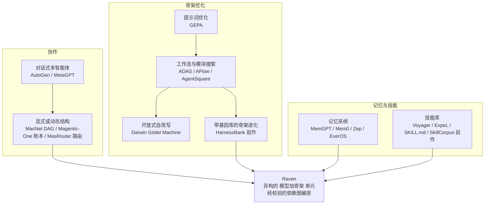
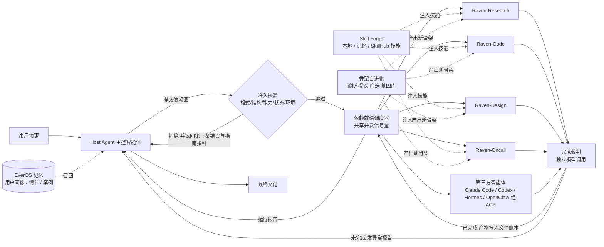
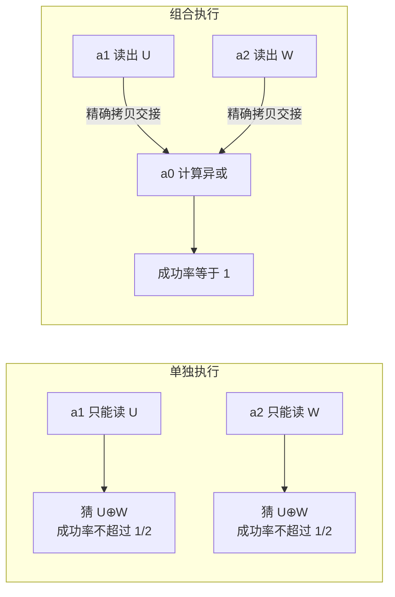
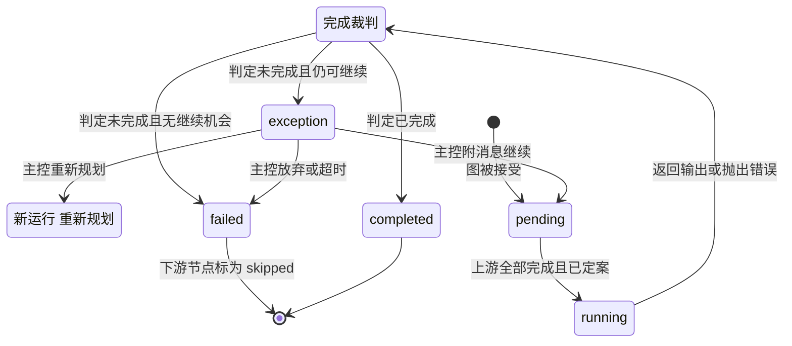
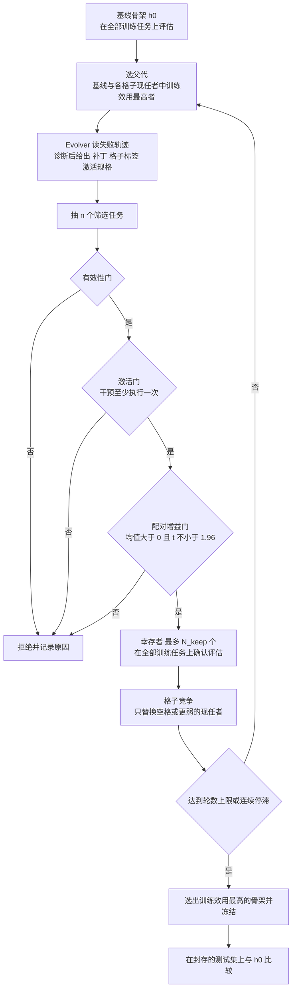
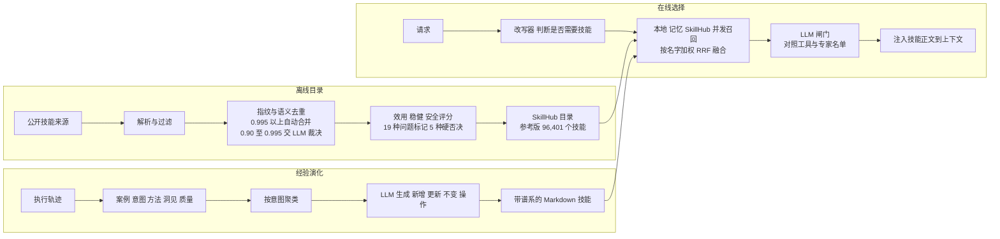
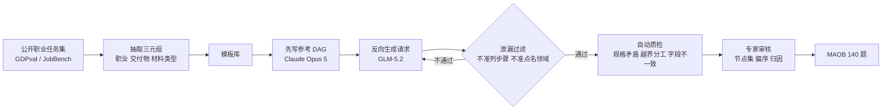

# Raven：骨架之骨架，面向可组合的智能体智能

> **原题**：Raven: The Harness of Harnesses for Composable Agentic Intelligence
> **作者**：EverMind AI（项目负责人 Chuanrui Hu；核心贡献者 Dizhan Xue、Chuanrui Hu；贡献者 Zuyi Zhou、Hongda Chen、Xingze Gao、Zhao Wang、Pengfei Yao、Zhengwei Wu、Tong Li、Ethan Wang、Xiaotian Luo、Juwei Yue、Jie Huang、Hui Zhang、Weixiang Chen、Chang Zhang、Yuqi Yang、Yifan Chen、Yunyun Han；通讯作者 Yafeng Deng）
> **机构**：EverMind AI（代码开源于 github.com/EverMind-AI/Raven）
> **年份**：2026（arxiv ID 2609.33439，9 月 27 日提交 v1）
> **分类**：cs.AI / cs.CL / cs.GT / cs.MA / cs.NE
> **链接**：https://arxiv.org/abs/2609.33439
> **精读日期**：2026-09-30

## 阅读须知

### 这篇在领域里的位置

这篇论文属于智能体系统工程，更具体地说，属于「骨架（harness）」这一支。所谓骨架，是包在大语言模型外面的那一整层执行策略：给模型看哪些工具、上下文怎样裁剪、什么时候判定任务完成、出错以后怎样恢复。

过去两年，业界逐渐形成一个共识：同一个模型换一套骨架，在代码修复、深度检索这类长任务上的成绩可以相差十几个百分点。SWE-agent 的研究结论，以及 Claude Code、Codex 这类编码助手的普及，都是这一共识的体现。

沿着这一共识，研究大致分成三条线。第一条是多智能体协作，例如 AutoGen、MetaGPT、Magentic-One，它们研究怎样让几个角色分工合作。第二条是骨架自动优化，例如 GEPA 只优化提示词，ADAS 与 AFlow 搜索工作流，Darwin Gödel Machine 则直接改写自身代码。第三条是长期记忆与技能库，例如 MemGPT、Mem0、Voyager，以及围绕 SKILL.md 规范形成的技能生态。

Raven 的位置在这三条线的交汇处。它不再追问「怎样给某一个领域造一个更强的骨架」，而是把每一个「模型加骨架」的组合当成一个可调用、可替换的单元，再由一个主控智能体（Host Agent）把这些单元按依赖图组合起来。

与此同时，它把骨架进化、记忆系统、技能复用这三套机制都接到同一个生态上，并为「组合何时能超过单个智能体」写了一套形式化的充分条件。换句话说，这是一篇系统报告加一段理论分析，而不是提出单个新算法的论文。

### 读完能回答什么

1. 为什么 Raven 把「模型加骨架」而不是单独的「模型」或「角色」当作组合的最小单位，这样做给异构智能体（包括 Claude Code、Codex 这类第三方工具）的协作带来了什么？
2. 主控智能体提交的依赖图在派发之前要接受哪五组检查，节点运行之后的「完成裁判」为什么不能等同于客观正确？
3. 组合执行的成功率下界为什么等于「1 减去所有节点与交接的误差之和」，这一结论依赖哪些前提，又为什么不需要独立性假设？
4. 骨架自进化中的一个候选补丁要依次通过哪几道门才能进入基因库，「激活检查」与「配对 t 统计量」各自防范的是什么？
5. 论文的实验证明了什么、没有证明什么：为什么编排基准上的图一致性提升，并不等于「组合系统的能力超过了最强的单个智能体」？

### 阅读前置

本文假定读者熟悉大语言模型的基本用法，知道工具调用（function calling）是什么，用过或至少了解 Claude Code、Codex 这类命令行编码智能体，并且对 BM25、向量检索、有向无环图、t 检验这些常见概念有基本印象。

本文不假定读者做过多智能体系统，也不假定读者熟悉 Hoare 逻辑或 MAP-Elites 这类质量多样性搜索；这些内容会在正文里先铺垫再展开。论文正文与附录合计篇幅很长，公式密集，本笔记只挑最关键的两三个公式写出来，其余部分用文字说明其作用。

### 缩写表

- **LLM**（Large Language Model）：大语言模型。
- **Harness（骨架）**：包在模型外面的执行策略，包括工具接口、上下文与记忆管理、技能、控制规则和恢复机制。
- **Host Agent（主控智能体）**：Raven 里负责拆解目标、挑选执行者、提交依赖图并整合结果的那个智能体。
- **DAG**（Directed Acyclic Graph）：有向无环图，这里用来表示子任务之间的依赖。
- **ACP**（Agent Client Protocol）：智能体客户端协议，Raven 用它接入 Claude Code、Codex 等第三方智能体。
- **MCP**（Model Context Protocol）：模型上下文协议，一种给智能体挂载外部工具的标准接口。
- **MAOB**（Multi-Agent Orchestration Benchmark）：本文新提出的多智能体编排基准。
- **Node F1 / Edge F1**：预测图与参考图在节点集合、边集合上的 F1 一致度。
- **POA**（Partial Order Accuracy）：偏序准确率，衡量共有节点之间的先后关系是否一致。
- **EM**（Exact Match）：整张图在领域层面完全一致的比例。
- **EverOS**：EverMind 的记忆操作系统，Raven 的长期记忆后端。
- **MemCell / MemScene**：EverOS 里的记忆单元，以及由相近记忆单元聚成的记忆场景。
- **BM25**：经典的关键词检索打分函数。
- **RRF**（Reciprocal Rank Fusion）：倒数排名融合，用来合并多个检索通道的排名。
- **Skill Forge**：Raven 的技能检索与演化模块。
- **SkillHub / SkillCorpus**：在线技能目录，以及作为其基础、经过清洗的技能语料库（同组前作）。
- **HarnessBank**：同组前作，提出带语义基因库的骨架自进化方法。
- **MAP-Elites**：一种质量多样性搜索算法，在按行为划分的每个格子里保留一个最优个体。
- **Pass@1 / Pass@5**：单次尝试成功率，以及五次尝试中至少一次成功的比例。
- **BPB**（Bits Per Byte）：每字节比特数，语言模型预训练的验证指标，越低越好。
- **AI4AI / AI4S**：「用 AI 做 AI 研究」与「用 AI 做科学计算」两组值守类任务。
- **A2A**（Agent-to-Agent）：智能体之间的通信协议，出现在论文的未来工作里。

## 一、问题

今天一个能力较强的编码智能体，已经可以在一个代码仓库里连续工作几个小时，读代码、改代码、跑测试。然而用户真正的需求往往跨越好几个领域。论文举的例子是开发并运营一款第一人称射击游戏：先要做需求调研，再写玩法代码、做视觉设计，然后集成测试，上线以后还要持续值守。

这几个阶段的工具和完成标准各不相同，而且前一阶段的产出必须能被后一阶段直接使用。如果把所有这些能力都放进一个骨架，骨架本身会越来越复杂：工具越多、执行条件越多，需要配置和验证的设计选择就越多，这些选择彼此还会相互影响，手工维护很难及时适应模型和领域的变化。

反过来，如果给每个领域单独做一个专门的骨架，比如专门做检索的、专门写代码的、专门做幻灯片的，那么每个骨架都会固化自己的工具假设、上下文格式和产出格式，彼此之间很难直接交接。已有的多智能体失败分析也反复指出，智能体之间的错位和任务验证不足是最常见的失败原因。

于是，这篇论文把核心问题改写为：怎样自动构造并改进专门化的骨架，同时让它们的能力可以跨领域地组合起来。

### 把问题落到可以验证的陈述

论文把「能力」形式化为「在给定资源预算下，可靠地覆盖一类任务」。具体地说，一个系统对某个任务的能力，是它在总成本不超过预算 B 的前提下交付正确结果的概率；如果这个概率不低于 1−δ，就说这个任务落在系统的能力集合里。

有了这个定义，「组合是否有用」就变成一个可以陈述的问题：在同一个预算下，由主控智能体组合出来的系统，能不能可靠地完成那些任何单个可用智能体都无法可靠完成的任务？这里的预算必须把规划、交接、校验、重试的开销全部计入，否则组合带来的好处便无从谈起。

### 前人路线各自解决了什么

第一条路线是以对话为中心的多智能体框架。AutoGen 让开发者通过可配置的对话模式把智能体组合起来，MetaGPT 则把软件开发流程编码成角色和产物。

它们的优点是分工清楚、易于使用。不足在于，对话本身并不是一个能在执行前被校验的结构，结果在消息里被转述时还会丢失细节；而且这些框架默认所有角色共用同一套骨架架构，难以把独立开发的智能体当作平等的执行者接入。

第二条路线把执行结构显式化或动态化。MacNet 用有向无环图表示交互，但参与者来自一个相对同质的智能体池；Magentic-One 维护一个任务账本，在执行中根据账本变化分派任务；MasRouter 则学习在多个模型之间路由请求。

这些工作解决了「选谁来做」的问题，但通常假设执行者名单是稳定的。与此同时，只决定由谁执行，并没有规定交接时产物应当满足什么契约。

第三条路线是骨架优化。GEPA 用反思反馈进化提示词，ADAS 和 AFlow 搜索智能体设计或工作流程序，AgentSquare 在规划、推理、工具、记忆四个预定义模块之间重组，Darwin Gödel Machine 则开放式地改写自身代码。

它们证明了提示词、流程结构和模块化控制逻辑都可以作为优化变量。然而每种方法的搜索空间和评估回路不同，某一处的改进不一定能迁移到另一套骨架上。

第四条路线是记忆与技能。MemGPT、Generative Agents、Mem0、Zep 等工作研究怎样保存和召回交互历史，Voyager、ExpeL、SkillWeaver 以及 SKILL.md 规范研究怎样把成功的做法沉淀成可复用的程序。

这些工作让经验可以跨任务保留。但记忆记录与任务依赖是两种不同的关系：一条记忆描述的是过去的一次尝试，并不是当前计算必需的前置产物。

### 为什么还需要一篇新论文

归根结底，旧路线卡在两个地方。其一，协作框架大多只能组合同一套骨架里的角色，无法把独立开发、各有工具与执行策略的智能体当作平等的执行单元接进来。

其二，关于「组合什么时候真的有用」，多数工作只给出经验性的成绩，没有说清楚在什么条件下组合一定不比单个智能体差，更没有把规划与协调成本纳入同一个预算里讨论。已有的扩展性研究甚至发现，增加智能体数量本身并不能预测协作效果，冗余的消息和交接会消耗预算而不带来收益。

Raven 试图同时处理这两个问题。工程上，它用执行适配器把异构智能体接入统一的编排接口，用显式的依赖图和记录在案的产物完成交接；理论上，它给出组合可靠性的下界，以及组合系统覆盖到「单个智能体覆盖不到的任务」的充分条件。

## 二、方法

Raven 由五个相互配合的部分组成：一套关于组合的理论、多智能体协作层、骨架自进化、记忆系统 EverOS，以及技能模块 Skill Forge。下图给出整体结构。

下面按「理论、协作、骨架进化、记忆、技能」的顺序展开。

### 2.1 组合的理论

#### 智能体是模型加骨架

论文的出发点是一条定义：一个智能体由模型和骨架共同决定。写成公式是

$$a_i = \mathrm{Agent}(M_i, h_i): \mathcal{H}_i \to \Delta(\mathcal{U}_i)$$

- $M_i$：第 i 个模型，内部参数化不受限制。
- $h_i$：它的骨架，包括工具接口、上下文与记忆机制、技能、控制规则、执行接口。
- $\mathcal{H}_i$：这个智能体被允许看到的观察历史空间，包括请求本身与本地记忆。
- $\mathcal{U}_i$：它可以采取的动作，包括调用工具、返回产物、主动放弃。
- $\Delta(\cdot)$：概率分布，意味着智能体是一个随机策略。

这条定义的意义在于，它把「同一个模型、不同骨架」和「不同模型、同一骨架」都视为不同的智能体。执行者池里还专门包含一个 $a_0$，即关闭了跨名单委派能力的主控智能体自身；这样一来，最终的汇总工作也被当作一次普通的节点调用来计入成本。

#### 任务、能力与预算

一个任务由四部分组成：可观察的请求、初始输入与环境的分布、环境对工具动作的反应规律，以及一个判定交付记录是否正确的验证函数。验证函数只看客观正确性，与某个智能体或评审模型「宣称完成」是两回事。

系统 S 对任务 t 在预算 B 下的能力定义为

$$p_S(t;B) = \mathbb{P}\big(\mathsf{V}_t(\omega, Y_S)=1,\ C_S \le B\big)$$

也就是「交付正确且总成本不超过预算」的概率。对组合系统而言，总成本 $C_S$ 要把规划、各节点执行、交接、运行时校验与重试全部算进去，不终止的运行一律视为失败。能力集合 $\mathcal{C}_S(B,\delta)$ 则是所有满足 $p_S \ge 1-\delta$ 的任务。

#### 计划是一张带契约的依赖图

主控智能体给出的计划不仅是一张图，还附带语义和资源上的约束：执行者分配、每个节点的输入如何由上游消息拼装、每个节点与每条交接边的契约、一个把所有节点和边排成线性顺序的调度，以及一个预算分配向量。

契约借用了程序验证的思路。Hoare 逻辑是一种证明程序正确性的形式系统，它给每一段代码写一个前置条件和一个后置条件：只要前置条件成立、代码执行成功，后置条件就一定成立。

Raven 给每个节点写前置条件 $P_v$ 和「输出与状态转移」条件 $Q_v$，给每条交接边写「忠实传递」条件 $J_e$。然后它要求计划满足一串不变式：第 j 个操作之前的不变式能推出它的入口条件，操作成功后能推出下一个不变式，最后一个不变式能推出任务验证通过。满足这些条件的计划称为「相容计划」。

在相容计划下，引理 1 给出一个确定性的结论：只要每一步都成功，并且各部分预算之和不超过总预算，系统就一定在预算内交付正确结果。论文特别提醒，仅仅把一个文件路径传给下游，并不能建立这些蕴含关系，交接的内容必须真正满足契约。

#### 可靠性下界：误差可以直接相加

现实中每一步都可能失败。论文为每个操作定义一个局部误差上界 $\epsilon_j$：在前面所有步骤都成功的条件下，第 j 步失败的概率不超过 $\epsilon_j$。定理 1 随即给出

$$q_t(\zeta,\pi) \ge \Big[1 - \sum_{v\in V}\epsilon_v - \sum_{e\in E}\epsilon_e\Big]_+$$

- $q_t(\zeta,\pi)$：在给定规划记录 $\zeta$ 与所选计划 $\pi$ 的条件下，组合系统成功的概率。
- $\epsilon_v, \epsilon_e$：每个节点、每条交接边的条件失败率上界。
- $[x]_+$：取 $\max\{x, 0\}$，保证下界落在概率的取值范围内。

证明只用到一件事：「整体失败」可以被拆成互不重叠的若干事件，每个事件是「前 j−1 步都成功而第 j 步失败」，其概率不超过对应的 $\epsilon_j$，求和即得。于是这个下界不需要各步骤相互独立，错误之间存在相关性也不影响结论。

它的代价是，节点和边越多，误差项越多，下界越松。这恰好对应工程上的直觉：多拆分一步可以让每个子任务变简单，但也多了一次交接和一份出错的机会。

命题 1 再把主控智能体的规划失误考虑进来。如果主控智能体选出有效计划的概率至少是 $1-\eta_H$，而每个有效计划的累积误差不超过 $\bar\epsilon$，那么整体能力满足 $p_{S_H} \ge (1-\eta_H)(1-\bar\epsilon)$。

#### 什么时候组合能超过单个智能体

论文接着定义了「互补的局部能力」：对一个给定的任务拆解，每个节点至少有一个智能体能按契约可靠完成它，但不存在一个智能体能可靠完成所有节点。

推论 1 进一步说，如果组合系统的下界 $(1-\eta_H)(1-\bar\epsilon)$ 不低于 $1-\delta$，而所有单个智能体独立完成整个任务的成功率都严格低于 $1-\delta$，那么这个任务就属于「组合新增的覆盖」。

为了说明这个集合可以非空，论文构造了一个极简的例子。任务要求返回两个随机比特 U、W 的异或值；智能体 $a_1$ 只能读 U，$a_2$ 只能读 W，$a_0$ 两个都读不到。任何一个智能体单独作答，成功率都不超过 1/2；而由 $a_1$、$a_2$ 各读一个比特交给 $a_0$ 计算异或，三节点计划的成功率是 1。

论文对这个例子的边界说得很清楚：一个同时拥有两个读接口的单一智能体同样能完成任务，这个构造并不声称组合优于那种骨架。组合带来的新增覆盖，来自于把互补接口的结果通过计入成本的消息汇集起来。

它也不意味着组合系统在平均意义上更好，更不意味着组合系统的能力集合包含所有单个智能体的能力集合。论文明确写道，要检验新增覆盖，实证上必须与模型、工具、初始信息和总成本都相当的强单智能体基线做对比。

推论 2 把结论推广到一族任务：只要对这一族里每个任务，规划失误率与执行误差都有统一的上界，并满足 $\eta_\star + (1-\eta_\star)\epsilon_\star \le \delta$，整族任务就都落在组合系统的能力集合里。附录用一套带类型的任务文法（原子任务、串行、分叉再汇合）和一个编译器构造，说明满足条件的计划确实存在。

### 2.2 多智能体协作

理论给出的是条件，协作层负责把计划真正执行起来。论文用一个贯穿全节的例子：用户要求调研「AI 做 AI 研究」的最新进展，在一个实验环境里复现领先算法，再做一个网页报告结果。对应的计划是两个调研节点并行，编码节点依赖两者，设计节点依赖编码结果。

#### 异构的智能体注册表

每个可用智能体在注册表里有一个名字、一段能力描述，并绑定到四种执行后端之一：进程内的 Raven 智能体循环、命令行进程、ACP 连接，或者兼容 OpenAI 接口的模型 API。注册条目还记录三项会约束规划的能力：是否有状态（能否延续之前的会话）、能否读本地文件、能否流式报告进度。

默认名单包括一个通用 Raven 智能体和四个专家：Raven-Research、Raven-Code、Raven-Design、Raven-Oncall。预置配置可以经由 ACP 接入 Claude Code、Codex、OpenCode、Hermes Agent 和 OpenClaw；主控智能体的模型直接根据上下文和这些能力标签挑选执行者，没有单独训练的路由分类器。

#### 分阶段披露编排规则

光有工具定义，模型并不知道一张合法的图要遵守哪些规则：占位符语法、标识符规则、各后端的能力限制，以及什么时候根本不需要建图。如果把全部规则放进每一轮的上下文，不需要编排的对话也要为此付出输入成本。

Raven 的做法是分阶段披露。每一轮上下文只带一段简短说明；当主控智能体判断请求需要多个智能体时，工具说明会指示它先加载完整指南再建图，加载后的指南在会话里常驻。

运行时并不强制要求先加载指南。不过每一次被拒绝的图都会附带错误信息和指向指南的指针，于是模型在出错时会被引导到相关规则上。

#### 节点规格与产物绑定

主控智能体从最终交付物倒推建图：每个节点必须有一个可识别的产出和一个能产出它的执行者，凡是一个节点的输入需要另一个节点的输出，就加一条依赖。每个节点记录包含标识符、执行者、提示模板、依赖列表、输入绑定、可选的会话句柄，以及可选的技能与 MCP 服务器覆盖配置。

提示模板用占位符引用上游产物，既可以内联内容，也可以只传文件路径。例如 `{{ research_alg.output_path }}` 把算法调研报告的路径交给一个能读文件的编码智能体，避免在初始提示里复制一份长报告；不能读文件的执行者则必须收到内容本身。

所有被代入的文件和节点内容都被标记为不可信数据。这样做是为了区分上游产物与主控智能体的指令，降低上游内容冒充指令的风险。

#### 准入校验：派发之前的五组检查

一张图只有在通过五组检查之后才会被接受。下表归纳了论文表 1 的内容。

| 检查组 | 具体内容 |
| --- | --- |
| 格式 | 参数是完整的 JSON，字段类型和取值正确，没有未知字段，标识符匹配规定模式 |
| 图结构 | 标识符唯一且未在会话中用过；依赖指向本图节点或之前已完成且有产出的节点；每个输出占位符都有对应依赖；文件路径不越出允许的根目录；图无环 |
| 智能体能力 | 共享会话句柄只用于有状态智能体；技能覆盖只出现在会话链的开头；路径形式不发给不能读文件的智能体 |
| 智能体状态 | 每个被点名的智能体都已注册并启用 |
| 环境 | 调用不来自某个子智能体内部（禁止递归委派）；委派未被暂停且派发预算充足；如需用户确认，用户已批准 |

校验在第一处失败时停止，并返回点名到具体节点或字段的错误，有些错误还直接给出修复建议。由于校验发生在派发之前，一张被拒绝的图只消耗主控智能体的一轮对话，不会留下执行了一半的工作。

不过论文也承认，准入只保证图能被一致地解释。调研任务是否真的回答了用户的问题、编码任务是否有合适的完成标准，这些语义层面的正确性仍需另外保证。

#### 执行：依赖就绪调度与完成裁判

图被接受后，每个节点在几个状态之间流转。一个节点要等所有上游都「完成且已定案」之后才进入可运行集合；之所以要求「已定案」，是为了防止下游读到一个完成判断还可能被推翻的产物。

所有就绪节点共享一个会话级的并发信号量，图运行和单次委派共用这份容量。共享同一会话句柄的节点按顺序执行，彼此独立的实例可以并行。

一个节点返回结果并不等于任务完成。智能体可能只是解释了自己为什么做不下去，可能因为输出长度限制被截断，也可能报告成功却没有产出要求的文件。

因此每个节点结束后，都由一次独立的模型调用来裁判。它读取渲染后的提示、输出和执行记录的尾部，必须通过受约束的工具给出「已完成」或「未完成」；未完成时还要说明类别（缺少用户输入、缺少凭据、工具失败、上游产物不可用、输出超限等）并引用证据。被判未完成的节点会失去其输出引用，下游无法消费它。

论文明确指出，这个裁判并不证明客观正确。为了可用性，如果裁判本身失败或超时，一个正常返回的调用会被当作已完成；换句话说，运行时看到的「已完成集合」与理论里的「客观成功前缀」是两个不同的东西。

#### 异常处理与澄清请求

被挂起的节点会给主控智能体发一份异常报告，内容包括任务复述、裁判类别、缺失条件、证据、被阻塞的下游节点、剩余尝试次数和决策截止时间。主控智能体可以附一条消息让节点继续、放弃该节点，或者重新规划剩余的工作流。

重新规划会以新的运行标识启动一张后继图，旧运行中已完成的节点仍可被引用，旧的执行记录也不会被覆盖。如果截止时间之前主控智能体没有作出决定，该节点直接判为失败。

执行中的智能体有时需要提示里没有给出的信息，例如偏好的输出格式或数据集位置。Raven 不会把每个问题都转给用户，而是先由一次独立模型调用，基于主控智能体当前的对话、之前的回答和从 EverOS 召回的记忆尝试作答；只有当用户明确说过，或者记忆能唯一确定答案时，才会代为回答。

凡是请求批准推送、删除、发送、付款之类动作的问题，一律不代答，而是交给用户本人。这条规则保证了「执行者的请求」与「用户的授权」始终是两回事。

#### 文件化交接与跨图复用

每一次交接都经由一个记录在案的文件。运行时在派发前写下渲染后的提示，返回后写下输出，裁判读取前写下执行记录；继续执行的节点为每次尝试保留编号副本。

这样做有两个好处：长产物不必在主控智能体和每个下游提示里重复出现；下游拿到的是生产者的原始产出，而不是经过转述的版本。

节点标识符在整段对话里唯一，图节点和单次委派共用一个注册表。于是，用户在后续请求里要一份幻灯片时，新图可以直接引用之前的两份调研报告和复现结果，不必重新执行；单次委派也可以接着编码节点的会话去修一个实验。

论文还描述了一个可选的「群体记忆」层：主控智能体在每一轮结束时给每个参与的智能体写一份评价，在下一轮用户反馈之后再修订一次，此后派发任务时把最近的评价预取给对应智能体。需要强调的是，这一层默认关闭，论文也没有评测它的效果。

### 2.3 骨架自进化

协作层决定谁来执行，骨架自进化则改进每个执行者本身。这一部分建立在同组前作 HarnessBank 之上，由三个角色组成：执行任务的 Task Agent（模型冻结）、提出修改的 Evolver Agent，以及一个固定的 Evaluator。

#### 四个策略接口与可编辑边界

骨架被拆成四个策略接口，外加一组参数：

$$h = (\mathrm{id}_h, \mathsf{Mem}_h, \mathsf{Plan}_h, \mathsf{Cap}_h, \mathsf{Act}_h; \theta_h)$$

- $\mathsf{Mem}_h$（记忆）：组装工作上下文，并在上下文紧张时决定删除或摘要什么。
- $\mathsf{Plan}_h$（规划）：准备每一轮的指导，并融入领域建议。
- $\mathsf{Cap}_h$（能力）：选择向模型暴露哪些工具定义。
- $\mathsf{Act}_h$（行动）：获得可用的模型响应，并判断动作或完成。
- $\theta_h$：这些策略的提示词、领域指令和配置，不包括模型权重。
- $\mathrm{id}_h$：候选标识，用于区分即使可执行内容相同的不同候选。

工具分发、迭代计数、持久化和有界重试由共享的执行外壳负责，不属于可进化的部分。进化从基线骨架 $h_0$ 出发，只允许修改事先划定的位置；评估、记账和必需的执行接口被列为不可变内核。

这一限制保证了进化出来的候选总是可以执行的。但可执行只是门槛，任务层面是否真的改进，仍然需要评估来证明。

#### 从失败轨迹到干预假设

Evolver Agent 读取父骨架在训练集上的完整日志，把某个观察到的失败转化成一个可检验的干预假设：症状是什么、哪些轨迹事件支持它、改哪里、预期改变什么行为。例如，推理预算耗尽后给出空的最终回答，对应一个恢复类干预；代码改动后未经测试就结束，对应一个收尾检查类干预。

每个提议包括三样东西：可执行的补丁、一个语义描述符，以及一个事先声明的「激活规格」，即用哪个记录事件判断目标机制是否真的执行了。Evaluator 独立记录激活情况和分数，不依赖 Evolver 自己的解释。

#### 语义基因库

基因库借用了 MAP-Elites 的思想。MAP-Elites 是一种质量多样性搜索算法，它不只保留全局最优解，而是按行为特征把搜索空间划成格子，每个格子保留一个最好的个体，于是搜索过程能同时维持多种风格不同的好解。

在 HarnessBank 里，格子由两维组成：编辑类别（提示词、知识、运行时、配置四类）乘以诊断出的病理标签。每个格子只存一个完整骨架及其评估日志；即使它的总体效用低于当前最优，也可以留作日后重组的供体。

每一轮的父代，从基线和所有格子的现任者里选训练效用最高的一个。提议既可以针对诊断新写一个干预，也可以把档案里其他谱系的改动与父代重组；重组后的骨架需要单独评估，因为各部分的收益未必能简单相加。

#### 三道筛选门

每一轮从训练集里无放回地抽 n 个任务，所有候选都在同一批任务上与父代比较。候选依次通过三道门：

1. **有效性门**：候选在筛选集上的日志必须完整且符合评估协议。基础设施故障按预先声明的规则重试，智能体自身的失败则不能从分母里剔除。
2. **激活门**：在筛选集的所有尝试里，声明的激活谓词至少触发一次。它防范的是「补丁根本没有被执行，分数变化只是噪声」这种情况。
3. **配对增益门**：对每个任务计算候选与父代的平均得分差 $\gamma_i$，要求平均差 $\bar\gamma > 0$，并且配对 t 统计量 $\bar\gamma / \widehat{\mathrm{se}} \ge 1.96$。它防范的是「在少数任务上偶然得分更高」这种情况。

之所以先把同一任务的多次尝试取平均再做配对，是为了让「任务」成为测量单位：样本量是 n，而不是 n 乘以尝试次数，从而避免把同一任务的重复尝试误当作独立证据。论文也坦白，1.96 只是一个固定阈值，不应被解读为严格的有限样本 5% 检验。

最终选出的骨架在训练结束后冻结，再与基线在封存的测试集上比较，测试结果不会反过来修改提议、阈值或档案。论文同时承认，反复的自适应筛选可以引导搜索，却不提供族系层面的显著性保证。

### 2.4 记忆系统 EverOS

Raven 的长期记忆由同组的 EverOS 提供。它把记忆的生命周期分成三段：形成情节痕迹、语义整合、按查询重建式召回；同时分出用户轨道和智能体轨道两条线，写入是异步进行的。

#### MemCell：一段对话被拆成什么

首先，一个边界检测器用 LLM 在滑动窗口里寻找语义边界（例如话题切换），把连续的消息分成若干段。每一段对应一个 MemCell，包含四部分：

- **情节叙述**：用第三人称改写这段交互，消解指代、去掉对话里的重复，同时保留事件及其上下文。
- **原子事实**：把叙述拆成可以单独匹配查询的短陈述，例如「选定的 Python 版本是某某」。
- **前瞻**：带有效时间区间的计划或临时状态，例如一个即将到来的截止日期；过期的前瞻会被过滤掉。
- **元数据**：时间、来源、会话与归属信息，决定这条记忆能在哪个集合里被召回。

叙述负责解释当时为什么这样决定，事实负责提供精确的检索目标，两者分工明确。

#### MemScene：把相关情节聚成场景

为了发现反复出现的话题，用户侧会对情节的嵌入向量做在线聚类。一个新情节只考虑那些最近成员与它的时间差不超过 $\Delta_{\rm time}$ 的场景，在其中找余弦相似度最高的一个；相似度达到阈值就并入并更新质心，否则新建一个单成员场景。

时间窗口只约束归入哪个场景，并不影响情节本身的保留与检索。因此同一个话题在不同时期出现时，可能分属几个不同的场景。

用户画像的更新以场景为线索：选出自上次画像更新以来有新成员的场景，把它们关联的原始片段按时间排序交给 LLM，由它在旧画像的基础上抽取新的显式属性与推断特征。

#### 混合检索：情节先召回，事实再竞争

Raven 调用用户记忆时使用混合检索。第一步，情节同时经由 BM25 关键词检索和稠密向量检索召回，两路排名用 RRF 融合，决定展开的先后顺序；最终的相关度则由一个固定系数的 logistic 校准分数给出，使情节与事实处在同一个打分尺度上。

第二步，对每个被展开的情节，取出其下的原子事实，按与查询的向量相似度打分，与情节一起在一个有上限的候选集合里竞争。一条事实入选时，它的父情节会被移出竞争，避免同一份证据占两个名额；返回结果时，入选的事实再被归到父情节之下，恢复上下文。

实际拼进主控智能体上下文的，是两部分的串联。一部分是工作区里一份由主控维护的 Markdown 档案，取与本轮消息词面重合最多的两个画像小节，加上全部笔记小节；另一部分是被标记为不可信数据的 EverOS 召回结果。任何一层不可用时，这一层贡献空内容，对话照常继续。

### 2.5 Skill Forge：技能的检索与演化

技能介于一次性工具调用与整套骨架修改之间。一个技能描述一类任务、执行这类任务的步骤，以及所需的脚本或参考资料；在 SKILL.md 格式里，名字和描述写在文件头，步骤是 Markdown 正文，可选目录存放脚本与资源。

#### 经过清洗的技能目录

在线目录 SkillHub 建立在同组前作 SkillCorpus 之上。SkillCorpus 从公开来源汇集技能，经过解析、过滤、去重、质量评估、发布准入、附加检索嵌入六个阶段，参考版本包含 96,401 个有效技能。

去重分两层。先按内容与名字指纹合并完全重复的条目，再在 1024 维嵌入空间里比较余弦相似度：高于 0.995 自动合并，介于 0.90 到 0.995 之间交给 LLM 裁决。

随后，评审模型给每个技能打效用、稳健性、安全性三项 0 到 10 分，另有 19 种问题标记。其中提示注入、命令注入、不安全执行、绕过鉴权、儿童安全风险五种属于硬性否决项，安全分低于 0.3 的技能同样不予发布。

通过准入的技能，按效用 0.5、稳健性 0.35、安全性 0.15 的权重计算内容质量，再乘以一个随安全分变化的衰减系数，最后与来源先验、结构加分组合成最终质量分。论文强调，这些分数反映的是清洗规则，并不是经过校准的下游成功概率。

检索侧，SkillCorpus 提供了两个微调模型：基于 Qwen3-Embedding-0.6B 的召回模型和基于 Qwen3-Reranker-0.6B 的重排模型。它们使用从技能正文蒸馏出的、长度不超过 3000 字符的检索字段。

#### 在线选择：三源融合加 LLM 闸门

Raven 在此基础上加了一个在线路由器，流程如下：

1. 一个可选的改写器判断当前请求是否需要技能；如果需要，就把请求改写成保留任务类别、领域和所需能力的检索查询。
2. 本地技能库、记忆派生技能、SkillHub 三个来源并发查询，每个来源最多返回 $2k_{\rm pool}$ 条。
3. 按技能名字分组，用加权 RRF 融合三路排名；同名技能里取来源原生分数最高的一条作为代表，截取前 $k_{\rm pool}$ 个。
4. 剔除被屏蔽的候选，取回 SkillHub 的正文，并执行安全策略检查。
5. LLM 闸门读取查询、候选描述与正文摘录，以及当前智能体可用的工具和专家名单，排除需要不可用能力的技能，也排除工作已被某个专家覆盖的技能，最后返回一个有上限的列表。

闸门调用失败时，系统退回到按融合排名直接取前几个。选中的技能正文、标识符与已解析的资源路径被渲染进智能体上下文。

论文特别区分了三件事：被选中、资源可用、真正被执行。记录下被注入的标识符，只能证明第一件事。

#### 从执行案例到技能修订

技能不只来自公开目录，也来自自己的经验。当 Raven 把交互片段提交给 EverOS 时，智能体轨道会从中抽出至多一个「案例」，记录任务意图、采取的方法、可复用的洞见和一个估计的质量分；质量低于阈值的案例不参与技能更新。

合格的案例按意图的嵌入向量归入某个簇：相似度足够高就直接并入，否则让 LLM 在最相近的几个簇之间判断归属或者新建。然后，一次结构化的 LLM 调用读取这个簇里已有的技能、每个技能的支撑案例和新案例，输出一串「新增、更新、不变」操作。

通过校验的操作被写成带有案例谱系的 Markdown 技能文件，索引异步更新之后即可被后续检索召回。论文强调，案例质量、目录质量、技能置信度与实际任务成绩是不同的量，一个结构上被接受、置信度很高的更新，并不能证明带来了改进。

#### 四个专家各自的骨架

四个原生专家都是在上述框架上做的领域特化，论文在实验一节逐一介绍。

**Raven-Research** 用一个插件替换内置的搜索、抓取与澄清工具。搜索会缓存重复查询，并在连续几次查不到新内容时停止；抓取按明确的信息需求抽取段落；固定检查点会在长串搜索之后强制阅读网页、阻止调查后期从头重来，并挽回那些没有给出答案就结束的回合。交付之前，一个不带智能体上下文的独立评审会核对关键论断，报告里每个数字、日期和引语都附完整网址。

**Raven-Code** 把仓库自己的 AGENTS.md、CLAUDE.md 等说明文件加到每次模型调用里，拒绝在未读取最新版本的情况下编辑文件，每次写 Python 文件都返回语法检查结果。任务结束时，它根据仓库状态生成一份包含基准提交、未提交文件与差异的清单，作为独立于模型自述的执行记录。

**Raven-Design** 把渲染与检查纳入产出流程：把 HTML、SVG 和 Office 文件渲染成页面和预览，让模型检查之后再交付。基于用户模板的幻灯片任务交给 Raven-PPT，每次构建检查 68 类问题，其中 9 类会阻止发布。

**Raven-Oncall** 把每个长时间作业表示成一个「战役」（campaign）记录，包含目标、测量值、允许的动作与预算。它一次提交一轮，向调度器登记唤醒之后便不再调用模型，由一个不耗模型调用的监视器在该轮结束或发散时提前唤醒它；每一个等待、终止或重新提交的决定，都必须引用最近的测量值。

## 三、实验

论文把评测分成几个层次：编排规划的质量、骨架进化、四个专家各自的领域表现，以及技能复用。需要先说明的是，这些评测彼此独立，其中没有一项是「整套组合系统端到端完成跨领域任务，并与强单智能体在同等预算下对比」的实验。

### 3.1 多智能体编排基准 MAOB

#### 基准怎么造

MAOB 包含 140 个仿照职业任务写成的请求，每个请求配一张参考依赖图，执行者名单固定为四个领域：调研、编码、内容（把材料做成演示或报告）、值守（运行并监控长时间作业）。四个领域里至少包含两个的子集恰好有 11 种，MAOB 全部覆盖。

构造流程是「先定图，再写请求」。作者先从 GDPval、JobBench 等公开职业任务集中抽取「职业、交付物、参考材料类型」三元组做成模板，然后用 Claude Opus 5 为每个模板实例写参考图，再用 GLM-5.2 从图反向生成请求文本，要求依赖关系可以从请求中推断，但不能直接写出图。

一个词面过滤器会拒绝枚举步骤（「先……然后……最后」）或直接点名领域（「做调研」「写代码」「做个幻灯片」）的请求。通过过滤的样本还要经过自动质检和人工专家审核。

最终数据集来自 137 种不同职业，参考图平均 2.72 个节点、1.84 条边；98 题是纯串行，42 题允许并行。按领域数量划分，两领域 66 题、三领域 47 题、四领域 27 题；按领域出现频次，内容 106、调研 103、编码 102、值守 70。

#### 指标

所有指标都先把图折叠到领域层面：同一领域的多个调用合并为一个节点，领域内部的边去掉。Node F1 衡量选对了哪些专家；Edge F1 在传递约简之后比较边集合，因此多画一条可由更长路径推出的冗余边不会扣分。

POA 看共有节点两两之间的先后关系是否一致；Exact Match 则要求节点集合相同，且所有先后关系都一致。四个指标分开报告，不合成一个总分。

#### 设置与结果

对比对象是 Raven、Claude Code、Hermes Agent 三个编排系统，各自使用自己的原生编排接口，骨干模型分别换成 Qwen3.8-27B 和 DeepSeek-V4-Flash-0731。三者收到完全相同的请求文本和委派指令，领域描述只通过各自编排工具的模式提供；评测只捕获提交的图，不真正派发执行。

| 骨干 | 系统 | Node F1 | Edge F1 | POA | Exact Match |
| --- | --- | --- | --- | --- | --- |
| Qwen3.8-27B | Claude Code | 0.524 | 0.507 | 0.518 | 0.464 |
| Qwen3.8-27B | Hermes Agent | 0.776 | 0.744 | 0.780 | 0.607 |
| Qwen3.8-27B | **Raven** | **0.923** | **0.812** | **0.950** | **0.711** |
| DeepSeek-V4-Flash-0731 | Claude Code | 0.835 | 0.813 | 0.844 | 0.762 |
| DeepSeek-V4-Flash-0731 | Hermes Agent | 0.854 | 0.776 | 0.803 | 0.748 |
| DeepSeek-V4-Flash-0731 | **Raven** | **0.963** | **0.897** | **0.918** | **0.867** |

Raven 在两种骨干、四个指标上都排第一。Exact Match 相对最强基线分别提高 10.4 和 10.5 个百分点，Edge F1 分别提高 0.068 和 0.084。

与此同时，对每个系统而言 Edge F1 都低于 Node F1。这说明判断「谁依赖谁」比判断「该找谁」更难。

这里有一个值得单独讨论的现象。同一个 Claude Code 编排接口，换成 Qwen3.8-27B 之后 Node F1 只有 0.524，换成 DeepSeek-V4-Flash 却有 0.835；两个基线之间的相对名次也随骨干变化，Hermes Agent 在 Qwen 上全面领先 Claude Code，在 DeepSeek 上的 POA 反而落后。

这说明编排质量强烈依赖「骨干与骨架是否匹配」，恰好印证了论文把「模型加骨架」而非单独的模型当作能力单位的出发点。但它也提醒读者，Claude Code 的骨架原本围绕 Anthropic 自家模型调校，用开源模型驱动时的低分，并不完全代表该骨架本身的编排上限。

### 3.2 骨架自进化

这一节复述前作 HarnessBank 的结果，而不是在 Raven 集成系统里重新运行。设置是冻结的 Qwen3.6-27B 骨干、七个基准，训练集用于进化、测试集封存，每个任务尝试三次取平均。

| 基准 | 初始骨架 | 进化后骨架 | 提升（百分点） |
| --- | --- | --- | --- |
| Terminal-Bench-2 | 36.1 | 45.4 | +9.3 |
| LiveCodeBench | 58.1 | 71.8 | +13.7 |
| Omni-MATH | 54.3 | 66.0 | +11.7 |
| BrowseComp+ | 16.9 | 30.8 | +13.9 |
| GDPval | 43.7 | 52.9 | +9.2 |
| AppWorld | 41.3 | 56.7 | +15.4 |
| SWE-bench Verified | 47.4 | 52.6 | +5.1 |

七个基准上测试集 Pass@1 全部提升，其中六个通过了配对增益标准。SWE-bench Verified 的测试集只有 26 题，它的提升没有通过这一标准。

论文把增益的机制归于针对诊断出的失败模式所做的干预，例如推理预算超支和过早收尾。这些干预与执行轨迹里可观察的事件相对应，为「不改模型只改骨架也能提分」提供了行为层面的解释。

### 3.3 Raven-Research：深度检索

评测集 DeepResearch Mixed 混合了 BrowseComp、FRAMES、Humanity's Last Exam 的纯文本精确匹配部分，以及中文的 xBench-DeepSearch，由 LLM 评审判断简短答案是否与参考答案语义等价。对比对象是 MiroFlow 与 DeepSeek-Harness，三者使用相同的搜索与网页抓取工具（Serper 与 Jina Reader），另有三个商业深度检索服务作参考。

| 骨干 | 系统 | 准确率（%） | 输入（百万 token） | 输出（千 token） | 成本（美元/题） |
| --- | --- | --- | --- | --- | --- |
| Qwen3.6-35B-A3B | MiroFlow | 47.7 | 1.493 | 11.3 | – |
| Qwen3.6-35B-A3B | DeepSeek-Harness | 49.7 | 4.587 | 16.2 | – |
| Qwen3.6-35B-A3B | **Raven-Research** | **56.3** | 1.706 | 30.0 | – |
| Qwen3.5-397B-A17B | MiroFlow | 48.0 | 1.799 | 15.3 | – |
| Qwen3.5-397B-A17B | DeepSeek-Harness | 56.0 | 0.679 | 6.6 | – |
| Qwen3.5-397B-A17B | **Raven-Research** | **59.3** | 1.837 | 7.6 | – |
| DeepSeek-V4-Flash | MiroFlow | 67.2 | 3.737 | 39.3 | 0.0374 |
| DeepSeek-V4-Flash | DeepSeek-Harness | 68.9 | 2.975 | 31.8 | 0.0211 |
| DeepSeek-V4-Flash | **Raven-Research** | **76.5** | 2.380 | 41.6 | 0.0242 |
| 商业服务 | MiroThinker-1.7 | 50.3 | 约 1.247 | 约 18.5 | 5.62 |
| 商业服务 | Perplexity Sonar Deep Research | 52.0 | – | 11.7 | 0.55 |
| 商业服务 | Gemini Deep Research (2604) | 63.2 | 1.178 | 97.0 | 约 1.67 |

在三种共享骨干下，Raven-Research 分别领先最强基线 6.6、3.3 和 7.6 个百分点。使用 DeepSeek-V4-Flash 时，它在 BrowseComp 上达到 69.3%，在 Humanity's Last Exam 上达到 60.0%，另外两个骨架最高只有 62.4% 和 43.3%。

不过并非每个子集都领先。三个骨架在 FRAMES 上都超过 86%，而在 xBench-DeepSearch 上，DeepSeek-Harness 反而领先 3.4 个百分点。

统计上，六组配对比较里有五组的精确 McNemar 检验显著，唯一不显著的是 Qwen3.5-397B-A17B 上对 DeepSeek-Harness 的 3.3 个百分点差距（p=0.21）。成本方面，在 DeepSeek-V4-Flash 这一组里，Raven-Research 的每题成本介于两个基线之间，输入 token 更少、输出 token 更多。

需要注意两点。其一，重新评审同一批答案会让准确率变动约 1.3 个百分点；其二，这批题目在开发检索流程时也被使用过。

### 3.4 Raven-Code：代码仓库任务

编码评测覆盖四类任务：SWE-bench Pro（731 题，生成时断网）、SWE-bench Verified（500 题，生成时联网）、WorkBuddy Bench 的 80 题代码子集，以及整仓库技术栈迁移的 SWE-Refactor（20 题）。本地运行的系统都经由内部框架 AgentEval 在一次性容器里执行，并用官方评分代码打分；部分基线数值取自公开排行榜。

| 基准 | 骨干 | Raven-Code | 对比系统 |
| --- | --- | --- | --- |
| SWE-bench Pro（解决率 %） | Qwen3.8-27B | **54.4** | Claude Code 52.4 |
| SWE-bench Verified（解决率 %） | DeepSeek-V4-Flash | **91.0** | DeepSeek-Harness 90.4，OpenCode 90.2 |
| SWE-bench Verified（解决率 %） | Claude Opus 4.8 | **87.0** | Claude Code 85.8（排行榜） |
| WorkBuddy-Code（奖励 %） | DeepSeek-V4-Flash | **78.1** | Claude Code 76.7，OpenCode 76.1，Hermes 74.1 |
| WorkBuddy-Code（奖励 %） | Claude Opus 4.8 | 76.7 | **Claude Code 77.9**（排行榜），CodeBuddy 74.4 |
| WorkBuddy-Code（奖励 %） | Qwen3.6-35B-A3B | 60.2 | **OpenCode 60.6**，Claude Code 58.4，Hermes 53.9，Codex 50.7 |
| SWE-Refactor（平均分 0-100） | DeepSeek-V4-Flash | **16.5** | Claude Code 7.0（排行榜） |
| SWE-Refactor（平均分 0-100） | GPT-5.6 Luna | **13.5** | Codex 10.5（排行榜） |

八个设置中，Raven-Code 在六个里得分最高，差距最大的是整仓库迁移。SWE-bench 上的差距折算成题数并不大：在 SWE-bench Pro 上多解决 15 题，在 Verified 上分别多解决 3 题和 6 题。

WorkBuddy-Code 的两个设置里，它落后于最强者，差距分别是 1.2 和 0.4 个百分点。与此同时，SWE-Refactor 的绝对分数整体很低，满分 100 分的任务上最好成绩只有 16.5 分，说明整仓库迁移对所有系统都仍然困难。

另外，在数据分析基准 DataAgentBench 上（12 个数据集、54 个自然语言问题，横跨 PostgreSQL、MongoDB、SQLite、DuckDB），以 Claude Opus 5 为主模型的 Raven-Code 取得 Pass@1 0.8762、Pass@5 0.9097，在 2026 年 8 月 24 日的公开排行榜条目中 Pass@1 最高。不过这个条目尚未提交给排行榜维护者，而且一个语义映射步骤还用到了另外两个模型，按排行榜的分类属于调过提示词的系统。

### 3.5 Raven-Design：视觉设计

幻灯片生成在 PresentBench 上评测。它有 238 个任务，每个任务给出指令和背景材料，要求产出可编辑的 PPTX 文件，官方评测器从基本功、视觉版式、内容完整、内容正确、内容忠实五个维度打 0 到 100 分。

Raven-Design 以 Claude Opus 5 驱动得 80.2 分，以 GPT-5.6 Luna 驱动得 72.9 分；同骨干下 Claude Code 分别是 78.3 和 52.4 分。GPT-5.6 Luna 这一组 20.5 分的差距很大，但报告的均值只统计成功评分的幻灯片，不同配置的任务覆盖也不相同。

SVG、数据看板（来自 ArtifactsBench）和职业交付物（来自 GDPval）三类任务用内部评分器打分，评审模型是 GPT-5.6 Luna。这与两个基准的官方协议都不同，分数不能与官方排行榜比较。

| 骨干 | 任务 | Raven-Design | Hermes Agent | Claude Code |
| --- | --- | --- | --- | --- |
| GPT-5.6 Luna | 看板 | **69.1** | 68.4 | 53.6 |
| GPT-5.6 Luna | SVG | **77.2** | 76.9 | 72.7 |
| GPT-5.6 Luna | GDPval | **87.6** | 87.3 | 83.7 |
| Claude Opus 5 | 看板 | **66.3** | 64.4 | 62.8 |
| Claude Opus 5 | SVG | **86.2** | 83.0 | 83.4 |
| Claude Opus 5 | GDPval | **91.9** | 89.1 | 89.2 |

六个设置全部第一，但领先最强对手的幅度只有 0.3 到 2.8 分。

论文还展示了七个案例：四套幻灯片、两组海报和一个交互网页，全部由主控智能体规划任务图，以一个 Raven-Design 节点收尾。四套幻灯片都采用「三个调研节点并行、一个调研节点汇总、一个设计节点出稿」的结构，设计节点每套耗时 19 到 65 分钟，展示页列出的成本约为每套 0.80 美元。

GPS 三边定位网页则体现了跨专家的协作：两个编码节点分别写出定位计算和一份独立的对照实现，值守节点交叉核对两者，最后由设计节点做成一个可以拖动卫星、实时重算定位的页面。这些案例属于定性展示，没有人工偏好评分。

### 3.6 Raven-Oncall：无人值守的长时间作业

AI4AI 任务取自公开的 autoresearch 项目：在约 5000 万参数的 GPT 模型上改进预训练配方。每次训练 300 秒单卡时间，每个战役总预算 5 GPU 小时（两张 A800 80GB），指标是多个种子上的验证 BPB，起点为 1.108；每个系统只跑一个战役。

| 系统 | 骨干 | 最终 BPB | 用时（小时） | Token（百万） | 成本（美元） |
| --- | --- | --- | --- | --- | --- |
| Claude Code | Claude Opus 5 | 1.053 | 4.99 | 13.35 | 50.00 |
| **Raven-Oncall** | Claude Opus 5 | **1.038** | 4.90 | 9.38 | 39.40 |
| **Raven-Oncall** | DeepSeek-V4.1-Flash | **1.037** | 3.74 | 3.79 | 0.97 |

AI4S 是一个内部基准，包含 17 个科学计算与运维任务，涉及 CalculiX 结构力学、OpenFOAM 流体计算、分子模拟、Qwen3-8B 批量推理调优、嵌入模型训练、BM25 调参和一个 GitLab 合并请求审查机器人等。成功与否由人工对照任务专属的参考值与证据判定。

| 系统 | 骨干 | 成功率 | 平均用时（分钟） | 平均 Token（百万） | 平均成本（美元） |
| --- | --- | --- | --- | --- | --- |
| Claude Code | Claude Opus 5 | 64.71%（11/17） | 113 | 16.328 | 13.60 |
| **Raven-Oncall** | Claude Opus 5 | **82.35%（14/17）** | 85 | 6.123 | 5.10 |
| Raven-Oncall | DeepSeek-V4-Flash | 41.18%（7/17） | 69 | 1.038 | 0.10 |

在同为 Claude Opus 5 的对比里，Raven-Oncall 多解决 3 个任务，同时平均 token 用量和平均成本都降到对方的约 37%。论文没有对此做消融，但一个合理的推测是，「登记唤醒之后停止调用模型、由不耗模型调用的监视器负责等待」这一设计贡献了大部分节省，因为长作业里大量时间本来就花在等待上。

需要留意的是，两边的输入并不完全相同。Claude Code 在 AI4AI 里收到的是另写的任务说明，在 AI4S 的模拟与批量推理任务里，它的任务说明还额外包含了机器地址和作业命令，而 Raven-Oncall 需要自己选择这些。

### 3.7 技能检索与复用

这一节同样复述前作 SkillCorpus 的结果。评测共 407 题：SkillsBench 87 题（确定性验证器）、GDPval 220 题（LLM 评审）、QwenClawBench 100 题（自动检查加 LLM 评审）。

Raven 与 OpenClaw 两个都能加载 SKILL.md 的骨架，各自搭配 Qwen3.5-27B 和 Qwen3.5-397B-A17B，在「不用技能」和「用 SkillCorpus 技能」两种条件下各跑三次。两个骨架拿到完全相同的、预先计算好的技能选择，每题最多注入两个完整技能。

| 骨架与骨干 | SkillsBench 无/有/增益 | GDPval 无/有/增益 | QwenClawBench 无/有/增益 |
| --- | --- | --- | --- |
| Raven + Qwen3.5-27B | 10.0 / 16.5 / +6.5 | 82.6 / 83.8 / +1.2 | 66.9 / 70.8 / +3.9 |
| Raven + Qwen3.5-397B-A17B | 9.2 / 22.6 / +13.4 | 84.0 / 85.2 / +1.2 | 68.8 / 73.2 / +4.4 |
| OpenClaw + Qwen3.5-27B | 8.8 / 13.0 / +4.2 | 81.2 / 83.1 / +1.9 | 65.2 / 66.7 / +1.5 |
| OpenClaw + Qwen3.5-397B-A17B | 11.1 / 16.9 / +5.8 | 82.2 / 84.0 / +1.8 | 65.7 / 67.0 / +1.3 |
| 合并增益（± 标准误） | +7.5 ± 2.3 | +1.51 ± 0.49 | +2.79 ± 0.70 |

十二组比较全部为正。在 SkillsBench 和 QwenClawBench 上，Raven 从同样的技能里获得的增益都大于 OpenClaw。

对执行轨迹的检查给出了一个定性解释：OpenClaw 常常在推理之后就停下、写好的脚本不去执行、结束前不跑验证器，而 Raven 会完成「执行、验证、修复」的循环。换句话说，技能能发挥多大作用，取决于骨架能否把程序性知识真正带到执行和检验环节。

GDPval 是一个例外。四个单元的增益只有 1.2 到 1.9 分，而单题奖励的标准差有 20 到 27 分，单个单元的增益在统计上与零无法区分。

消融实验在最强配置（Raven 搭配 Qwen3.5-397B-A17B，SkillsBench）上各替换一个部件，结果只跑了一次：

| 目录 | 检索栈 | Pass@1（%） | 相对无技能增益 |
| --- | --- | --- | --- |
| 无技能 | – | 9.2 | – |
| 清洗后目录 | 微调模型 | 22.6 | +13.4 |
| 清洗后目录 | 现成 Qwen3 模型 | 13.8 | +4.6 |
| 原始抓取（约 82.1 万个技能文件） | 微调模型 | 14.9 | +5.7 |

两个消融配置都仍高于无技能基线，但都远低于完整流程，说明目录清洗和检索模型微调各自贡献了相当一部分增益。值得注意的是，原始抓取的规模是清洗后目录的八倍多，效果却差得多，技能库的质量比数量更重要。

另一个值得注意的发现是，增益随「技能覆盖度」变化。以最高排名技能的重排分数作为覆盖度的代理：分数低于 0.45 的 26 题平均只提升 2.2 分，0.45 到 0.75 之间的 40 题提升 6.2 分，0.75 及以上的 17 题提升 25.1 分。

与之相对地，数学与金融经济两类任务在 Raven 上的增益接近零。这提示目录的覆盖面，而不是检索算法本身，可能是下一步扩展收益的关键。

## 四、局限

### 作者自己承认的局限

第一，理论部分给出的都是充分条件。定理与推论成立的前提是：计划相容、主控智能体能在预算内找到这样的计划、每个执行者在实际被调用的上下文里满足局部契约。论文反复强调，测得的平均成功率并不能建立这些条件可靠性前提，孤立基准上的平均分也不能直接代入局部误差上界。

第二，运行时的完成裁判不等于客观正确。裁判失败或超时时，正常返回的调用会被当作完成，所以运行时看到的「完成集合」与理论中的「成功前缀」不是同一回事。群体记忆这一层默认关闭，论文完全没有评测它对编排和任务表现的影响。

第三，MAOB 只衡量执行前的图与参考图的一致程度。论文明确指出，它需要辅以语义契约检查、端到端结果、成本核算与失败归因；而且另一个合法计划可能与参考图不同却同样可行。

第四，骨架进化的增益可能不稳定。论文引用 HarnessDev 的发现：进化得到的骨架收益只能部分迁移到留出任务上，而且高度依赖执行它的模型；反复的自适应筛选也不提供族系层面的显著性保证。

第五，深度检索评测中各骨架保留了各自的轮数上限、时间上限和上下文策略，只能算观察性比较。评测题目在开发阶段被使用过，所有系统都没有屏蔽基准的公开副本，BrowseComp 与 Humanity's Last Exam 的绝对分数可能因此偏高。

### 读完能看出来的潜在问题

最核心的一点是，论文的中心主张是「组合可以扩大可靠覆盖」，但实验里没有一项直接检验它。编排评测只衡量规划出的图与参考图是否一致，专家评测检验的是单个专家的骨架，骨架进化与技能复用的数字又来自两篇前作。

真正需要的实验是：在同一预算、同样的模型与工具下，让组合系统和最强的单智能体各自端到端完成跨领域任务，比较成功率与成本。论文在理论一节自己也写明，这种匹配比较才是检验新增覆盖的方法，而它恰恰没有出现在实验里。

MAOB 的构造存在偏向的可能。参考图由 Claude Opus 5 写成、请求由 GLM-5.2 反向生成，四个领域的划分又与 Raven 自己的四个原生专家一一对应。

与此同时，Raven 的编排指南明确规定了节点连线方式与何时应该建图，而 Claude Code、Hermes Agent 的原生编排接口并非为这种按领域分工的 DAG 提交而设计。在这种条件下的领先，有一部分可能来自「基准的任务形态与 Raven 的接口形态天然吻合」，而不完全是规划能力的差异。

多处对比的输入条件并不对等。AI4AI 中 Claude Code 使用另写的任务说明，AI4S 中它反而额外拿到机器地址与作业命令；AI4AI 每个系统只跑一个战役，BPB 相差 0.015，缺少战役层面的方差估计。

编码与设计评测混用了自跑结果和公开排行榜数值。WorkBuddy-Code 上 Raven-Code 还屏蔽了 35 个代码托管与搜索域名，设置与其他自跑系统不同；设计评测的评审模型 GPT-5.6 Luna 在部分配置里同时也是生成模型。

AI4S 是 17 题的内部基准，由人工对照参考值判定成功，论文没有说明评判者是否独立于开发团队。像这样样本量小、自建、人工评判的基准，14 比 11 的差距更适合作为方向性信号，而不是确定性结论。

成本核算也不完整。一次编排除了各专家的执行，还包括准入校验失败时的重试回合、每个节点一次的完成裁判调用、澄清请求的自动代答调用，以及记忆与技能检索的开销。理论要求这些都计入同一预算，但编排评测只测规划、专家评测只测单个专家，整套系统在真实任务上的额外开销没有被报告。

最后是复现与依赖问题。整个系统虽然开源，但记忆依赖 EverOS 后端、技能依赖在线的 SkillHub 目录、评测依赖内部的 AgentEval 框架，多项结果还依托 2026 年 8 月时点的模型与排行榜状态。

第三方技能与上游产物被一律标记为不可信数据，这是必要的防护，但标记本身并不能阻止提示注入。系统在安全方面的实际稳健性，论文没有专门评估。

## 一句话

Raven 把模型与骨架的组合当作可调度单元，用经过校验的依赖图编排多个专家智能体，并配套骨架进化、记忆和技能复用。
