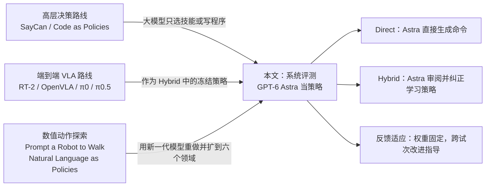
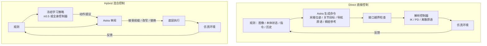
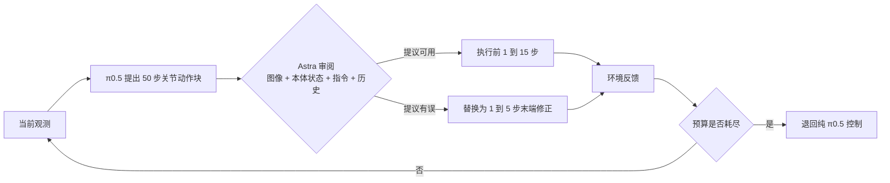
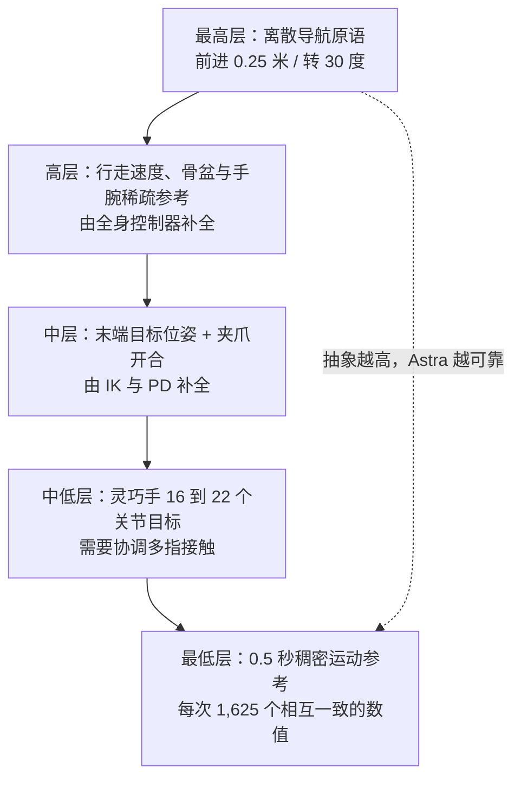
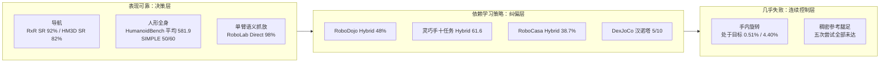

# 系统探究 GPT-6 Astra 作为具身策略的能力

> **原题**：Systematically Exploring the Capabilities of GPT-6 Astra as Embodied Policies
> **作者**：Galbot Team（共 33 位作者，按姓氏字母排序：Xuchuan Chen、Xiaoqian Cheng、Yu Deng、Lihe Ding、Shaocong Dong、Xiangjun Gao、Haozhe Jia、Zekai Li、Zhoujian Li、Yunrui Lian、Sikai Liang、Chenghuai Lin、Dairu Liu、Jiahang Liu、Qingtao Liu、Yuxuan Ma、Zekun Qi、Jiayi Su、He Wang、Ruochen Xu、Tianyu Xu、Xudong Xu、Zhe Xu、Mi Yan、Siming Yan、Li Yi、Ruixi Yu、Jinlu Zhang、Yintianrun Zhang、Zhikai Zhang、Zhizheng Zhang、Yixin Zheng、Weiyi Zhu）
> **机构**：银河通用机器人（Galbot）；项目页 galaxygeneralrobotics.github.io/astra-policy，代码 github.com/anonymous-report-421/GPT-as-Policy
> **年份**：2026（arxiv ID 2609.38537，9 月 29 日提交 v1）
> **分类**：cs.RO
> **链接**：https://arxiv.org/abs/2609.38537
> **精读日期**：2026-10-01

## 阅读须知

### 这篇在领域里的位置

这篇论文属于机器人学习里「让通用大模型直接充当控制策略」的评测类工作。要理解它的位置，需要先交代机器人策略过去几年走过的两条主路。

第一条路让大模型只负责高层决策。2022 年前后的 SayCan 用语言模型从一个固定技能库里挑选下一步要执行的技能，Code as Policies 则让语言模型写一段程序，去调用事先准备好的感知与运动接口。在这条路上，大模型从不直接驱动电机，真正的动作由专门设计或训练的底层模块完成。

第二条路是训练端到端的视觉-语言-动作模型。从 RT-2、OpenVLA 到 Physical Intelligence 的 π0 与 π0.5，这类模型在视觉语言模型的基础上，用大规模机器人演示数据继续训练，让模型从图像和指令直接输出关节或末端执行器的动作。它们擅长接触丰富的精细操作，但每换一类任务，通常都要再采数据、再微调。

夹在两条主路之间，还有一小批探索性工作，例如 Prompt a Robot to Walk 和 Natural Language as Policies。它们尝试不做任何微调，让通用语言模型直接吐出数值形式的关节目标或反馈控制量。受限于当时模型的能力，这些尝试大多停留在简单环境的概念验证。

本文就站在这第三条线上。起因是 GPT-6 Astra 这一代通用多模态模型在社区实验里显示出直接生成数值机器人动作的能力，从三维场景理解、真实到仿真的迁移，一直延伸到机械臂操作。作者团队想把这些零散的演示放到统一的口径下，系统回答三个问题：它能可靠地完成哪些任务，在哪里失败，每一个决策要付出多少计算代价。

换句话说，这是一份评测报告，而不是一个新方法。论文不训练任何参数，只设计接口、组织实验、拆解失败模式，并把 token 用量和推理延迟一并记账。它的价值在于覆盖面：夹爪操作、灵巧手操作、移动操作、导航、腿足运动、人形全身操作六个领域，被放在同一套「直接控制」与「混合控制」的框架下比较。

### 读完能回答什么

1. 论文里的 Direct（直接控制）与 Hybrid（混合控制）分别把哪一层交给大模型、哪一层交给学习到的策略或解析控制器，为什么两者的优劣排序会随着基准的不同而翻转？
2. 为什么同一个 Astra 在视觉语言导航上能达到 92% 的成功率、在人形全身任务的平均回报上超过强化学习基线，却在灵巧手连续旋转与稠密参考的腿足运动上几乎全部失败，这背后的「接口抽象层级」规律是什么？
3. 混合控制里 Astra 只改写了大约 12% 到 45% 的执行步，为什么这一小部分干预能把分数拉高数十分，又为什么它也会让单独策略本可完成的案例失败？
4. 「推理期间暂停物理仿真」意味着什么，一次 30 秒运动需要 250 次平均 39.86 秒的模型调用、RoboDojo 每种条件 50 个实例消耗 6 亿到 11 亿 token，这些成本数字应当怎样解读？
5. 这份评测的结论边界在哪里：全部实验都在仿真中完成，样本量为每格 5 到 50 次，多项对比依赖已发表数值或改动过的相机设置，哪些结论可以放心引用，哪些只能当作线索？

### 阅读前置

本文假定读者熟悉大语言模型和多模态模型的基本用法，知道工具调用、上下文缓存这些概念，也大致了解强化学习里「策略」「回报」「试次（episode）」的含义。

本文不假定读者做过机器人。逆运动学、PD 控制、操作空间控制器、视觉语言导航的评测指标、人形机器人的全身控制器这些内容，都会在正文第一次出现时先铺垫再展开。论文正文覆盖六个领域、十几张表格，本笔记会保留主要数字，但会把篇幅更多地用在解释「为什么会这样」上。

### 缩写表

- **LLM / VLM**（Large Language Model / Vision-Language Model）：大语言模型，以及能同时读图和读文字的视觉语言模型。
- **VLA**（Vision-Language-Action model）：视觉-语言-动作模型，从图像与指令直接输出机器人动作。
- **π0.5**：Physical Intelligence 发布的 VLA 模型，本文所有混合控制实验里的学习策略都用它。
- **Astra**：本文的评测对象 GPT-6 Astra，一个通用多模态大模型；论文没有披露它的发布方、版本号、推理档位等设置。
- **Direct / Hybrid**：本文定义的两种控制方式，前者由 Astra 直接生成控制命令，后者由 Astra 与冻结的学习策略或全身控制器配合。
- **EEF**（End-Effector）：末端执行器，即机械臂末端的夹爪或手。
- **IK**（Inverse Kinematics）：逆运动学，把末端的目标位姿换算成各关节角度。
- **PD 控制**（Proportional-Derivative control）：比例-微分控制，按位置误差与速度误差计算关节力矩的经典底层控制器。
- **OSC**（Operational Space Controller）：操作空间控制器，直接在末端的笛卡尔空间里跟踪目标。
- **RL**（Reinforcement Learning）：强化学习。
- **DROID**：一个大规模、在真实环境中采集的 Franka 机械臂演示数据集。
- **RoboDojo / RoboLab / DexJoCo / RoboCasa365**：本文用到的四个仿真操作基准，分别侧重双臂长时程任务、单臂语义抓放、双臂灵巧手、厨房场景移动操作。
- **VLN-CE**（Vision-and-Language Navigation in Continuous Environments）：连续环境中的视觉语言导航，机器人按一段自然语言路线描述走到终点。
- **R2R / RxR**（Room-to-Room / Room-across-Room）：两个 VLN 数据集，后者指令更长、更细。
- **ObjectNav**：物体目标导航，只告诉机器人一个物体类别，例如「找到马桶」，由它自己搜索。
- **MP3D / HM3D**（Matterport3D / Habitat-Matterport 3D）：两个室内三维扫描场景库。
- **SR / SPL**（Success Rate / Success weighted by Path Length）：成功率，以及按路径效率加权的成功率。
- **nDTW / sDTW**（normalized / success-weighted Dynamic Time Warping）：衡量实际轨迹与参考路线贴合程度的指标，后者只在成功时计分。
- **G1**：宇树科技的 G1 人形机器人，本文腿足与人形实验的机器人本体。
- **PASSAGE**：本文腿足实验里作为对照的学习式运动生成器。
- **ScaleTrack / Humanoid-GPT**：本文使用的冻结人形全身控制器与预训练全身策略。
- **SAC / TD-MPC2 / DreamerV3**：三种强化学习算法，HumanoidBench 公布的基线。
- **SIMPLE**：一个人形机器人操作基准，本文选用其中六个 L2 难度任务。
- **MAE**（Mean Absolute Error）：平均绝对误差。
- **Chamfer-L1**：两组点云之间最近点距离的平均值，用来衡量三维重建误差。
- **CAD**（Computer-Aided Design）：这里指物体的精确几何尺寸模型。

## 一、问题

机器人策略今天面临的核心瓶颈是数据。一个 VLA 模型要在新任务上做好，通常需要为这个任务采集几十到几百条演示，再做一轮微调。本文的数字很能说明问题：在 RoboLab 这个单臂语义抓放基准上，只在 DROID 数据上训练、没有见过测试任务的 π0.5 零样本成功率只有 36%。

与之相对地，通用多模态大模型从互联网规模的数据中学到了大量关于物体、空间和任务步骤的常识。如果它能直接输出可执行的动作，那么「每个任务都要采数据」这一步就有可能省掉，机器人可以像聊天助手一样，靠一段指令进入新任务。

过去两年，社区里已经出现了不少令人振奋的演示：让大模型看着相机画面直接输出机械臂的目标位姿，或者让它边看边纠正一个学习策略的动作。然而这些演示有三个共同的问题：它们是挑选过的成功片段，没有与已有方法在同一批测试实例上对照，也很少记录每一次决策花了多少时间和 token。

于是，从业者手里缺的是一张「能力地图」：在哪些领域、以什么接口形式，大模型当策略已经可靠；在哪些领域，它只是看起来合理。这篇论文要填的就是这张地图。

### 把问题落到可以验证的陈述

论文把「Astra 能不能当具身策略」拆成三个可以检验的子问题。第一，直接控制：Astra 在没有任何学习策略帮助的情况下，生成的命令经过解析控制器执行，能把任务完成到什么程度。第二，协作：Astra 与一个冻结的学习策略配合时，能否在保留策略原有能力的同时修复它的失败。

第三，反馈适应：在模型权重固定的前提下，Astra 能否利用前几次尝试的结果，在后续尝试中改进。这三个子问题分别对应「零样本控制能力」「与现有系统集成的价值」「不训练也能积累经验」三种实用场景。

每个子问题都用同一套口径回答：在相同的初始状态和随机种子上，比较任务结果，对照已有方法，拆解失败案例，并记录推理代价。这一口径的意义在于，它把「Astra 的推理贡献」与「接口、全身控制器、反馈结构所提供的能力」区分开来。

### 前人路线各自解决了什么

**SayCan** 的做法是让语言模型给每个候选技能打一个「与指令相关」的分数，再乘以一个学习到的「可供性」价值函数，后者表示这个技能在当前状态下成功的概率。它做对的地方是把语言模型的常识和机器人的实际能力绑在一起，避免模型提出机器人做不到的步骤。

它的不足在于技能库是固定的：语言模型只能在预先训练好的若干技能之间选，无法生成新动作，也无法修正某个技能执行中的细节偏差。

**Code as Policies** 让语言模型写一段 Python 程序，程序里调用物体检测、抓取、移动等原语接口。它的好处是组合能力强，一段代码可以表达循环、条件和空间计算。然而程序通常是开环执行的，一旦原语本身失败，例如抓取滑脱，程序本身并不知道，需要额外设计反馈机制。

**VLA 模型**（以本文反复使用的 π0.5 为代表）走的是另一条路。它们把视觉语言模型接上一个动作输出头，在大规模机器人数据上训练，直接从图像和指令输出一段连续的关节动作。这条路在接触丰富、需要双臂协调的任务上表现最好，因为这些细节已经编码在演示数据里。

但它的代价是对数据的依赖。没有见过的任务、没有见过的场景布局，VLA 的表现会明显下降。本文 RoboDojo 实验里，即便是针对任务微调过的 π0.5，在选出的十个任务上按已发表结果加权后的成功率也只有 15.67%。

**Prompt a Robot to Walk 与 Natural Language as Policies** 是最接近本文的前人工作。前者让语言模型直接输出四足机器人的关节目标，后者让模型根据数值反馈做闭环控制。它们证明了「语言模型可以输出数值动作」这件事在原理上可行，但实验环境简单，模型能力也有限，结论很难推广。

本文在这一谱系中的位置，是用新一代模型把第三条路重新做一遍，并且把第二条路的 VLA 也纳入进来，系统地测试两者混合的效果。

### 为什么还需要一篇新论文

之所以需要一篇新的系统评测，一方面是因为模型能力上了一个台阶。早期语言模型输出数值动作时经常格式错误、数值离谱，于是旧的结论更多是「能不能做」；新一代多模态模型能看图、能调工具做计算，问题就变成了「在哪些条件下做得可靠」。

另一方面，社区演示之间无法比较。每个演示用的机器人、接口、任务都不同，也没有失败案例和成本数据。没有统一口径，就无法判断一个成功是来自模型本身的推理，还是来自精心设计的接口和底层控制器。本文的六个领域、两种控制方式与成本记账，正是为了解决这个可比性问题。

## 二、方法

既然这是一篇评测论文，它的「方法」就是评测框架本身：一个动作如何定义，两种控制方式如何组织，六个领域分别给模型看什么、让它输出什么，跨试次的经验怎样传递，以及时间和 token 怎样记账。

### 2.1 一个「动作」在本文里指什么

在本文的框架里，一个动作是提交给控制接口的一条命令，例如一个末端目标位姿、一组关节增量，或者一个导航原语「前进 0.25 米」。这样定义的原因是，不同领域的执行器差别很大，只有在「接口」这一层，六个领域才能被统一地描述。

整个循环是这样的：Astra 接收研究允许它看到的观测，选择一个动作，接口检查这个动作是否越界，环境执行它并返回反馈，Astra 再根据反馈选择下一个动作。任务是否成功，由环境本身的判定规则决定，而不是由 Astra 自己声明。

与此同时，Astra 可以调用三类辅助工具：做数值计算、检查图像（例如放大某一区域）、记笔记。工具的存在让它能够在输出动作之前做坐标换算或几何推理，这一点在输出末端位姿时尤其重要。

### 2.2 两种控制方式：Direct 与 Hybrid

**Direct（直接控制）** 指 Astra 自己生成机器人命令，再由解析控制器执行，中间没有任何学习到的模块。命令的形式因领域而异：末端目标位姿、夹爪开合、导航原语、关节目标，或者稠密的运动参考轨迹。执行这些命令的是逆运动学、PD 控制或离散原语这类不需要训练的控制器。

**Hybrid（混合控制）** 指 Astra 与一个冻结的学习策略或全身控制器配合。在操作任务里，学习策略先提出一段动作，Astra 决定接受、修改还是替换它。在人形机器人任务里，Astra 只给出行走速度、骨盆和手腕的稀疏参考，由预训练的全身控制器负责把这些参考变成全身数十个关节的协调动作。

这两种方式的本质区别在于「谁负责物理细节」。Direct 让 Astra 对每一个物理细节负责；Hybrid 则把接触、协调、平衡这些需要高频反馈的细节交给学习模块，Astra 只在决策层面发力。论文后面所有的结果，几乎都可以从这一区别出发去理解。

### 2.3 混合控制的决策循环

以夹爪操作为例，混合控制的一轮循环可以分成四步。第一步，π0.5 根据当前观测提出一段 50 步的关节空间动作序列，这是 VLA 模型常用的「动作块」输出方式，一次预测未来一小段动作以保证平滑。

第二步，Astra 拿到这段提议，同时看到图像、本体感觉（各关节和夹爪的当前状态）、任务指令和此前的执行历史。第三步，它在两个互斥的分支里选一个：要么执行提议的前 1 到 15 步，要么丢弃提议，自己写一段 1 到 5 步的末端执行器修正。

第四步，执行完毕后环境返回新的观测，循环重新开始。之所以只执行前缀而不是整段 50 步，是因为前缀越短，Astra 就越能及时发现策略走偏；而之所以修正只有 1 到 5 步，是因为 Astra 生成的动作不够平滑，只适合用来「把策略拨回正轨」，而不适合长时间接管。

当审阅次数或 token 预算耗尽时，系统退回到纯 π0.5 控制。这一设计保证了即使 Astra 的预算用完，任务也不会停在半途。灵巧手实验沿用同一模式，只是前缀长度为 1 到 16 步，审阅频率约为每秒 30 次。

### 2.4 六个领域的观测与动作接口

六个领域的接口设计差别很大，这里先用一张表把它们摆在一起，再逐一解释其中值得注意的设计。

| 领域 | Astra 看到什么 | Astra 输出什么 | 底层执行 |
|---|---|---|---|
| 夹爪操作 | 图像、本体状态、指令、执行历史 | 双臂末端目标与夹爪命令，每次 1 到 5 个控制步 | IK + PD 控制 |
| 灵巧手操作 | 图像、本体状态、指令、执行历史 | 手腕与手指目标；策略前缀 1 到 16 步，修正 1 到 5 步 | 约 30 Hz 审阅，约 50 Hz 底层控制 |
| 移动操作 | 三路 RGB 视角，末端、底盘、夹爪状态 | 有界的机械臂、夹爪、底盘、躯干命令，每段 20 步 | 20 Hz，操作空间控制器 |
| 导航 | 单张前向 512×384 RGB 图像、指令或物体类别、步数、动作反馈 | 前进 0.25 米、转向 30 度，或局部路点 | Habitat 离散原语，500 步预算 |
| 腿足运动 | 场景对齐表示、地形高程、局部路线指引 | 关节 PD 目标，或稠密运动参考 | 50 Hz 跟踪器，500 Hz 物理 |
| 人形全身操作 | RGB、特权状态、任务几何、指导文本 | 行走速度与偏航角速度，或骨盆与手腕的稀疏参考 | 50 Hz 全身控制，500 Hz 物理 |

导航接口的限制格外严格。Astra 只有一张前向彩色图像，没有 GPS、指南针、深度图、语义标签、目标坐标，也看不到参考路线。这意味着它必须完全依靠视觉和指令判断自己在哪里、该往哪里走，而这正是评估「空间推理」最直接的方式。

移动操作的观测同样刻意收紧：没有物体位姿，没有接触真值，也没有中间奖励。换句话说，Astra 不能通过读取仿真器内部状态「作弊」，只能像真实机器人一样从相机画面推断物体位置。

腿足运动的稠密参考是全文最苛刻的接口。每次调用，Astra 需要给出未来 0.5 秒、每秒 50 帧的参考，每一帧包括根部高度、重力在机身坐标系下的投影、平面速度、偏航角速度，以及 29 个关节的位置和速度。论文说每次调用需要 1,625 个相互一致的数值；按每帧 1 + 3 + 2 + 1 + 29 + 29 = 65 个数、共 25 帧计算，恰好是 1,625（重力投影是三维向量）。

这 1,625 个数必须在物理上彼此协调：关节速度要与关节位置的变化相符，根部高度要与腿部姿态相符，否则跟踪控制器无法执行。这相当于要求语言模型「心算」一段完整的步态轨迹，难度远高于输出一个末端位姿。

人形全身操作则走向另一个极端。Astra 只输出行走速度、偏航角速度，或者骨盆和手腕的少量参考点，其余全身协调全部由预训练的全身控制器完成。这里 Astra 的角色更接近一个「指挥」，而不是「舞者」。

把这些接口按抽象层级排开，可以得到一条从「决策」到「控制」的梯子。后文的结果几乎完全沿着这条梯子分布。

### 2.5 跨试次的反馈适应

论文的第三个子问题是「不训练也能积累经验」。具体做法是：模型权重始终固定，但在试次之间，Astra 会检索或改写一段书面指导，供下一次尝试使用。这段指导可以看作一种外部记忆。

不同领域的反馈形式不同。在人形 SIMPLE 基准上，每次尝试之后 Astra 会显式修订任务指令。在腿足运动的开发过程中，前几次尝试的进展、跌倒和碰撞情况会被总结成文字，交给后续尝试。在 DexJoCo 双臂灵巧手实验里，十个试次被分成五对，同一对共享一份指导，每对之间再修订一次。

### 2.6 时钟与成本记账

大模型的推理延迟远远超过机器人控制周期的要求。为了让实验能够进行，论文在推理期间暂停物理仿真，等 Astra 给出动作后再继续。这样一来，机器人的「运动时钟」不包含决策延迟，任务看起来是在正常时间内完成的。

这一设定必须牢记在心。它意味着本文所有的成功率，都是在「机器人可以无限等待大模型思考」的前提下得到的。论文因此单独记录了 token 用量、请求次数和单次调用延迟，作为结果的限定条件，而不是附带信息。

## 三、实验

下面按六个领域依次展开，最后集中讨论成本与反直觉结果。

### 3.1 夹爪操作：RoboDojo 与 RoboLab

**RoboDojo** 是一个仿真双臂基准，任务涵盖语义分类、模仿动作序列、打包、搭建和可变形物体（衣物）操作。作者从中选了十个任务，选法是按已发表的 π0.5 成功率分层：最低区间选六个，次低区间选两个，两个更高区间各选一个。

之所以这样分层，是为了让评测集中在「还有提升空间」的任务上，同时保留交互类型的多样性。每个任务每种条件跑五次，Direct 与 Hybrid 使用相同的任务实例、场景配置和随机种子。Hybrid 中的 π0.5 使用公开发布的、针对任务微调过的权重。

| 条件 | 成功率 | 平均得分 |
|---|---|---|
| Hybrid（Astra + π0.5） | 24/50（48%） | 62.60 |
| Direct（Astra 单独） | 13/50（26%） | 37.81 |
| π0.5（按已发表结果加权） | 15.67% | 24.43 |

π0.5 的数字不是作者自己跑的，而是把已发表的 RoboDojo 结果按本文选出的十个任务和场景组合重新加权得到的。这一点在解读时需要注意：Direct 和 Hybrid 是成对比较，π0.5 则是间接对照。

在 Hybrid 的 50 条轨迹里，一共执行了 42,750 个控制步，其中 36,576 步（85.6%）直接采用 π0.5 的动作，只有 6,174 步（14.4%）由 Astra 生成或修正。换句话说，Astra 只介入了七分之一的动作，成功率就从 15.67% 提高到了 48%。

分任务的得分揭示了两种方式各自擅长什么：

| 任务 | π0.5 | Hybrid | Direct |
|---|---|---|---|
| 整理桌面 | 23.33 | 60.00 | 30.00 |
| 按语言描述分类 | 0.60 | 38.00 | 60.00 |
| 模仿动作序列 | 1.60 | 53.00 | 0.00 |
| 按数字排列 | 2.29 | 50.00 | 57.00 |
| 打包物体 | 18.36 | 50.00 | 50.00 |
| 物体分类 | 24.67 | 71.00 | 100.00 |
| 搭塔 | 37.73 | 64.00 | 12.00 |
| 麻将杠牌 | 26.67 | 40.00 | 0.00 |
| 叠衣服 | 29.12 | 100.00 | 40.00 |
| 瓶子入桶 | 79.93 | 100.00 | 36.00 |

Hybrid 的优势集中在长时程、对接触敏感的任务上：模仿序列 53 对 0，搭塔 64 对 12，叠衣服 100 对 40，瓶子入桶 100 对 36。这些任务要求持续稳定的接触与双臂协调，正是 π0.5 从演示数据中学到的东西。

Direct 反而在纯语义任务上更好：按语言描述分类 60 对 38，物体分类 100 对 71。这类任务的难点在于理解「哪个物体属于哪一类」，动作本身只是简单的抓放，于是 Astra 的语义理解直接转化为分数，而 π0.5 的提议有时反而成为干扰。

**RoboLab** 的设定与 RoboDojo 形成对照：仿真单臂 Franka，任务是抓放、按顺序堆积木、翻转杯子，测试任务没有任何训练数据。这里的 π0.5 使用只在 DROID 上训练的零样本权重。

| 条件 | 成功率 |
|---|---|
| Direct | 49/50（98%） |
| Hybrid | 46/50（92%） |
| π0.5（零样本） | 18/50（36%） |
| Cosmos3-Nano-Policy | 18/50（36%） |
| DreamZero | 17/50（34%） |

在这个基准上，Direct 以 98% 领先，Hybrid 比 π0.5 高出 56 个百分点，但仍比 Direct 少三次成功。论文给出的解释是：RoboLab 是单臂、以语义为主的抓放任务，Astra 自己就能完成；而一个零样本策略只有 36% 的成功率，它的提议未必能为修正提供有用的先验，反而把 Astra 往错误方向拉。

两个基准合在一起说明，「混合是否有利」取决于学习策略本身有没有值得保留的能力。策略在任务上训练过、掌握了接触细节时，混合大幅占优；策略本身很弱时，混合可能不如让 Astra 单独完成。

### 3.2 灵巧手操作

灵巧手实验分三组，覆盖面广，结论也最分化。

**第一组：十个任务的策略协助。** 仿真中使用 Sharpa 灵巧手，任务包括抓取、取物、放置、插入、堆叠和整理。π0.5 在每个任务 100 条、共 1,000 条演示上做了多任务微调。三种条件各在每个任务的五个未见过的初始状态上测试，仿真时长 20 到 60 秒，评分为 0 到 100，允许部分得分。

| 任务 | π0.5 | Direct | Hybrid |
|---|---|---|---|
| 提锅并保持 | 40.0 | 44.0 | 62.0 |
| 耳机装盒 | 42.0 | 22.0 | 42.0 |
| 玩具取回 | 100.0 | 22.0 | 100.0 |
| 挂杯子 | 62.0 | 4.0 | 82.0 |
| 麻将牌收纳 | 48.0 | 18.0 | 88.0 |
| 瓶罐分类 | 72.0 | 14.0 | 100.0 |
| 鸡蛋竖放 | 6.0 | 12.0 | 38.0 |
| 两碗叠放 | 46.0 | 20.0 | 52.0 |
| 面包插槽 | 10.0 | 8.0 | 28.0 |
| 套娃排序 | 16.0 | 2.0 | 24.0 |
| **平均** | **44.2** | **16.6** | **61.6** |

Hybrid 的平均分 61.6，比 π0.5 的 44.2 高 17.4 分，在八个任务上有提升；比 Direct 的 16.6 高出 45 分，在全部十个任务上占优。提升最大的是麻将牌收纳（+40）、鸡蛋竖放（+32）和瓶罐分类（+28），面包插槽和套娃排序的提升则很小。

Astra 的干预只占执行步的 11.98%。论文统计了干预的原因：最常见的是处理抓空、物体掉落和放置失败，其次是对齐放置位置和稳定握持。也就是说，Astra 擅长的是「看出哪里出错并给出一个纠正方向」，而不是从头规划一段手指动作。

Direct 只有 16.6 分，主要失败在抓取阶段：多根手指同时闭合时会把物体推开，或者抬升力度不够导致物体支撑不稳。即便在 Hybrid 中，当物体掉落、需要以陌生姿态重新抓取时，Astra 也常常束手无策。

**第二组：DexJoCo 双臂汉诺塔。** 任务是用两台 Franka Panda 机械臂加 Allegro 灵巧手，按顺序完成两次圆盘搬运。π0.5 在这个任务上训练过，Astra 审阅它的动作，接受前缀或修正手腕与手指目标。每次最多 1,500 个控制步（50 Hz），每段最多 30 步；十个试次按五对组织，对内共享指导，对间修订。

结果是 10 次中成功 5 次。在执行的 11,320 步中，73.6% 是未修改的策略动作，26.4% 是 Astra 的修正。成功案例里的策略很有代表性：当小圆盘尚未得到支撑时，Astra 推迟策略提出的松手动作，先施加一段短促的向下修正，确保圆盘与下方的堆叠接触，然后把控制交还给策略，由策略完成松手和撤离。

这一组的 token 记录也值得一提：共 63.60M token（含缓存输入），其中试次之间复盘经验只用了 0.136M。也就是说，几乎全部开销都花在在线控制上，尽管大部分物理动作是策略提供的。

**第三组：手内旋转与平移。** 这一组让 Astra 直接控制灵巧手做持续的手内操作，对照组是针对任务训练好的冻结 RL 策略。Astra 每次接收图像和状态，为 Sharpa 手的 22 个关节或 Allegro 手的 16 个关节下达 1 到 5 个 20 Hz 控制步的命令；RL 策略则每一步都做决策。

| 任务 | 指标 | Astra | RL |
|---|---|---|---|
| 圆柱旋转（20 秒） | 处于目标的时间比例 | 0.51% | 76.90% |
| | 姿态误差（rad） | 1.626 | 0.173 |
| | 角速度 MAE | 0.960 | 0.276 |
| 长方体旋转（10 秒） | 处于目标的时间比例 | 4.40% | 63.50% |
| | 姿态误差（rad） | 0.742 | 0.096 |
| | 角速度 MAE | 0.143 | 0.063 |

圆柱旋转的五次运行里，Astra 有三次坚持到了时长结束，一次掉落物体，一次耗尽预算。长方体旋转中两者都全程保持握持，但 Astra 转得太慢，始终追不上目标姿态。

| 任务 | 条件 | 位置误差（mm） | 旋转误差（度） | 成功 |
|---|---|---|---|---|
| 平移 | Astra | 59.05 | - | 1/5 |
| 平移 | RL | 17.29 | - | 4/5 |
| 平移 + 旋转 | Astra（120 次决策） | 47.35 | 32.72 | 0/5 |
| 平移 + 旋转 | RL（相同控制步数） | 16.22 | 8.31 | 4/5 |
| 平移 + 旋转 | RL（15 秒） | 16.08 | 3.49 | 5/5 |

论文对这组结果的诊断是「稳定与进展之间的张力」。持续旋转一个物体，需要手指不断地松开、换位、再接触；而 Astra 倾向于保持当前握持，因为这样最稳。结果是物体不再掉落，旋转却也随之停滞。协调的接触切换，正是学习控制远远领先的地方。

### 3.3 移动操作：RoboCasa365

RoboCasa 是一个厨房场景的移动操作基准，机器人是带移动底盘的仿真 PandaOmron。作者选了 15 个任务，分成三组各五个：见过的原子任务、见过的组合任务、没见过的组合任务。每个任务五个种子，每种条件 75 个试次，任务时长按复杂度从 450 步到 4,350 步不等。

三种条件共享初始状态（用指纹匹配保证完全相同）、控制器、时长和原生成功判定。Hybrid 中的 π0.5 是多任务版本，没有针对具体任务微调；Astra 可以接受 20 步前缀、自己构造动作，或者改写子目标指令再交给策略。

| 任务组 | π0.5 单独 | Astra Direct | Astra Hybrid |
|---|---|---|---|
| 见过的原子任务 | 13/25（52.0%） | 7/25（28.0%） | 13/25（52.0%） |
| 见过的组合任务 | 3/25（12.0%） | 4/25（16.0%） | 7/25（28.0%） |
| 没见过的组合任务 | 1/25（4.0%） | 14/25（56.0%） | 9/25（36.0%） |
| **全部** | **17/75（22.7%）** | **25/75（33.3%）** | **29/75（38.7%）** |

总成功率上，Hybrid 38.7% 高于 Direct 33.3% 和 π0.5 的 22.7%。然而 Hybrid 与 Direct 之间的差异在统计上并不显著：作者做了一个探索性的精确 McNemar 检验（专门用于比较同一批样本上两种方法成败的配对检验），p = 0.5235。

分组看，规律与夹爪操作一致。在见过的原子任务上，π0.5 本身有能力，Hybrid 与它持平，Direct 只有 28%。在没见过的组合任务上，π0.5 几乎完全失效（4%），Direct 反而达到 56%，比 Hybrid 的 36% 更高，因为一个不懂任务的策略此时只会成为负担。

Hybrid 的执行步里，55.2% 是被接受的策略动作，44.8% 是 Astra 生成的动作；在策略提出的动作中，有 72.6% 是在 Astra 改写过的子目标指令条件下生成的。这说明在移动操作里，Astra 的贡献很大一部分来自「把复杂任务翻译成策略听得懂的子指令」。

配对结果显示三种条件的成功集合互有交错。Hybrid 独有的成功 13 次，Direct 独有的 9 次，两者共同的 16 次。论文举了几个例子：烧水壶任务只有 Hybrid 成功；按类型回收瓶子只有 Direct 成功；准备咖啡杯有一个案例只有单独的 π0.5 成功；在准备咖啡杯和洗生菜两个任务上，两种 Astra 条件全部失败，单独的策略却分别完成了三次和两次。

### 3.4 导航

导航实验用了四个固定子集，各 50 个试次：VLN-CE 的 R2R 与 RxR 英文指令（都取未见过场景的验证集），以及 MP3D 和 HM3D 上的物体目标导航。VLN-CE 的成功标准是在距离终点 3 米内执行「停止」；ObjectNav 要求在目标视点集合 1 米内停止。

在介绍结果之前，需要先铺垫一下 SPL 这个指标。导航任务里，「到达」和「高效到达」是两回事：绕了十倍远的路才到终点，成功率照算，但实际价值很低。SPL 的做法是把每次成功按「最短路径长度 / 实际路径长度」打折，于是它同时反映成功与效率。

| 任务 | 数据集 | SR | SPL | nDTW | sDTW |
|---|---|---|---|---|---|
| VLN-CE | R2R | 78% | 65.27 | 72.20 | 59.35 |
| VLN-CE | RxR 英文 | 92% | 77.25 | 84.73 | 80.42 |
| ObjectNav | MP3D | 56% | 22.43 | - | - |
| ObjectNav | HM3D | 82% | 43.69 | - | - |

有路线指令时，SPL 明显更高（65 到 77）；只有物体类别、需要自主搜索时，SPL 降到 22 到 44。这一对比说明，Astra 能把文字路线描述转化为高效的路径，但在开放搜索时会走大量弯路。摘要里说的「搜索带来大量绕行」指的就是这一点。

作者在本地用同样的 200 个试次、同样的评分和原语预算，跑了五个公开发布的导航模型作为对照：

| 系统 | R2R SR | R2R SPL | RxR SR | RxR SPL | MP3D SR | MP3D SPL | HM3D SR | HM3D SPL |
|---|---|---|---|---|---|---|---|---|
| Astra | 78 | 65.27 | 92 | 77.25 | 56 | 22.43 | 82 | 43.69 |
| LightNav-0 | 58 | 54.14 | 72 | 64.08 | 20 | 8.39 | 66 | 37.75 |
| Uni-NaVid 7B | 30 | 27.76 | 34 | 25.67 | 8 | 5.46 | 30 | 20.48 |
| OmniNav Flow | 56 | 53.89 | 72 | 56.29 | 4 | 2.96 | 6 | 2.90 |
| NavFoM | 44 | 40.04 | 58 | 51.79 | 18 | 13.01 | 42 | 30.38 |
| SPAN-Nav | 70 | 61.71 | 72 | 56.19 | - | - | - | - |

Astra 在全部四个子集的成功率上领先，相对最强对照 LightNav-0 的成功率差距分别是 R2R +20、RxR +20、MP3D +36、HM3D +16 个百分点。唯一的例外是路线贴合度：LightNav-0 在 R2R 上的 nDTW 略高（72.77 对 72.20），但 Astra 的 sDTW 更高（59.35 对 48.89）。

这组对照有一个需要留意的细节：LightNav-0 和 Uni-NaVid 使用的是 Astra 的前向相机规格，而不是它们原论文的相机设置；LightNav-0 和 OmniNav Flow 的输出还经过本地适配器转换成共享的离散动作。这些改动是为了统一口径，但也可能让部分基线偏离其最佳工作条件。

失败分析指出了三类困难：难以把视觉观测与具体位置对应起来，难以确认目标是否已经达成，以及难以有效利用碰撞反馈和搜索历史。论文的总结很精炼：为运动给出一个合理的理由，并不能保证对目标的判断正确，也不能保证空间上确实有进展。

### 3.5 腿足运动

腿足实验是全文最直接的失败案例。任务是让 G1 人形机器人穿过一条开放的障碍赛道，Astra 每次生成 0.5 秒的稠密运动参考，交给冻结的 ScaleTrack 跟踪控制器执行。对照是学习式运动生成器 PASSAGE，两者共享初始状态、目标、地形高程、局部路线指引、跟踪器和终止条件。

成功标准是最终位置与目标的平面距离不超过 0.5 米。跌倒会触发重置，连续八秒位移不足 0.1 米则判定为无进展而终止。Astra 连续尝试五次：第一次是零样本；之后每次都保留前几次的进展、跌倒和碰撞的文字总结；第五次之前还额外给了一段从另一条赛道重定向过来的行走片段。

| 尝试 | 结局 | 时间（秒） | 前进（米） | 最终误差（米） | 到达 |
|---|---|---|---|---|---|
| PASSAGE | 到达 | 13.18 | 8.622 | 0.495 | 是 |
| Astra 第 1 次 | 跌倒 | 9.80 | 1.561 | 7.556 | 否 |
| Astra 第 2 次 | 无进展 | 20.28 | -0.024 | 9.141 | 否 |
| Astra 第 3 次 | 无进展 | 8.00 | 0.012 | 9.104 | 否 |
| Astra 第 4 次 | 无进展 | 8.48 | 0.159 | 8.958 | 否 |
| Astra 第 5 次 | 超时 | 30.00 | 2.598 | 6.519 | 否 |

这张表的形状很说明问题。第一次尝试主动前进，走了 1.56 米便跌倒。第二到第四次吸取了「避免跌倒」的教训，于是站得很稳，却几乎原地不动。第五次有了一段示范步态，稳定性和前进都有改善，行走距离达到 3.83 米、离目标的距离缩短了 2.60 米，但最终仍差 6.52 米。

延迟数字更直观。第五次 30 秒的运动需要 250 次同步模型调用，每次平均 39.86 秒，物理仿真在调用期间暂停。换算下来，30 秒的机器人运动需要接近 2 小时 46 分钟的墙钟时间；PASSAGE 每次规划只需约 0.08 秒。

为了判断失败究竟是 Astra 的问题还是接口本身的问题，作者另做了一组不用 Astra 的诊断：用两种解析生成器在六条赛道、两种物理后端上直接生成紧凑参考，测试这类接口的可行性上限。

| 接口 | 严格成功 | 到达并停止 | 跌倒 | 最终误差（米） | 峰值接触力（N） | 非足部接触力（N） |
|---|---|---|---|---|---|---|
| Five-point | 0/12 | 4/12（33.3%） | 1/12（8.3%） | 3.441 | 1853 | 644 |
| WholeBody-14 | 0/12 | 3/12（25.0%） | 4/12（33.3%） | 5.334 | 2293 | 1562 |

两种接口都没有一次严格成功，低矮障碍尤其困难。这组诊断表明，「用紧凑参考驱动人形穿越障碍」这一接口本身就存在很低的天花板，Astra 的失败有一部分来自接口，而不全是模型的推理问题。

### 3.6 人形全身操作

**HumanoidBench。** 这是一个包含行走、跑步、爬行、开门、推箱子等数十个任务的人形机器人基准。作者使用 30 个可执行任务（排除两个单杠变体），每个任务两个种子。Astra 通过预训练全身策略和 ScaleTrack 控制器驱动 G1，每次只给出行走速度与偏航角速度，或者骨盆与手腕的稀疏参考。

| 任务 | DreamerV3 | TD-MPC2 | SAC | Astra | 达标阈值 |
|---|---|---|---|---|---|
| 迷宫 | 272.3 | 244.3 | 144.8 | 1358.8 | 1200 |
| 伸手触达 | 7580.9 | 7316.1 | 4565.1 | 11430.2 | 12000 |
| 行走 | 800.2 | 782.0 | 31.7 | 848.7 | 700 |
| 跑步 | 633.8 | 93.3 | 5.0 | 642.1 | 700 |
| 爬行 | 878.8 | 957.4 | 330.0 | 971.9 | 700 |
| 爬楼梯 | 131.1 | 70.4 | 14.1 | 272.5 | 700 |
| 推箱子 | -1251.9 | -258.7 | -97.9 | 877.3 | 700 |
| 开门 | 213.0 | 274.7 | 39.4 | 142.4 | 600 |

在 30 个任务上，Astra 的平均回报为 581.9，TD-MPC2 为 338.2，SAC 为 42.7，DreamerV3 为 -41.9。Astra 达到了六个任务的阈值（站立、行走、迷宫、爬行、推箱子、简单坐下）。逐任务比较，它在 13 个任务上超过三个基线中最好的那个，在厨房任务上持平；分别超过 DreamerV3、TD-MPC2、SAC 的任务数是 16、19、25。

开门是一个反例：Astra 142.4，低于 TD-MPC2 的 274.7 和 DreamerV3 的 213.0。开门需要手与门把之间持续施力并跟随门的转动，这又回到了「持续接触控制」这一弱项上。

**SIMPLE。** 作者选了六个 L2 难度任务，每个十个场景，使用官方代码和协议。每次尝试之后 Astra 修订自己的指令，模型权重不变。

| 任务 | 成功 | 比例 |
|---|---|---|
| 递交物体 | 8/10 | 80% |
| 移动抓放 | 7/10 | 70% |
| 桌面操作 | 9/10 | 90% |
| 弯腰抓取（XMove） | 9/10 | 90% |
| 抓取（XMove） | 9/10 | 90% |
| 弯腰 | 8/10 | 80% |
| **合计** | **50/60** | **83.3%** |

83.3% 的总成功率看起来很好，但论文专门拿「递交」任务拆解了这一数字的脆弱性。原生的成功判定并不要求完全松手之后物体仍然稳定，于是有些「成功」其实是假象：手指闭合、纸箱倾斜被误认为抓牢了，实际承重的是桌面或另一只手；接收的手一动，递出的手腕也跟着偏移；一个阶段看起来足够的抓握，到了下一阶段就失效。

作者据此写了一套指导：把抓取与抬升分开，先撤回辅助的那只手，再确认被递交的手确实把物体抬起来了。然而这套指导并不能保证可靠：一次成功的递交之后，重复同样的场景失败了；固定流程只在三个此前成功的场景中通过了两个；三次有效的恢复尝试即使给了更长的预算也全部失败。

**第一人称视频到仿真。** 这是一个附加实验：Astra 自己组装感知和动作重定向工具，从第一人称视频中重建物体和支撑面的布局，并提取骨盆、手腕、脚踝的位姿和手部开合。重建误差随输入信息的增加而下降：只用图像时 Chamfer-L1 为 35.93 毫米，加上图像细化为 24.73 毫米，再加上 CAD 尺寸降到 12.14 毫米。

迁移到机器人执行时，几厘米的物体位置误差就足以导致抓取失败。三个「把苹果放进垃圾桶」的案例里，只有一个完整成功（踩踏板、放入、合盖），另外两个都在抬升阶段掉了苹果。这一实验在开发、评测和文档化过程中共消耗 2.17 亿 token。

### 3.7 成本

论文把成本单独列成一张表，这里原样呈现。

| 设定 | 记录的资源用量 | 范围与解读 |
|---|---|---|
| RoboDojo，每种条件 50 个实例 | Hybrid / Direct：总计 624.8M / 1,132.3M token；缓存输入 607.6M / 1,107.3M；非缓存输入 15.90M / 22.91M；输出 1.31M / 2.09M | 不含早期尝试；缓存输入占总量的绝大部分 |
| RoboCasa，每种条件 75 个试次 | Direct / Hybrid：7,910 / 8,941 次请求；每试次中位数 85 / 108 次 | 统计的是保存下来的请求日志，含恢复历史，不等于全部推理调用 |
| 稠密腿足运动，最后一次尝试 | 30 秒仿真运动需 250 次同步调用；平均单次延迟 39.86 秒 | 推理期间物理暂停；PASSAGE 规划约 0.08 秒一次 |

读这张表需要区分两件事。第一，RoboDojo 的 token 总量看起来十分庞大，但 97% 以上是缓存输入，也就是每一步都重复送入的长历史和系统提示。真正新计算的非缓存输入与输出加起来，Hybrid 约 17M、Direct 约 25M。

第二，Hybrid 的 token 比 Direct 少 44.8%，但在 RoboCasa 上它的请求次数反而更多（中位数 108 对 85）。论文的解读是：把动作交给策略，并不等于把审阅工作也交了出去。Astra 仍然需要逐段审阅策略的提议，这本身就要调用模型。

### 3.8 值得单独拎出来的反直觉结果

**混合不总是优于直接。** 直觉上，「大模型 + 学习策略」应该至少不差于任何一方单独工作。然而在 RoboLab（Direct 98% 对 Hybrid 92%）和 RoboCasa 没见过的组合任务（Direct 56% 对 Hybrid 36%）上，Direct 都更好。原因在于这些场景里的学习策略本身没有掌握任务，它的提议成为噪声，Astra 花力气纠正它，还不如自己从头做。

**协助会让策略原本能完成的案例失败。** 在 RoboCasa 的准备咖啡杯与洗生菜任务上，单独的 π0.5 分别成功三次和两次，两种 Astra 条件却全部失败。论文的结论里明确承认了这一点：协助可能让单独策略本可完成的案例失败。有效的协作不仅要修复失败，还要保留原本正常工作的行为。

**文字经验可能让机器人变得过于保守。** 腿足实验第二到第四次尝试都保持站立，却几乎没有前进。从表面看，反馈起了作用，跌倒消失了；但它把「避免跌倒」变成了首要目标，代价是放弃了前进。这是一个典型的「优化了容易度量的指标」的例子。

**少量干预带来大量增益，但 token 主要花在审阅上。** 灵巧手十任务里干预只占 11.98% 的步数，却把平均分从 44.2 提到 61.6。与此同时，DexJoCo 汉诺塔的 63.6M token 几乎全部花在在线控制，而不是试次之间的经验复盘。这两点合起来说明，Astra 的价值集中在少数关键时刻，但为了找到这些时刻，它需要持续盯着整个过程。

把六个领域的结果按接口层级排开，可以得到下面这张能力分布图：

## 四、局限

### 作者自己承认的局限

作者在结论里把最核心的发现概括为「有用的任务决策与可靠的物理控制之间存在差距」。Astra 在导航和面向任务的操作中表现出优势，能够纠正目标与接触条件；但直接的手内控制在持续运动上落后于学习基线，稠密参考的腿足运动经过多次尝试仍不可靠。

作者承认推理延迟与 token 消耗是对所有结果的限定条件。30 秒运动需要 250 次平均近 40 秒的调用，而且实验依赖暂停物理仿真才能进行。长历史与审阅会推高资源用量，把动作委托给策略也不会自动减少审阅工作。

作者也承认协作并非单调有益：协助可能让单独策略本可完成的案例失败。论文还指出，发现错误、提出修正、验证修正效果是三项独立的要求。修正次数的多少和解释的合理程度，都不能衡量干预的价值，真正的衡量标准只能是随后的物理结果。

关于跨试次适应，作者坦承反馈可以在已知案例上改进流程，却不能保证跨尝试的可靠性。推箱子开发中出现过一次成功后重复失败的情况；递交任务的固定流程只在三个此前成功的场景中通过了两个。诊断、指导与持续控制需要分别评估。

最后，作者强调这些结论需要把 Astra 自身的推理贡献，与接口、全身控制器和反馈结构所提供的能力区分开来。在人形任务上，「Astra 超过了强化学习基线」的说法里，很大一部分功劳属于预训练的全身控制器。

### 读完能看出来的潜在问题

**全部在仿真中，没有真实机器人。** 论文所有实验都在物理仿真器中完成，没有一个真实机器人实验。仿真中可以暂停物理等待模型思考，真实世界不能；仿真中的接触、摩擦和感知噪声也都比现实干净。因此，本文结论对真实部署的外推需要格外谨慎。

**「暂停物理」让成功率与实时性脱钩。** 在真实系统里，一次 40 秒的思考意味着机器人在这 40 秒内要么保持静止，要么继续执行旧动作。对于导航这种可以停下来想的任务，影响或许有限；对于腿足平衡、动态抓取这类任务，这一设定实际上改变了任务的性质。读者引用本文的成功率时，最好同时注明这一前提。

**样本量小，统计效力有限。** 大部分格子是每任务五次，腿足运动只有一条赛道、五次尝试，SIMPLE 每任务十个场景。唯一做过的显著性检验（RoboCasa 的 McNemar 检验）给出的 p 值是 0.5235，也就是 Hybrid 与 Direct 的差异无法与随机波动区分。很多表格里几个百分点的差距，换一批种子可能就会改变排序。

**多处对照口径不完全一致。** RoboDojo 的 π0.5 是按已发表结果重新加权得到的，而非与 Astra 成对运行。HumanoidBench 的 DreamerV3、TD-MPC2、SAC 使用的是已发表的回报；按 HumanoidBench 原始设定，这些基线是在不同的机器人本体上从零训练、没有预训练全身控制器帮忙的策略，而 Astra 一侧接入了预训练全身控制器。导航实验中两个基线换用了 Astra 的相机规格，另两个经过本地动作适配器。这些处理各有理由，但都会让「Astra 领先多少」这一数字带上不确定性。

**单一模型，无法区分「Astra 特有」与「前沿大模型普遍」。** 论文只评测了 GPT-6 Astra，没有与其他前沿多模态模型做同口径比较。于是读者无法判断，导航上的 92% 是 Astra 独有的能力，还是这一代大模型普遍具备的能力。论文也没有披露 Astra 的版本、推理档位、上下文长度等设置，这对复现构成障碍。

**接口设计承担了大量工作。** 每个领域的观测、动作格式、控制频率、前缀长度、修正步数、预算和指导文本都是逐一设计的。这些设计里凝结了大量人类经验，而论文没有系统地做接口消融，例如换一种动作表示或换一种提示词时结果会如何变化。于是「Astra 能做什么」与「这套接口让 Astra 能做什么」之间的边界并不清晰。

**基准数据可能被模型见过。** 本文使用的导航数据集、HumanoidBench、RoboCasa 等都是公开基准，其任务描述、场景图片乃至解题讨论都可能出现在大模型的训练语料中。论文没有讨论数据污染问题。对于导航这类高度依赖「认出场景」的任务，这一点尤其值得关注。

**成本数字难以直接换算成金钱。** 论文按 token 记账，但没有给出单价或墙钟总时长，只有腿足运动给出了单次延迟。考虑到 97% 以上是缓存输入，实际费用取决于服务商对缓存的计价方式。对于想评估「用大模型当策略是否划算」的读者，还需要自己做一遍换算。

## 一句话

在六类仿真机器人任务上系统评测 GPT-6 Astra 当策略：擅长任务决策与纠偏，难以胜任稠密实时的物理控制。
