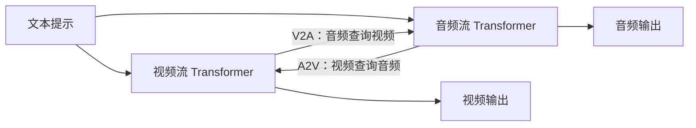
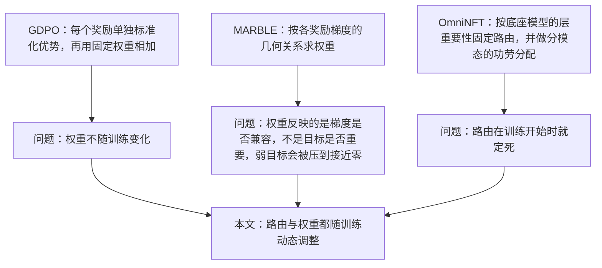
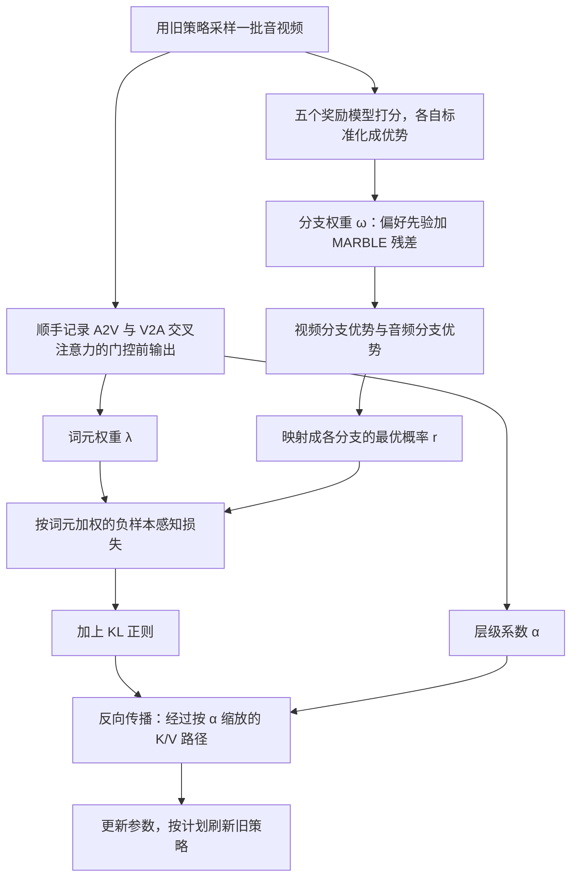
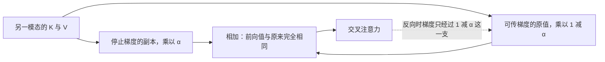
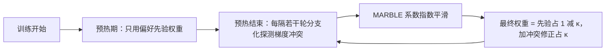

# 自适应奖励路由：用前向过程强化学习为音视频联合扩散模型做动态多奖励优化

> **原题**：Adaptive Reward Routing: Dynamic Multi-Reward Optimization for Joint Audio-Video Diffusion via Forward-Process RL
> **作者**：Songlin Yang, Xiaotong Zhao, Jiacheng Zhang, Zhe Wang, Toyota Li, Eric Liu, Alan Zhao, Anyi Rao
> **机构**：香港科技大学 MMLab、腾讯视频、香港大学
> **年份**：2026（arxiv ID 2609.37200）
> **分类**：cs.CV
> **链接**：https://arxiv.org/abs/2609.37200
> **精读日期**：2026-10-02

## 阅读须知

### 这篇在领域里的位置

过去两年，视频生成模型从「只出画面」走到了「画面和声音一起出」。早期的做法是先生成一段无声视频，再用另一个模型为它配音；后来出现了联合生成的模型，例如本文用作底座的 LTX-2，它在同一个网络里同时生成视频和音频，两路信号在生成过程中互相参照。这类模型的好处是声画天然一体，难点在于它要同时照顾三件事：画面好不好看、声音好不好听、两者是否对得上。

另一条脉络是扩散模型的强化学习后训练。大语言模型靠人类偏好和奖励模型做后训练已经成为常规，扩散模型也在沿着这条路走：先有在去噪轨迹上做策略梯度的方法，后来出现了 DiffusionNFT 这类在「加噪的前向过程」上做强化学习的方法，训练更稳、更省。本文把这两条脉络接在一起：用前向过程强化学习，以多个奖励模型为信号，去后训练一个音视频联合扩散模型。

在这个交叉点上，前人已经意识到「多个奖励怎么配」和「更新应该落在网络哪里」这两个问题，但给出的答案都是静态的。本文的位置是把这两个答案从静态改成动态，让它们随着训练过程中模型本身的变化而调整。

### 读完能回答什么

1. 为什么给音视频联合扩散模型做多奖励强化学习时，固定的奖励权重会让「声画同步」这类较弱的目标被压没。
2. 本文如何用模型自己已经算出来的交叉注意力输出，判断哪些词元、哪些层对跨模态交互最关键，并据此调整损失和梯度。
3. 「偏好先验加残差修正」的权重组合方式，相比单纯按梯度几何求权重，好在哪里，为什么需要预热期。
4. DiffusionNFT 的正负隐式策略损失是怎样构成的，本文在它上面改了哪几处。
5. 这套方法在 LTX-2 和 LTX-2.3 上分别带来了多大的提升，哪些消融最能说明问题。

### 阅读前置

本笔记假定读者熟悉 Transformer 的注意力机制、PyTorch 里的梯度与停止梯度（stop-gradient）操作，以及强化学习里「优势」这一概念的大意。读者不必专门做过扩散模型或音频生成：流匹配、DiffusionNFT、多目标权重这些概念都会在第一次出现时铺垫清楚。

### 缩写表

- **RL**（Reinforcement Learning，强化学习）：根据奖励信号调整模型行为的训练方式。
- **NFT**（Negative-aware Fine-Tuning，负样本感知微调）：DiffusionNFT 的核心损失，同时利用好样本和坏样本来更新模型。
- **LTX-2 / LTX-2.3**：本文使用的音视频联合扩散模型，参数量分别为 190 亿和 220 亿。
- **A2V / V2A**（Audio-to-Video / Video-to-Audio）：音频流向视频流的交叉注意力，以及反方向的交叉注意力。
- **K / V**（Key / Value，键和值）：注意力里被查询的两组张量，本文的层级路由作用在它们身上。
- **KL**（Kullback-Leibler 散度）：衡量新旧策略差多远的量，用作正则，防止模型跑偏。
- **LoRA**（Low-Rank Adaptation，低秩适配）：只训练一小组低秩矩阵的轻量微调方式，本文各方法在同样的 LoRA 预算下比较。
- **GDPO**：对每个奖励分别归一化优势、再用固定权重相加的多奖励强化学习方法。
- **MARBLE**：根据各奖励梯度之间的几何关系自动求权重的多奖励方法。
- **OmniNFT**：在 DiffusionNFT 上做多模态后训练、按底座模型固定层级路由的方法，是本文最强的对照。
- **CLIP / CLAP**：分别衡量图像与文本、音频与文本是否匹配的对比学习模型。
- **IB**（ImageBind）：把多种模态映射到同一空间的模型，评测里的 TV-IB、TA-IB、AV-IB 都用它算相似度。
- **VQ / AQ**（Visual Quality / Audio Quality）：视频质量和音频质量得分。
- **DeSync**：衡量声画不同步程度的指标，越低越好。
- **JavisBench**：本文的评测集，含 10,140 条音视频生成提示词。

## 一、问题

先从一个具体的场景讲起。假设要生成一段「玻璃杯掉在地上摔碎」的四秒视频，画面要清晰，碎裂声要逼真，而且碎裂声必须恰好落在杯子触地的那一帧。前两项各自都有成熟的打分模型，第三项则要专门的同步检测器。如果后训练时只盯着画质和音质，模型很可能学会生成漂亮的画面和好听的声音，却让声音早半拍或晚半拍响起。对用户来说，这种错位比画质略差更刺眼。

所以，音视频联合生成的后训练天然是一个多奖励问题。本文用了五个奖励信号：视频质量用 VideoAlign 和 HPSv3，音频质量用 AudioBox Aesthetics，文本与音频是否相符用 CLAP，声画同步用 DeSync。这些目标彼此并不总是一致，提升画质的梯度方向未必有利于同步。

### 1.1 底座模型长什么样

要理解后面的路由设计，得先看清 LTX-2 的结构。它是一个双流模型：视频走一条 Transformer 流，音频走另一条，两条流共享同一个时间步。两条流之间通过双向交叉注意力交换信息：视频流里的词元可以去查询音频流（A2V），音频流里的词元也可以去查询视频流（V2A）。

每条流都按流匹配的方式训练。流匹配是扩散模型的一种表述，它把加噪过程写成干净样本和纯噪声之间的直线插值：

$$x_t^m = (1-t)\,x_0^m + t\,x_1^m$$

这里 $m$ 表示模态，取视频或音频；$x_0^m$ 是干净数据，$x_1^m$ 是高斯噪声，$t$ 是 0 到 1 之间的时间。网络要学的是沿这条直线移动的速度，也就是目标速度 $u$。

### 1.2 前向过程强化学习：DiffusionNFT

扩散模型做强化学习，早期的办法是把整条去噪轨迹看成一个决策序列，在每一步上做策略梯度。这条路的问题在于要记录和回传整条采样轨迹，代价高，而且对采样器的选择很敏感。

DiffusionNFT 换了一个角度。它不在去噪轨迹上做文章，而是在前向的加噪过程上训练：先用当前模型生成一批样本，用奖励给它们打分，然后像普通的扩散训练那样对这些样本加噪、让模型预测速度，只是损失里按样本好坏区别对待。

具体做法分三步。第一步，把每个样本的奖励在同一组样本里标准化成优势：

$$A^{(n)} = \frac{R^{(n)} - \mu_R}{\sigma_R + \epsilon}$$

其中 $R^{(n)}$ 是第 $n$ 个样本的奖励，$\mu_R$ 和 $\sigma_R$ 是这组样本奖励的均值和标准差。

第二步，把优势截断并映射成一个 0 到 1 之间的「最优概率」：

$$r^{(n)} = \tfrac{1}{2} + \tfrac{1}{2}\,\mathrm{clip}\!\left(A^{(n)}/A_{\max},\,-1,\,1\right)$$

好样本的 $r$ 接近 1，坏样本接近 0。

第三步，构造一正一负两个隐式策略。设 $v_\theta$ 是正在训练的速度网络，$v^{\text{updated}}$ 是用来采样的旧版本，$\beta$ 是一个混合系数：

$$v_\theta^{+} = (1-\beta)\,v^{\text{updated}} + \beta\,v_\theta, \qquad v_\theta^{-} = (1+\beta)\,v^{\text{updated}} - \beta\,v_\theta$$

损失让正策略去拟合好样本、负策略去拟合坏样本：

$$\mathcal{L}_{\text{NFT}} = \mathbb{E}\Big[r^{(n)}\,\|v_\theta^{+} - u^{(n)}\|_2^2 + (1-r^{(n)})\,\|v_\theta^{-} - u^{(n)}\|_2^2\Big]$$

由于负策略是正策略关于旧策略的「镜像」，压低负策略对坏样本的误差，等价于把 $v_\theta$ 推离坏样本的方向。这样一来，坏样本也贡献了有用的信号，这正是「负样本感知」这个名字的由来。

### 1.3 多奖励的两个难题

把多个奖励接进 DiffusionNFT，最直接的办法是把它们加权求和成一个总奖励。本文指出，这样做隐含了两个需要回答的问题。

第一个问题是「更新落在哪里」。声画同步这类目标，主要依赖两条流之间的交叉注意力；如果奖励驱动的梯度均匀地洒在全网络上，真正决定同步的那几层、那些词元得不到足够的更新。

第二个问题是「奖励怎么配」。各奖励之间会冲突，而且冲突的程度随训练变化。权重定死了，就无法跟上这种变化。

### 1.4 前人的三种答案

GDPO 的贡献在于让每个奖励各自标准化，避免数值尺度大的奖励一家独大，但最后相加用的还是固定权重。MARBLE 往前走了一步，它根据各奖励梯度方向是否冲突来求权重，冲突大的就互相让一让。本文指出，这样求出来的系数反映的是「梯度合不合得来」，而不是「这个目标重不重要」，于是像声画同步这种梯度较弱、又常与画质冲突的目标，权重会被压到接近零。OmniNFT 是最接近本文的工作，它已经意识到更新应该落在关键的层上，也做了分模态的功劳分配，但它依据底座模型一次性定下路由，训练过程中不再改变。

### 1.5 静态方案为什么会「过期」

本文用四组分析证明静态方案会随训练逐渐失效。第一组对各层的键值做前向消融，看去掉哪一层对 DeSync 影响最大，结果底座模型和训练后的模型，关键层的分布明显不同。第二组统计各层查询和键值的梯度范数，两条流里梯度的峰值位置在训练前后也发生了移动。

第三组看每条提示词上各奖励之间的冲突，发现冲突因提示词而异。第四组画出 MARBLE 求出的权重轨迹，其中声画同步对应的权重几乎一路贴着零走，说明这个目标实际上被放弃了。

换句话说，训练开始时测得的「关键层」到训练中段已经不再关键，而纯梯度几何的权重又会悄悄把弱目标饿死。这两点构成了本文要解决的技术命题：在前向过程强化学习中，同时让「更新位置」和「奖励配比」随模型状态动态变化。

## 二、方法

本文的方法叫自适应奖励路由，由两个部件组成。第一个部件决定梯度往哪里去，称为跨模态影响引导的路由；第二个部件决定各奖励怎么配，称为保留偏好的模态感知重加权。两者最后汇入一个改造过的 DiffusionNFT 损失。

### 2.1 用交叉注意力的输出当作「影响力」的代理

要动态决定更新落在哪里，首先得有一个廉价的办法，随时估计每个词元、每一层的跨模态影响有多大。最准确的办法是逐个消融，但代价太高。本文的选择是直接利用模型前向时本来就要算的交叉注意力输出。

在第 $l$ 层、时间步 $t$，对视频流里的第 $i$ 个词元，取它从音频那里查询回来的注意力输出（在门控之前）的 L2 范数；对音频词元则取它从视频那里查询回来的输出：

$$d_{v,i}^{l,t} = \|o_{a\to v,i}^{l,t}\|_2, \qquad d_{a,i}^{l,t} = \|o_{v\to a,i}^{l,t}\|_2$$

这里 $o_{a\to v,i}^{l,t}$ 是视频词元 $i$ 收到的来自音频的注意力输出。直觉很简单：一个词元从另一模态拿回来的信息越多，它对跨模态交互就越敏感。这些数值在采样阶段顺手收集，只取中段到后段的去噪窗口，并且在优化时截断梯度，所以几乎没有额外开销。

本文专门验证了这个代理是否可靠。在层的层面上，它与真实消融结果的斯皮尔曼相关系数，A2V 为 0.98，V2A 为 0.97。如果把代理在训练开始时冻结，训练中它与真实情况的一致性会跌到 0.56 和 0.38；而随训练实时更新的代理始终保持在 0.96 以上。在词元的层面上，屏蔽得分最高的那批词元，对最终预测的改变是随机屏蔽的 1.62 倍（A2V）和 1.74 倍（V2A）。

### 2.2 词元级路由：调整损失权重

有了每个词元的影响力，下一步是让影响大的词元在损失里分量更重。对模态 $m$ 的词元 $i$，把它在选定层集合 $\mathcal{B}$ 和时间步集合 $\mathcal{T}$ 上的平均响应归一化，再映射成一个权重：

$$\lambda_{m,i} = 1 + (\lambda_{\max} - 1)\cdot \mathrm{Norm}_{99}\!\left(\frac{1}{|\mathcal{B}||\mathcal{T}|}\sum_{l\in\mathcal{B}}\sum_{t\in\mathcal{T}} d_{m,i}^{l,t}\right)$$

$\mathrm{Norm}_{99}$ 是按百分位截断后的最小最大归一化，把数值压到 0 到 1 之间，避免个别极端值主导。$\lambda_{\max}$ 控制权重的上限，所以每个词元的权重落在 1 到 $\lambda_{\max}$ 之间：没有任何词元被丢弃，只是关键词元被放大。

音频词元在全局范围内归一化；视频词元则在每一帧内部归一化，因为不同帧的整体响应强度差别很大，如果全局归一化，某几帧会把整段视频的权重都吃掉。

### 2.3 层级路由：调整梯度流量

词元级路由改的是「损失算多少」，层级路由改的是「梯度往哪层流」。对每一层先算一个层分数，在所有交叉模态层之间做最小最大归一化得到 $\tilde{\delta}_m^l$，再转换成一个软截断系数：

$$\alpha_m^l = \left(1 - \tilde{\delta}_m^l\right)^{1/\tau}$$

$\tau$ 是温度，控制截断有多「软」。影响越大的层，$\tilde{\delta}$ 越接近 1，$\alpha$ 越接近 0；影响越小的层，$\alpha$ 越接近 1。

然后把这个系数用在交叉注意力里来自另一模态的键和值上：

$$\tilde{X}_{\bar{m}\to m}^{l,t} = \alpha_m^l\cdot \mathrm{sg}\!\left(X_{\bar{m}}^{l,t}\right) + \left(1-\alpha_m^l\right)\cdot X_{\bar{m}}^{l,t}, \qquad X\in\{K, V\}$$

$\mathrm{sg}$ 是停止梯度。这个式子的巧妙之处在于，前向时两项加起来就是原来的 $X$，模型的输出完全不变；反向时只有第二项传梯度，所以梯度被乘上了 $(1-\alpha_m^l)$。结果是：关键层的梯度几乎原样保留，不关键的层则逐渐被「断开」，奖励信号被集中送到真正决定跨模态交互的地方。

### 2.4 奖励配比：偏好先验加残差修正

第二个部件处理多奖励之间的冲突。本文的思路是：使用者事先给定的权重代表「我在乎什么」，这部分应该保留；梯度冲突的估计代表「此刻各目标之间合不合得来」，这部分只作为修正，不能喧宾夺主。

冲突的估计用的是 MARBLE，但做了分支化的改造：视频奖励只通过视频分支去探测梯度，音频奖励只通过音频分支，而像 CLAP、DeSync 这样的跨模态奖励则在两个分支上都探测。探测时把词元权重统一设成 1，免得路由本身影响冲突的判断。这样，每个分支 $m$ 里的每个奖励 $k$ 都得到一个冲突感知系数 $\gamma_{m,k}$。

这些系数每隔若干轮刷新一次，并做指数平滑：

$$\bar{\gamma}_m \leftarrow \rho\,\bar{\gamma}_m + (1-\rho)\,\gamma_m^{*}$$

其中 $\gamma_m^{*}$ 是本轮新求出的系数，$\rho$ 是动量。

最终权重分两段：

$$\omega_{m,k} = \begin{cases} \omega_{m,k}^{\text{prior}}, & e < e_{\text{warm}} \\ (1-\kappa)\,\omega_{m,k}^{\text{prior}} + \kappa\, C_m\,\bar{\gamma}_{m,k}, & e \ge e_{\text{warm}} \end{cases}$$

$e$ 是训练轮次，$e_{\text{warm}}$ 是预热长度，$\kappa$ 决定先验和残差各占多少，$C_m$ 是一个缩放因子，保证每个分支内的权重总和不变。关键在于 $(1-\kappa)\,\omega^{\text{prior}}$ 这一项：只要先验权重不是零，这个奖励的最终权重就有一个不会被压破的下限。这正好针对了 MARBLE 单独使用时把同步目标压到零的毛病。

预热期的作用是让模型在训练初期先按先验权重走一段，等梯度统计稳定下来再引入冲突修正。消融实验显示，这一步的贡献相当大。

### 2.5 合成训练目标

有了分支权重，就可以给视频分支和音频分支各算一个优势。跨模态奖励同时计入两个分支：

$$A_m^{(n)} = \sum_{k\in\mathcal{K}_m\cup\mathcal{K}_c}\omega_{m,k}\,A_k^{(n)}, \qquad m\in\{v, a\}$$

$\mathcal{K}_m$ 是该模态自己的奖励，$\mathcal{K}_c$ 是跨模态奖励。再按 DiffusionNFT 的办法把 $A_m^{(n)}$ 映射成该分支的最优概率 $r_m^{(n)}$。

然后在每个词元上计算负样本感知损失，并用残差的平均绝对值做自适应归一化：

$$\ell_{m,i}^{(n)} = r_m^{(n)}\frac{\|v_{\theta,m,i}^{+} - u_{m,i}\|_2^2}{w_m^{+,(n)}+\epsilon} + \left(1-r_m^{(n)}\right)\frac{\|v_{\theta,m,i}^{-} - u_{m,i}\|_2^2}{w_m^{-,(n)}+\epsilon}$$

$w_m^{\pm,(n)}$ 是截断梯度后的平均绝对残差，作用是让不同样本、不同分支的损失量级可比。

各词元的损失按路由权重加权平均，分母用权重之和，保证整体损失尺度不会因为权重放大而漂移：

$$\mathcal{L}_m^{\text{policy}} = \mathbb{E}_n\!\left[\frac{\sum_{i\in\mathcal{I}_m}\lambda_{m,i}^{(n)}\,\ell_{m,i}^{(n)}}{\sum_{i\in\mathcal{I}_m}\lambda_{m,i}^{(n)}}\right]$$

总目标是两个分支的策略损失之和，再加上相对参考模型的 KL 正则：

$$\mathcal{L}(\theta) = \sum_{m}\mathcal{L}_m^{\text{policy}} + \lambda_{\text{KL}}\sum_{m}\mathcal{L}_{\text{KL},m}(\theta)$$

反向传播时，梯度经过 2.3 节那条按 $\alpha$ 缩放的键值路径。至此，「损失算多少」由词元权重决定，「梯度往哪去」由层系数决定，「各奖励占多少」由先验加残差决定，三者合在同一个训练循环里，每轮都根据当前模型重新估计。

## 三、实验

### 3.1 设置

训练用的是从 VGGSound 派生出来的 19,487 条音视频提示词，每条都包含视频描述、音频描述和联合描述。评测用 JavisBench，共 10,140 条提示词，所有输出统一成 4 秒、每秒 24 帧、16 kHz 音频。

指标分四组。质量组是视频质量 VQ 和音频质量 AQ；文本一致性组是 TV-IB、TA-IB、CLIP、CLAP；声画一致性组是 AV-IB 和 AVHScore；同步组是 JavisScore（越高越好）和 DeSync（越低越好）。

对照方法包括不做后训练的底座、GDPO、MARBLE、OmniNFT，以及 OmniNFT 作者公开的检查点（记作 OmniNFT*）。所有方法用同样的数据、同样的 LoRA 设置和同样的优化预算。

### 3.2 主要结果

LTX-2（190 亿参数）上的结果如下，加粗为本文方法：

| 方法 | VQ↑ | AQ↑ | TV-IB↑ | TA-IB↑ | CLIP↑ | CLAP↑ | AV-IB↑ | AVHScore↑ | JavisScore↑ | DeSync↓ |
|---|---|---|---|---|---|---|---|---|---|---|
| 底座 | 1.883 | 5.201 | 0.265 | 0.143 | 0.312 | 0.358 | 0.180 | 0.177 | 0.153 | 0.604 |
| GDPO | 2.722 | 5.450 | 0.261 | 0.138 | 0.312 | 0.347 | 0.174 | 0.175 | 0.155 | 0.671 |
| MARBLE | 2.384 | 5.100 | 0.265 | 0.138 | 0.311 | 0.365 | 0.182 | 0.182 | 0.158 | 0.618 |
| OmniNFT | 3.136 | 5.614 | 0.265 | 0.145 | 0.312 | 0.416 | 0.222 | 0.219 | 0.195 | 0.390 |
| **本文** | **3.336** | **5.868** | **0.268** | **0.167** | **0.314** | **0.425** | **0.235** | **0.234** | **0.206** | **0.341** |

相对最强对照 OmniNFT，本文的视频质量从 3.136 升到 3.336，音频质量从 5.614 升到 5.868。同步指标 DeSync 从 0.390 降到 0.341，相对降低约 13%；相对底座的 0.604，则降低了约 44%。

LTX-2.3（220 亿参数）上，本文与 OmniNFT 公开检查点的对比如下（本文数字附带标准差）：

| 方法 | VQ↑ | AQ↑ | TV-IB↑ | TA-IB↑ | CLIP↑ | CLAP↑ | AV-IB↑ | AVHScore↑ | JavisScore↑ | DeSync↓ |
|---|---|---|---|---|---|---|---|---|---|---|
| OmniNFT* | 3.537 | 5.702 | 0.260 | 0.174 | 0.311 | 0.456 | 0.252 | 0.249 | 0.221 | 0.335 |
| 本文 | 3.599 | 5.979 | 0.274 | 0.177 | 0.314 | 0.460 | 0.267 | 0.266 | 0.236 | 0.302 |

在更大的骨干上，提升幅度变小了，但方向一致，DeSync 从 0.335 降到 0.302。论文的总结是，在两个骨干上，本文都在十项指标中的九项取得最好成绩。

### 3.3 一个反直觉的结果

表里最值得单独说的，是 GDPO 和 MARBLE 这两行。它们都是多奖励强化学习，却让声画同步变差了：GDPO 把 DeSync 从底座的 0.604 推高到 0.671，MARBLE 是 0.618。MARBLE 甚至把音频质量也从 5.201 拉低到 5.100。

这和第一节的分析对得上。固定权重时，画质这个强目标主导了更新；按梯度几何求权重时，同步目标的权重被压到接近零。两种情况下，模型都在用同步去换画质。换句话说，多奖励强化学习如果配比不当，不仅不能兼顾，还可能让原本还行的那一项退步。

### 3.4 消融：哪些部件最关键

路由部件的消融以 GDPO 为起点逐项加入：

| 配置 | VQ↑ | AQ↑ | DeSync↓ |
|---|---|---|---|
| 加词元加权 | 3.008 | 5.663 | 0.482 |
| 加层级缩放 | 3.192 | 5.784 | 0.366 |
| 词元加层级 | 3.315 | 5.839 | 0.343 |

单看同步，层级缩放的作用比词元加权大得多：DeSync 分别是 0.366 和 0.482。这说明「梯度流向哪几层」比「哪些词元多算一点损失」更能决定声画是否对齐。两者合用时三项指标都最好，说明它们并不重复。

权重部件的消融以 MARBLE 为起点逐项加入：

| 配置 | VQ↑ | AQ↑ | DeSync↓ |
|---|---|---|---|
| 加分支化探测 | 2.612 | 5.290 | 0.492 |
| 加先验残差 | 2.891 | 5.526 | 0.455 |
| 加预热 | 2.999 | 5.791 | 0.369 |

每加一项都有改善，其中预热的贡献格外显眼，DeSync 从 0.455 一下降到 0.369。这印证了前面的直觉：训练初期梯度统计还不稳定，此时就让冲突估计介入，反而会把权重带偏。

## 四、局限

### 4.1 作者承认的局限

作者指出，目前还没有一个统一的奖励能同时刻画模态质量、语义一致性和时间同步，所以本文只能在多个分散的奖励之间做协调，协调得再好，也受限于这些奖励本身的质量。

作者还说明了方法的适用条件：路由要求各模态的词元可以区分开，而且两个方向的跨模态交互可以单独取出来。LTX-2 这种双流加双向交叉注意力的结构满足这个条件；如果是把音视频词元混在同一个序列里做自注意力的单流模型，交叉注意力输出这个代理就不存在了，需要另找办法。

### 4.2 读完能看出的问题

第一，评测和训练有部分重叠。CLAP 和 DeSync 既是训练奖励，又是评测指标；在这类指标上的提升，有一部分可能来自模型学会了迎合打分器，而不完全是真实质量的提高。论文没有做人工评测，这一点就更难排除。

第二，可复现性有欠缺。论文没有给出 $\lambda_{\max}$、$\tau$、$\kappa$、$\rho$、预热长度、刷新间隔这些超参数的取值，也没有说明训练轮数、显卡数量和批大小。对一个依赖多处动态调度的方法来说，这些细节恰恰是复现的关键。

第三，额外开销没有量化。交叉注意力响应是顺手收集的，几乎不花钱，但定期在两个分支上探测各奖励的梯度、再求解 MARBLE 问题，需要额外的反向传播。论文只说「不需要额外的模型干预」，没有报告这部分让训练慢了多少。

第四，验证范围有限。实验只在 LTX-2 系列的两个骨干上做，生成长度统一为 4 秒。更长的片段里同步误差会累积，方法能否保持优势，还需要在其他架构和更长时长上检验。

## 一句话

在音视频联合扩散的前向强化学习里，让梯度落点和奖励配比随训练实时调整，能兼顾画质、音质与声画同步。
