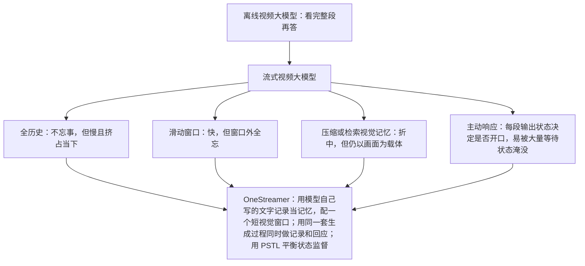
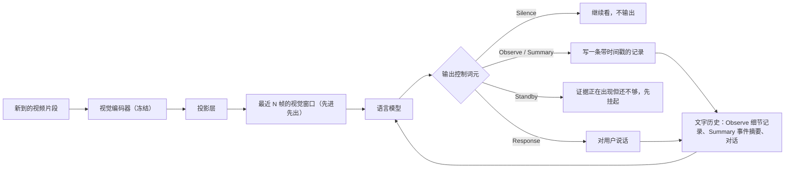
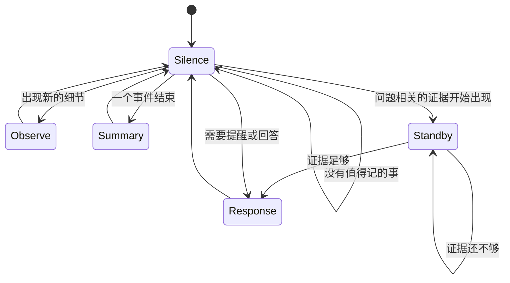
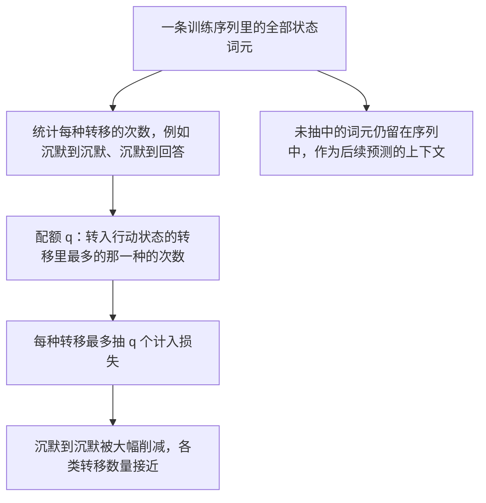
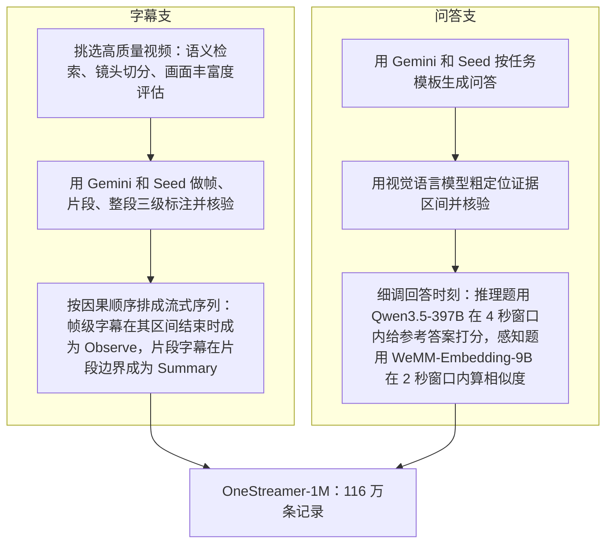

# OneStreamer：在流式视频交互中统一感知、记忆与主动响应

> **原题**：OneStreamer: Unifying Perception, Memory, and Proactive Response in Streaming Video Interaction
> **作者**：Xiangyu Zeng, Yuandong Yang, Zhiqiu Zhang, Yuhan Zhu, Xinhao Li, Qingyi Si 等 24 人，通讯作者 Limin Wang
> **机构**：南京大学、上海人工智能实验室、京东、上海交通大学、中国科学技术大学、中国科学院、香港中文大学、北京大学、清华大学、复旦大学、浙江大学
> **年份**：2026（arxiv ID 2610.01762）
> **分类**：cs.CV
> **链接**：https://arxiv.org/abs/2610.01762
> **精读日期**：2026-10-03

## 阅读须知

### 这篇在领域里的位置

视频大模型最常见的用法是「离线」的：把一整段拍好的视频交给模型，再提问题。这种设定下，模型在回答之前已经看完了全部画面，可以前后反复翻看。可是很多真实场景并不是这样。戴着智能眼镜做饭、看直播比赛、盯着监控画面，视频是一帧一帧源源不断进来的，用户可能随时提问，也可能希望模型在某件事发生的那一刻主动提醒。这一类任务叫流式视频理解，对应的模型叫流式视频大模型。

流式模型过去几年主要沿着两条线发展。一条线解决「记得住」：画面越积越多，上下文窗口装不下，于是有人保留全部历史、有人只留最近几秒、有人把旧画面压缩或存进外部库再检索。另一条线解决「什么时候开口」：模型不再等用户问完才答，而是每看一段就判断要不要说话。本文的位置在两条线的交汇处，它试图用同一套生成机制，同时完成「记录证据」和「适时回答」两件事。

### 读完能回答什么

1. 流式视频大模型为什么会陷入「保留历史」和「看清当下」的两难，全历史和滑动窗口各自坏在哪里。
2. OneStreamer 的分层字幕记忆是怎么做的，为什么用模型自己写的文字记录代替旧画面，能同时省显存又不丢历史。
3. 模型如何通过 Silence、Observe、Summary、Standby、Response 这几种控制词元，决定此刻是继续看、做笔记还是开口。
4. 为什么训练时如果把每个等待状态都算进损失，模型会学成「永远沉默」，PSTL 是怎样用 27.5% 的状态监督解决这个问题的。
5. 这个 40 亿参数的模型在八个流式基准上比基座和 110 亿参数的对手强多少，延迟和显存代价如何。

### 阅读前置

本笔记假定读者了解大语言模型的自回归生成、词元和上下文窗口的概念，也知道多模态大模型大致是「视觉编码器加投影层加语言模型」的结构。读者不必做过视频理解或流式系统，相关概念都会先铺垫再展开。

### 缩写表

- **VLM**（Vision-Language Model，视觉语言模型）：能同时处理图像或视频和文字的大模型。
- **PHCM**（Proactive Hierarchical Caption Memory，主动分层字幕记忆）：本文的记忆机制，让模型边看边写两种粒度的文字记录。
- **PSTL**（Proactive State Transition Learning，主动状态转移学习）：本文的训练技巧，按状态转移类型抽样监督控制词元。
- **FIFO**（First In First Out，先进先出）：只保留最近若干帧、旧帧依次丢弃的滑动窗口。
- **TTFT**（Time To First Token，首词元延迟）：从输入到模型吐出第一个输出词元所需的时间，是实时交互最直观的延迟指标。
- **QA**（Question Answering，问答）。
- **CE**（Cross-Entropy，交叉熵）：最常用的分类损失。
- **Focal**（Focal Loss，焦点损失）：一种给难分样本加大权重、缓解类别不平衡的损失。
- **ASI / EPM**：OVOBench 里「回溯」类任务的两个子项，考察模型能否回忆起早先出现过的内容。
- **OneStreamer-1M**：本文构建的流式视频交互数据集，含 116 万条训练记录。

## 一、问题

设想一个戴在头上的视觉助手。早上八点它看到你把钥匙放进了玄关第二个抽屉，当时没人问它；十点你出门前问「我钥匙放哪了」，它得答出来。下午你在厨房做菜，说「水开了提醒我」，它要在水沸腾的那一刻开口，而不是等你再问一遍。这两件事分别对应流式视频交互的两个核心难点：一是要在不知道将来会被问什么的情况下，把证据先存下来；二是要在证据刚刚足够时及时回应，既不能抢答，也不能拖延。

### 1.1 记忆的两难

流式模型最朴素的做法是把看过的每一帧都留在上下文里。这样不会忘事，但视频一长，视觉词元就会塞满上下文：本文在一段 360 秒的视频上测得，全历史需要 62,094 个上下文词元、25.18 GB 显存，首词元延迟 4.56 秒，根本谈不上实时。更隐蔽的问题是，大量旧画面会和当前画面争夺模型的注意力，反而让模型看不清眼下发生了什么。

另一个极端是只保留最近若干帧的滑动窗口，比如最近 16 帧。这样又快又省，但窗口外的事情就彻底忘了，被问到半小时前的事只能瞎猜。

介于两者之间的方案很多，例如把旧帧压缩成更少的词元，或者存进外部记忆库、需要时再检索。它们的共同点是记忆的载体仍然是视觉特征：压缩会丢细节，检索要额外计算，而且检索依赖问题本身，在问题出现之前无从判断该留什么。

### 1.2 开口时机的难题

流式交互的第二个难点是决定何时说话。主动响应的模型一般在每段新画面进来后，先输出一个「状态」，表示继续沉默还是开始回答。问题在于，在绝大多数时刻正确答案都是「继续等」：一段十分钟的视频里，真正需要开口的可能只有几个瞬间。如果训练时把每个时刻的状态都算进损失，模型会发现永远输出「沉默」就能拿到很低的损失，于是学成一个从不开口的哑巴。本文的实验正好印证了这一点，后面会看到具体数字。

### 1.3 前人路线与本文的切入点

本文的切入点是换掉记忆的载体。与其把旧画面以某种形式留着，不如让模型在看的时候就把要紧的事情写成带时间戳的文字，旧画面看完即丢，文字留下。文字比画面紧凑得多，而且一旦写下，就不依赖将来的问题。这样一来，「记录」和「回答」变成了同一种动作：都是在合适的时刻生成一段文字，区别只在于这段文字是写给自己的笔记，还是说给用户的话。

## 二、方法

### 2.1 整体结构

OneStreamer 以 Qwen3-VL-4B-Instruct 为基座，结构仍是视觉编码器加投影层加语言模型。视频被切成按时间排列的小片段逐段送入，视觉编码器把每段画面编码成视觉词元，投影层把它们映射到语言模型的表示空间。

与普通模型不同的是上下文的组织方式。上下文里同时放着两样东西：一是最近若干帧的视觉词元，用先进先出窗口维护，新帧进来、最老的帧出去；二是一条持续增长的文字历史，里面是模型此前写下的所有记录，以及与用户的对话。视觉部分负责看清当下，文字部分负责记住过去。

### 2.2 控制词元：一个小小的状态机

每当一段新画面进来，模型都要先输出一个控制词元，相当于给自己下一个指令。本文定义了五种：

- **Silence**：什么也不写，继续观察。
- **Observe**：写一条局部细节记录，描述刚刚看到的物体、动作、场景和状态变化。
- **Summary**：一个事件刚刚结束，写一条概括这件事的摘要。
- **Standby**：只在问答任务中使用，表示相关证据已经开始出现，但还不足以回答，先挂起等待。
- **Response**：生成用户能看到的回答或任务输出，比如提醒、计数结果。

这五种词元把「记录」和「回答」放进了同一个生成过程。模型并没有单独的记忆模块或单独的触发器，它只是在每个时刻决定下一个词元是什么，而 Observe 和 Summary 之后跟着的文字会被追加进文字历史，成为日后回答问题时可以引用的事实。

### 2.3 PHCM：分层字幕记忆

PHCM 就是上一节里 Observe 和 Summary 两种记录的总称。它的「分层」体现在两种记录的粒度不同。Observe 记录密而细，每隔一两秒就可能写一条，记下诸如「左手把红色杯子放到水槽边」这样的细节。Summary 记录疏而概括，在一个完整事件结束时写一条，比如「洗完了三个杯子，开始擦桌子」。

两种记录都带着时间戳，并且都在支撑它们的画面已经看完之后才写，所以不会出现「还没看到就先写」的情况。推理时，模型面对的上下文是「最近一小段清晰的画面，加上一长串自己写过的笔记」。被问到很久以前的事，它查的是笔记，而不是去翻旧画面。

训练时，这些笔记本身就是监督目标。数据里事先标好了每个时刻该写什么，模型在「只看过视频前缀」的条件下学习写出它们。这一点很关键：它教会模型在不知道将来问题的情况下，主动挑出值得记的东西。

这种做法带来的效率差异非常明显。在同一段 360 秒视频上，PHCM 的上下文只有 4,308 个词元，比全历史少 93.1%；显存 9.98 GB，比全历史少 60.4%；首词元延迟 0.124 秒，和只用 16 帧窗口的 0.094 秒相差无几。整段视频里模型一共写了 26 条细节记录和 2 条事件摘要，每次更新平均耗时 0.636 秒，低于每秒一帧的输入间隔，所以能跟得上实时视频。

### 2.4 PSTL：让模型不至于学成哑巴

第一节说过，状态监督的最大问题是「等待」压倒一切。PSTL 的做法分两部分理解。

第一部分是「保留所有输出锚点」。所谓输出锚点，是每段画面之后模型需要给出状态的位置。PSTL 不删除任何一个锚点，所有控制词元仍然留在训练序列里，供后面的预测作为上下文，只是并非每个都计入损失。

第二部分是「按转移类型抽样」。它先统计相邻两个状态之间的转移，记 $n_{X\to Y}$ 为从状态 $X$ 转到状态 $Y$ 的次数，例如 Silence 转 Silence、Silence 转 Response。然后取一个配额：

$$q = \max_{X}\ \max_{a\in\mathcal{A}_\tau} n_{X\to a}$$

这里 $\mathcal{A}_\tau$ 是当前任务里表示「采取行动」的那些状态，比如记录或回答。直观地说，$q$ 等于「转入某个行动状态」这类转移里最多的那一种的次数。

接着，对每一种转移类型，最多只保留 $q$ 个词元参与状态损失，从中不放回地均匀抽取：

$$|\mathcal{I}_{X\to Y}| = \min\left(n_{X\to Y},\ q\right)$$

于是，原本占绝大多数的「沉默转沉默」被削减到和「转入行动」大致相当的数量；而「状态发生变化」和「状态保持不变」两类样本都留有代表。未被抽中的控制词元仍然留在序列里，只是不贡献损失。结果是，模型在训练中看到的「该沉默」和「该行动」的例子数量接近，不再有一边倒的捷径可走。按论文统计，这样只监督了全部状态词元中的 27.5%。

### 2.5 数据：OneStreamer-1M

这样的训练需要大量「带时间对齐」的数据：每条记录、每个回答都要落在证据刚好充足的那一刻。现成数据集很少满足这一点，于是作者搭建了一条合成流水线，分字幕和问答两支。

问答支第三步的「细调回答时刻」值得一提。原始标注的回答时间点往往偏晚，因为标注者通常在事件完全结束后才标。作者用一个大模型逐段评估「在这个时刻、凭这几秒画面，参考答案有多可信」，把回答时刻往前挪到证据刚好足够的位置，平均提前了 13.72 秒。这直接决定了模型学到的开口时机是「及时」还是「迟钝」。

最终数据集共 1,160,004 条记录，分四类：主动字幕记忆 6 万条，主动交互（连续描述、提醒、计数）271,570 条，主动问答 197,584 条，感知与记忆问答 630,850 条，后者包括清洗过的开源数据。

### 2.6 训练配置

模型从 Qwen3-VL-4B-Instruct 初始化，冻结视觉编码器，训练投影层和语言模型。数据为 OneStreamer-1M 加上离线的 LLaVA-Video，共载入 991,773 个样本，打包成 150,261 条序列，最长 131,072 个词元。帧率在每秒 1 到 4 帧之间动态采样，单条序列最多 2,048 帧。优化器为 AdamW，峰值学习率 $1\times10^{-5}$，余弦退火、3% 预热，全局批大小 128，训练一个轮次共 1,174 步，使用 32 张 NVIDIA H200 显卡。

## 三、实验

### 3.1 评测设置

评测分两组共八个基准。感知与记忆组包括 OVOBench、StreamingBench（实时子集）、OVBench 和 ODVBench，考察模型能否看清当下、回忆过去、跟上事件。主动响应组包括 ProactiveVQA、OmniMMI、OVO-Timing 和 ViSpeak，考察模型能否在恰当时刻主动开口。

### 3.2 主要结果

| 方法 | 规模 | OVOBench | StreamingBench 实时 | OVBench | ODVBench | ProactiveVQA | OmniMMI | OVO-Timing | ViSpeak |
|---|---|---|---|---|---|---|---|---|---|
| Qwen3-VL（基座） | 4B | 58.8 | 81.8 | 55.4 | 57.6 | 34.3 | 29.4 | 29.4 | 2.41 |
| MOSS-VL-Realtime | 11B | 70.2 | 82.9 | 53.7 | 63.9 | 47.2 | 32.7 | 38.5 | 2.48 |
| **OneStreamer** | **4B** | **72.1** | **86.9** | **66.8** | **71.3** | **48.7** | **36.6** | **41.6** | **2.87** |

相对同尺寸的基座，四个感知与记忆基准分别提升 13.3、5.1、11.4 和 13.7 分；主动响应组的提升同样明显，ProactiveVQA 从 34.3 升到 48.7。与参数量接近三倍的 MOSS-VL-Realtime 相比，OneStreamer 在八个基准上全部领先。ViSpeak 一列是打分制，数值尺度与其他列不同。

### 3.3 记忆方式的对比

| 记忆方式 | 是否保留字幕 | OVOBench 回溯 ASI | OVOBench 回溯 EPM | StreamingBench 实时 |
|---|---|---|---|---|
| 全历史画面 | 否 | 67.6 | 63.0 | 80.5 |
| 最近 16 帧 | 否 | 63.5 | 62.0 | 86.3 |
| **PHCM** | **是** | **71.6** | **62.6** | **86.9** |

这张表里藏着一个反直觉的结果：保留全部历史画面，实时感知反而最差，只有 80.5 分，比只留 16 帧的 86.3 分低了将近 6 分。也就是说，记得越多，看得越不清楚，大量旧画面确实在干扰模型对当下的判断。

PHCM 则两头兼顾。实时感知和 16 帧窗口持平略高，回溯任务 ASI 从 63.5 升到 71.6，甚至超过了全历史的 67.6。EPM 一项上全历史仍略好，说明有些细节确实只存在于画面里，没被写进笔记。

### 3.4 状态监督方式的对比

| 监督方式 | 参与损失的状态词元比例 | ProactiveVQA | OmniMMI | OVO-Timing |
|---|---|---|---|---|
| 全部状态词元，交叉熵 | 100% | 26.1 | 30.8 | 1.5 |
| 全部状态词元，焦点损失 | 100% | 47.0 | 32.8 | 26.5 |
| **PSTL** | **27.5%** | **48.7** | **36.6** | **41.6** |

第一行是第一节预言的那个哑巴：用普通交叉熵监督所有状态，OVO-Timing 只有 1.5 分，模型几乎从不在该开口的时候开口。焦点损失通过给难样本加权缓解了一部分，但 OVO-Timing 仍只有 26.5。PSTL 只用了四分之一出头的监督，三个基准全部最好，OVO-Timing 达到 41.6。这说明问题的关键不在于监督多少，而在于监督的分布是否均衡。

### 3.5 效率

| 记忆方式 | 显存 | 上下文词元 | 首词元延迟 |
|---|---|---|---|
| 全历史画面 | 25.18 GB | 62,094 | 4.560 秒 |
| 最近 16 帧 | 9.69 GB | 3,036 | 0.094 秒 |
| **PHCM** | **9.98 GB** | **4,308** | **0.124 秒** |

以上在单张 H200 上、对一段 360 秒的 OVOBench 视频测得。PHCM 只比纯滑动窗口多出约 1,300 个词元和 0.3 GB 显存，换来了跨越整段视频的记忆。

## 四、局限

### 4.1 作者承认的局限

作者指出，回答时刻的细调并不总能找到最早可以作答的那一刻。用大模型逐段打分来定位「证据刚好足够」，本身就是一种近似，作者的说法是它在及时性和证据充分性之间取得了较好的折中，而不是最优解。

### 4.2 读完能看出的问题

第一，笔记写错了会一直错下去。PHCM 用模型自己写的文字代替旧画面，旧画面一旦丢弃就无法回查。如果某条 Observe 记录有误，比如把钥匙记进了错误的抽屉，这条错误会作为「事实」留在上下文里，影响之后所有相关回答。论文没有报告记录本身的准确率，也没有讨论纠错机制。

第二，没写进笔记的细节就彻底丢了。模型只记它认为值得记的东西，而「值得记」是从训练数据里学来的偏好。用户事后问到一个当时看起来无关紧要的细节，模型很可能答不出。记忆对比表里 EPM 一项全历史仍略优，就是这类损失的迹象。

第三，监督信号高度依赖闭源或超大模型。字幕和问答由 Gemini 和 Seed 生成，回答时刻用 Qwen3.5-397B 校准，模型学到的「记什么」「何时说」在很大程度上继承了这些教师模型的判断和偏差，复现时也难以获得同样的标注。

第四，验证范围和部署条件有限。论文只训练了 40 亿参数一个规模，主要对照只有基座和 MOSS-VL-Realtime 两个模型，延迟测在数据中心级的 H200 上，而这类应用的目标设备往往是眼镜或手机。另外，每秒 1 到 4 帧的采样对于转瞬即逝的动作可能不够密。

## 一句话

让流式视频模型边看边写带时间戳的笔记代替旧画面，并均衡训练沉默与开口，用 4B 模型兼得记忆、实时与及时响应。
