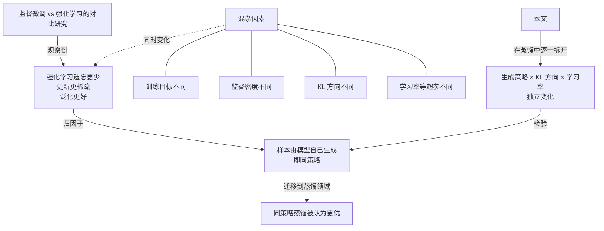
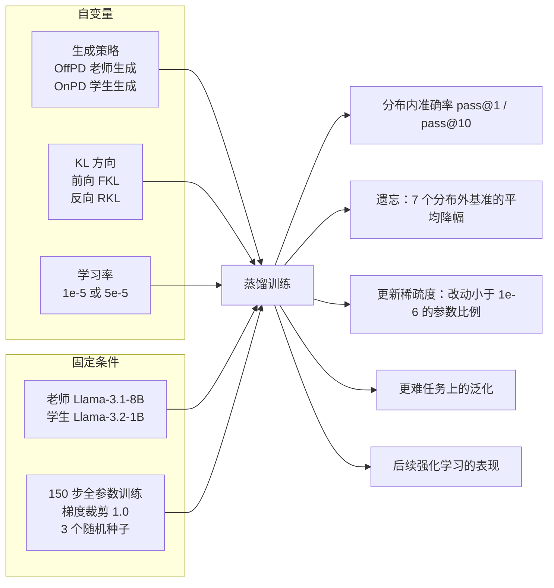
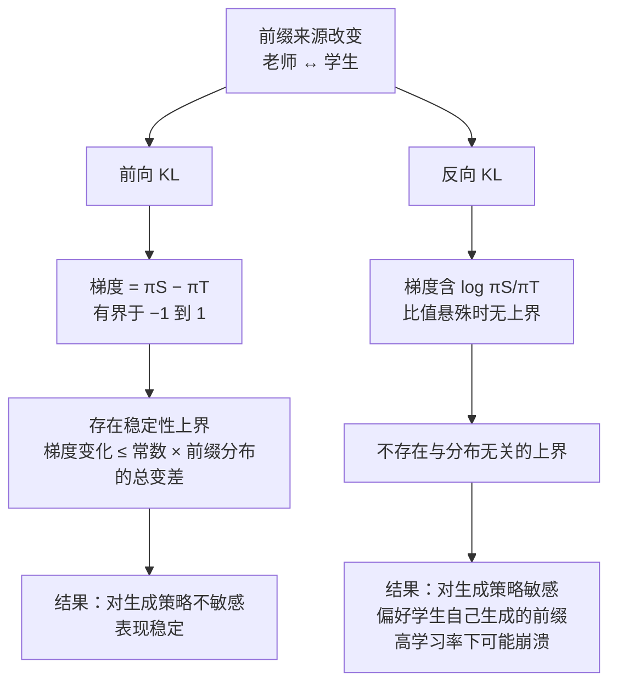
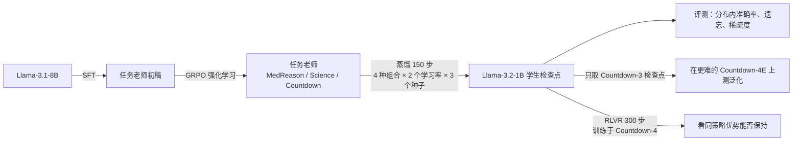

# 同策略还是异策略？蒸馏动力学的系统研究

> **原题**：On-Policy or Off-Policy Learning? A Systematic Study of Distillation Dynamics
> **作者**：Julianna Piskorz, Antonin Berthon, Mihaela van der Schaar
> **机构**：剑桥大学（University of Cambridge）
> **年份**：2026（arxiv ID 2609.35259，2026 年 9 月 28 日提交）
> **分类**：cs.LG
> **链接**：https://arxiv.org/abs/2609.35259
> **精读日期**：2026-10-04

## 阅读须知

### 这篇在领域里的位置

过去两年，大语言模型的后训练（post-training）里流行着一种说法：用模型自己生成的样本来训练，也就是所谓的「同策略」学习，比直接模仿现成答案要好。支持这种说法的证据大多来自监督微调与强化学习的对比，研究者观察到强化学习之后的模型遗忘得更少，参数改动更稀疏，泛化也更好，于是把功劳记在「样本是模型自己生成的」这一点上。

与此同时，知识蒸馏领域也出现了同样的趋势。从 2023 年谷歌提出的广义知识蒸馏开始，到 2025 年前后各家实验室推广的「同策略蒸馏」，大家普遍认为让学生模型在自己生成的文本上向老师学习，效果优于在老师生成的文本上学习。这篇论文位于这条脉络的反思一侧：它不提出新方法，而是设计一个能把各个因素拆开的受控实验，检验「同策略本身」究竟贡献了多少。

### 读完能回答什么

1. 为什么监督微调与强化学习的对比，不能直接证明「同策略样本」是收益的来源？
2. 在蒸馏里，生成样本的策略、KL 散度的方向、学习率这三个因素，各自主要影响哪一项结果？
3. 为什么前向 KL 对样本来自谁几乎不敏感，而反向 KL 却很敏感？从梯度的形式上怎样解释？
4. 同策略样本在什么场景下确实有用，这份优势又为什么在后续的强化学习之后不一定保得住？
5. 如果要在实际工作中做小模型蒸馏，这篇论文给出的默认选择是什么？

### 阅读前置

本文假定读者熟悉 Transformer 语言模型的基本训练流程，知道交叉熵损失、softmax 与对数概率是什么，也了解监督微调和强化学习在后训练中的大致角色。读者未必专门做过知识蒸馏，也未必熟悉 KL 散度两个方向的差别，这些内容会在正文里从头铺垫。

### 首次出现的缩写表

| 缩写 | 全称与解释 |
|---|---|
| KL | Kullback-Leibler divergence，KL 散度，衡量两个概率分布差异的一种非对称度量 |
| FKL | Forward KL，前向 KL，以老师分布为基准衡量学生，倾向于「覆盖」老师的所有可能 |
| RKL | Reverse KL，反向 KL，以学生分布为基准衡量，倾向于「抓住」老师最主要的那个模式 |
| OnPD | On-Policy Distillation，同策略蒸馏，训练样本由学生自己生成 |
| OffPD | Off-Policy Distillation，异策略蒸馏，训练样本由老师生成并固定下来 |
| SFT | Supervised Fine-Tuning，监督微调 |
| RL | Reinforcement Learning，强化学习 |
| RLVR | Reinforcement Learning with Verifiable Rewards，基于可验证奖励的强化学习，奖励来自答案能否被程序判定正确 |
| GRPO | Group Relative Policy Optimization，组相对策略优化，一种以同一问题多次采样的组内平均作为基线的强化学习算法 |
| ID / OOD | In-Distribution / Out-of-Distribution，分布内与分布外 |
| pass@k | 对同一道题采样 k 次，至少一次答对的比例 |
| LR | Learning Rate，学习率 |

## 一、问题

小模型蒸馏是今天大模型落地时绕不开的一步。一个八十亿参数的模型推理成本太高，团队往往希望把它的本事搬到十亿参数的小模型上，放到手机或者便宜的服务器里运行。于是「怎样蒸馏」就成了一个有实际分量的工程问题：选错了做法，小模型要么学不会，要么学会了新任务却把原来会的东西忘掉，后者通常被称为灾难性遗忘。

近两年业界对这个问题的主流回答是「同策略更好」。这种观点的源头之一，是一系列监督微调与强化学习的对比研究：它们发现强化学习之后的模型遗忘更少，只改动了一小部分参数，在没见过的题目上表现也更稳。研究者把这些好处归因于强化学习的样本来自模型自身，这个结论随后被搬到了蒸馏里，成为推广同策略蒸馏的理论依据。

问题在于，监督微调与强化学习之间的差别远不止「样本由谁生成」这一项。两者的训练目标不同，一个是逐字模仿，一个是最大化奖励；监督信号的密度也不同，一个逐词给出正确答案，一个只在整段回答结束后给一个分数；优化过程和超参数更是各不相同。于是，即使观察到了遗忘更少，我们也无法判断这究竟来自同策略样本，还是来自其他某个同时改变的因素。

### 前人路线与它们的局限

为了把问题讲清楚，先介绍蒸馏的基本形式。知识蒸馏要做的事情，是让学生模型在每一个位置上输出的下一词分布尽量接近老师模型的分布。具体而言，给定一个问题和一段已经写出的前缀，老师和学生各自给出下一个词的概率分布，训练目标就是缩小这两个分布之间的距离，再把所有位置的距离平均起来。

这里有两个独立的设计选择。第一个选择是前缀从哪里来：如果前缀是老师预先写好的，就叫异策略蒸馏；如果前缀是学生在训练过程中自己现场生成的，就叫同策略蒸馏。第二个选择是用哪种距离来衡量两个分布，最常见的是 KL 散度，而 KL 散度有前向和反向两个方向，性质截然不同。

前人的工作通常把这两个选择捆绑在一起。经典的序列级蒸馏用老师生成的文本加前向 KL，本质上就是在老师答案上做监督微调；而同策略蒸馏的代表性做法，例如广义知识蒸馏与 MiniLLM 一类方法，往往搭配反向 KL。这样一来，「同策略」和「反向 KL」两个因素被混在了一起，观察到的差异到底来自哪一个，同样说不清。



这篇论文要回答的技术问题因此可以表述得很具体：在老师、学生、数据和训练步数都固定的蒸馏实验里，只改变前缀由谁生成，任务准确率、遗忘程度、参数更新的稀疏度和泛化能力会不会出现系统性的差异？如果出现了，它们与 KL 方向、学习率相比又占多大分量？

## 二、方法

这篇论文的贡献不是一个新算法，而是一个把因素拆开的实验框架，外加一套解释实验现象的梯度分析。下面先介绍统一的训练目标，再介绍作者如何让「生成策略」变成一个可以连续调节的旋钮，最后介绍梯度分析。

### 统一的蒸馏目标

作者把所有配置写进同一个损失函数里：

$$
\mathcal{L}(\theta) = \mathbb{E}_{x \sim p_{data}}\ \mathbb{E}_{y \sim \rho(\cdot|x)} \left[ \frac{1}{L_y} \sum_{n=1}^{L_y} \mathcal{D}\big(\pi_S^\theta(\cdot|x,y_{<n}) \,\|\, \pi_T(\cdot|x,y_{<n})\big) \right]
$$

公式里每个符号的含义如下。

- $x$：一道题目，从训练数据分布 $p_{data}$ 中抽取。
- $y$：一段回答，由生成策略 $\rho$ 采样得到，长度为 $L_y$ 个词。
- $\rho$：生成策略，也就是「前缀由谁来写」。这是本文最关心的变量。
- $\pi_S^\theta$：学生模型给出的下一词分布，$\theta$ 是学生的参数。
- $\pi_T$：老师模型给出的下一词分布，训练中保持不变。
- $\mathcal{D}$：衡量两个分布距离的函数，本文取前向 KL 或反向 KL。

在这个统一写法里，异策略蒸馏对应 $\rho = \pi_T$，即用老师预先生成并固定下来的回答；同策略蒸馏对应 $\rho = \pi_S^\theta$，即用学生当前的参数现场生成回答，梯度不穿过采样这一步。

### 两个 KL 方向

KL 散度之所以有两个方向，是因为它不对称。前向 KL 以老师分布为权重，在老师认为可能的每个词上，惩罚学生给的概率太低；换句话说，它要求学生「覆盖」老师的全部可能，因而被称为模式覆盖型。

反向 KL 则以学生分布为权重，在学生自己认为可能的词上，惩罚老师认为不太可能的那些；于是学生会倾向于集中到老师最主要的那个模式上，被称为模式寻求型。这一差别在后面解释实验现象时会反复出现。

本文的关键设计在于，把生成策略和 KL 方向这两个原本捆绑的选择拆开，得到四种组合：异策略加前向 KL、异策略加反向 KL、同策略加前向 KL、同策略加反向 KL。再乘上两个学习率，每个组合跑三个随机种子，就构成了主实验的网格。



### 让生成策略连续可调

只比较「全老师」和「全学生」两个端点，信息还不够。作者因此构造了一条从老师到学生的连续谱。做法是在每一个位置上，把老师和学生的对数概率按一个参数 $\lambda$ 混合，再经过 softmax 得到用于采样的分布：

$$
(z_\lambda)_v = \tfrac{1}{2}\big(\log \pi_S(v) + \log \pi_T(v)\big) + \tfrac{\lambda}{2}\big(\log \pi_S(v) - \log \pi_T(v)\big), \qquad \pi_\lambda(v) = \mathrm{softmax}(z_\lambda)_v
$$

这里 $v$ 是词表里的一个词，$z_\lambda$ 是混合后的对数几率。当 $\lambda = -1$ 时，第二项正好抵消学生，只剩老师，于是退化为异策略；当 $\lambda = 1$ 时只剩学生，退化为同策略；$\lambda = 0$ 则是两者对数概率的平均。作者还尝试了 $\lambda$ 超出区间两端的外推，并加上了对数比裁剪和可信度掩码，防止采到荒唐的词。

### 梯度分析：为什么两个方向反应不同

为了解释后面的实验现象，作者分析了两种 KL 对学生输出层对数几率的梯度。对前向 KL 而言，关于第 $v$ 个词的对数几率，梯度系数就是两个概率之差：

$$
\frac{\partial D_{\text{F-KL}}}{\partial z_v} = \pi_S(v) - \pi_T(v) \in [-1, 1]
$$

这个量天然有界，不会因为某个词的概率极小而突然变得很大。作者在附录中据此证明了一个「生成策略稳定性上界」：两种生成策略产生的前向 KL 更新之差，最多与它们诱导的前缀分布之间的总变差距离成正比。换句话说，前缀稍有不同，梯度也只会稍有不同。

反向 KL 的梯度系数则是：

$$
\frac{\partial D_{\text{R-KL}}}{\partial z_v} = \pi_S(v)\left[\log\frac{\pi_S(v)}{\pi_T(v)} - D_{\text{R-KL}}\right]
$$

其中包含一个对数比值。当学生在某个前缀上给某个词的概率，与老师给的概率相差悬殊时，这个比值可以变得非常大，梯度也就没有上界。作者指出，反向 KL 不存在与分布无关的稳定性上界，因此它对「前缀由谁写」会敏感得多。



这套分析也给出了一个直观理解：反向 KL 只在学生自己认为可能的词上施加压力，如果前缀是老师写的，学生面对的很可能是自己从未走到过的地方，概率比值容易极端，于是训练更不稳；如果前缀是学生自己写的，情况正好相反。这正是同策略与反向 KL 被经典方法配成一对的原因。

### 训练流程

整个实验分成三段。第一段先造出老师：每个任务单独训练一个八十亿参数的老师，先做监督微调，再用组相对策略优化做强化学习，保证老师和学生之间有足够的能力差距。第二段是本文的主体，即在各种配置下把老师蒸馏到十亿参数的学生上。第三段只用于回答「同策略的泛化优势能否保持」，即拿蒸馏后的检查点继续做强化学习。



## 三、实验

### 设置

主实验的老师是 Llama-3.1-8B，学生是 Llama-3.2-1B；作者另用 Qwen2.5-7B 蒸馏到 Qwen2.5-1.5B 做了验证。任务有三类：医学推理数据集 MedReason、科学推理任务 Science，以及算术游戏 Countdown。Countdown 要求用给定的几个数字通过四则运算凑出目标数，三个操作数的版本称为 Countdown-3，四个操作数的更难版本用来测试泛化。

训练统一跑 150 步全参数微调，学习率取 1e-5 或 5e-5，梯度范数裁剪到 1.0，每个配置三个随机种子，KL 在整个词表上精确计算。遗忘程度用七个分布外基准的平均分降幅衡量，更新稀疏度则统计改动绝对值小于 1e-6 的参数占比。

### 主要结果

| 观察维度 | 主导因素 | 关键数字 |
|---|---|---|
| 分布内任务准确率 | KL 方向 | 同策略最佳平均 72%，异策略 73%，几乎相同；前向 KL 在各策略和学习率下稳定在 71% 至 73%，反向 KL 在 35% 至 72% 之间大幅波动 |
| 灾难性遗忘 | 学习率 | 学习率 1e-5 时分布外平均降幅不超过 1.3 个百分点；5e-5 时降幅达 11.2 至 14.0 个百分点；异策略在几乎每组对比中遗忘略少，但差距远小于学习率的影响 |
| 参数更新稀疏度 | 学习率 | Countdown-3 上低学习率时稀疏度为 85.3% 至 89.6%，高学习率时降到 51.9% 至 60.0%，且随学习率近似线性下降 |
| 生成策略连续谱上的稳定性 | KL 方向 | 前向 KL 在整条谱上都高于 80%，学习率 1e-5 时最大差距仅 5.2 个百分点；反向 KL 的均值随 λ 大幅变化、种子间方差大，偏好学生生成的前缀 |
| 更难任务的泛化 | 生成策略 | 从 Countdown-3 迁移到更难的四操作数版本，λ 从 −1 走到 1，pass@1 提升 10% 至 15%，两种 KL 方向都如此 |
| 输出覆盖 | KL 方向 | 在 pass@1 相近时，前向 KL 的 pass@10 明显更高 |
| 后续强化学习 | KL 方向与学习率 | 反向 KL 检查点起步快但出现奖励崩溃；异策略加前向 KL、学习率 1e-5 的检查点稳步上升，最终最高 |

这张表可以浓缩成一句话：三个因素各管一摊。KL 方向决定任务表现和输出的多样性，学习率决定遗忘和参数改动的范围，生成策略只在一个特定场景下明显起作用，那就是向更难的题目泛化。

```mermaid
graph LR
    K[KL 方向] -->|主要决定| A1[分布内准确率]
    K -->|主要决定| A2[输出覆盖 pass@10]
    K -->|主要决定| A3[对生成策略的敏感度]
    L[学习率] -->|主要决定| B1[灾难性遗忘]
    L -->|主要决定| B2[参数更新稀疏度]
    R[生成策略] -->|明显作用| C1[向更难任务泛化<br/>pass@1 +10% 至 15%]
    R -.->|作用很小| A1
    R -.->|作用很小| B1
    C1 -.->|经过 RLVR 后不一定保持| D[最终表现]
```

### 反直觉的结果

第一个反直觉之处在于遗忘。社区里流行的说法是「同策略学习遗忘更少」，而本文的数据显示，在同等条件下异策略在几乎每组对比里遗忘反而略少。真正左右遗忘的是学习率：把学习率从 1e-5 提到 5e-5，遗忘从一个百分点左右跳到十几个百分点，生成策略的差别与之相比几乎可以忽略。

参数更新稀疏度也是同样的情形。此前有研究观察到强化学习只改动一小部分参数，并把它归因于同策略样本；本文发现稀疏度随学习率近似线性变化，换句话说，所谓的「稀疏更新」更像是小学习率的副产品，而不是同策略的特有性质。

第二个反直觉之处在于后续强化学习。同策略样本在更难任务上的泛化确实更好，这是全文唯一一处同策略明显占优的地方。然而，当作者拿这些检查点在 Countdown-4 上继续做 300 步基于可验证奖励的强化学习时，最终表现最好的反而是异策略加前向 KL 的检查点，尽管它们起步时在 Countdown-4 上的准确率更低。

对这一现象，作者的解释与输出覆盖有关。前向 KL 训练出的学生保留了更宽的输出分布，pass@10 更高，强化学习因此有更多样的正确样本可以强化；反向 KL 训练出的学生输出更集中，强化学习初期进步快，但很快陷入奖励崩溃。由此可见，蒸馏阶段的单点准确率并不能完整预测它作为强化学习起点的价值。

第三个有意思的现象出现在附录的风格迁移实验里。作者让老师带上用西班牙语回答的风格，再观察学生是否被「顺带」学走。结果只有同策略加反向 KL 的组合基本保留了学生原本的英语风格，其余组合几乎完全转成了西班牙语。作者的解释是，模式寻求的反向 KL 只需要在学生自己的英语前缀上匹配老师的英语续写模式，不必覆盖老师的西班牙语可能，因而较少夹带老师的附带风格。

### 稳健性检查

作者用三组附加实验检验结论是否依赖特定设置。第一组去掉梯度裁剪：反向 KL 的表现明显恶化，前向 KL 在较大学习率下依然有效，同策略与异策略之间仍然没有稳定的差距，遗忘和稀疏度仍由学习率决定。

第二组把精确的全词表 KL 换成采样估计的 KL，结论保持不变：前向 KL 依旧对生成策略不敏感，反向 KL 依旧敏感。第三组换成推理链更长的 Numina-MATH 数据，平均回答长度 622 个词，而主实验任务只有 94 到 135 个词；这时同策略加反向 KL 在 MATH-500 上取得最高准确率，提示同策略在需要长推理的任务上可能更有用。不过这一组每个条件只跑了一次，作者也只把它当作提示性的证据。

## 四、局限

### 作者承认的局限

作者首先承认模型规模有限。实验中的学生只有十亿到十五亿参数，老师在八十亿参数左右，结论是否适用于数百亿参数的学生、以及更大的老师学生差距，目前没有证据。

其次是任务长度。主实验的回答都很短，最长的设置也只要求两千词以内的推理链；而长推理链恰恰是唯一一处同策略似乎占优的场景，且那组实验每个条件只有一次运行。作者把扩展到更长的推理任务列为未来工作。

最后，每个任务只用了一个固定的老师。不同的老师学生组合之间，同策略与异策略的差异会不会显现出来，作者表示有待进一步研究。

### 读者能看出来的潜在问题

从读者的角度看，训练步数只有 150 步，属于很短的蒸馏。同策略方法的一个常见论点是它能纠正学生在长期训练中逐渐累积的偏差，也就是暴露偏差，这种效应在短训练中可能还来不及显现，因此「生成策略不重要」的结论最好理解为在短期、小模型的范围内成立。

其次，遗忘只用七个分布外基准的平均分降幅来衡量，正文没有逐一列出这七个基准，读者难以判断它们是否覆盖了实际部署中最在意的能力，例如指令遵循或多轮对话。平均值也可能掩盖个别能力的大幅下降。

再次，后续强化学习的实验只在 Countdown 这一个算术任务上进行，奖励信号干净、答案唯一；在医学或开放式推理这类奖励更嘈杂的任务上，「前向 KL 起点更适合强化学习」的结论是否成立，仍需验证。

最后需要说明的是，这篇论文的结论是对一种流行观点的修正，而不是对同策略方法的否定。它告诉我们的是：同策略的价值取决于目标函数、评测场景和优化超参数，工程上做蒸馏时，应当把异策略加前向 KL 作为必须对比的基线，并把学习率当作控制遗忘的第一旋钮。

## 一句话

在受控蒸馏实验中，KL 方向决定效果、学习率决定遗忘，同策略样本只对更难任务的泛化有明显帮助。
