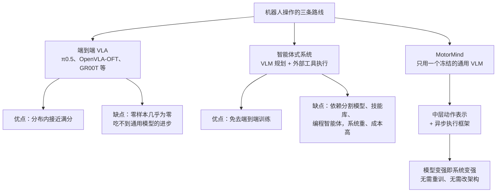
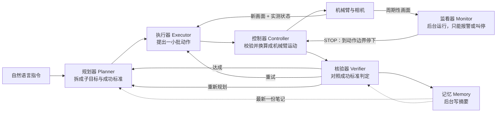
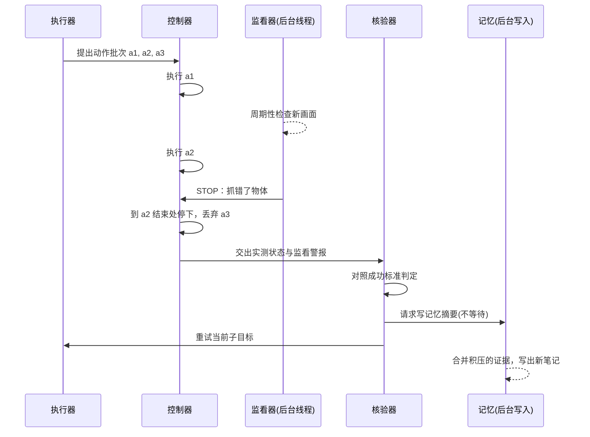
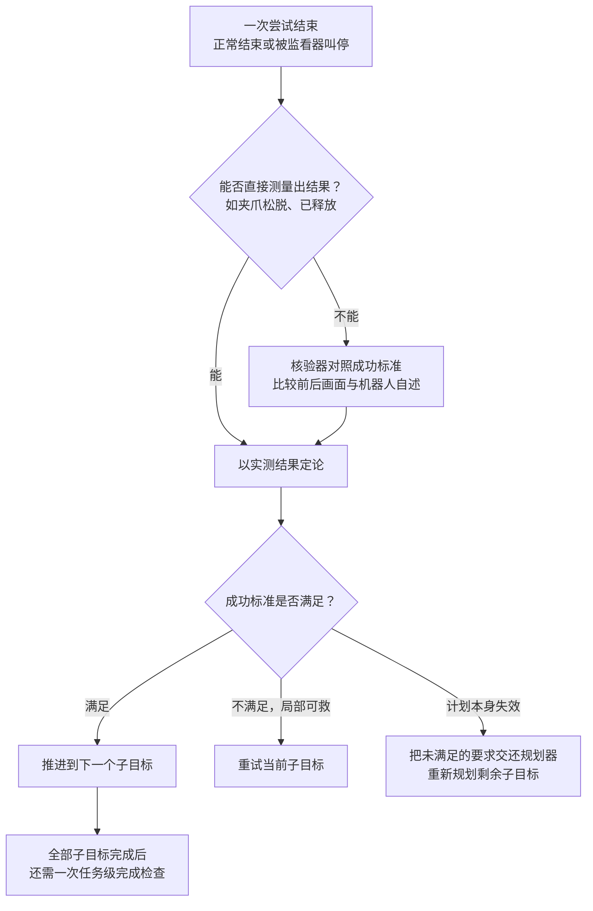
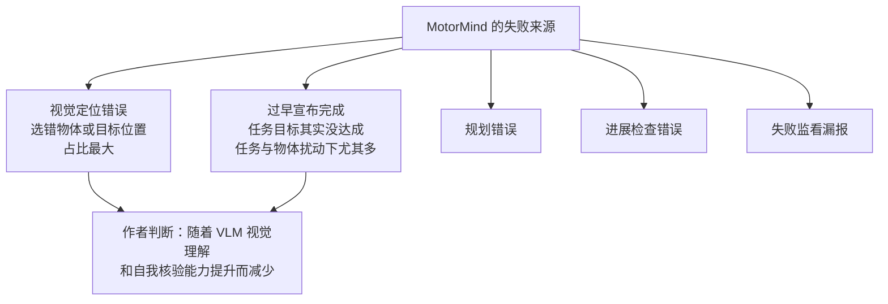

# MotorMind：给通用视觉语言模型搭一副脚手架，让它零样本操控机械臂

> **原题**：MotorMind: Scaffolding General Vision Language Models for Zero-Shot Robot Manipulation
> **作者**：Bingxuan Li, Siqi Song, Yizhuo Wu, Jiarui Yao, Tong Zhang, Huan Zhang
> **机构**：University of Illinois Urbana-Champaign
> **年份**：2026（arxiv ID 2609.38078）
> **分类**：cs.RO
> **链接**：https://arxiv.org/abs/2609.38078
> **精读日期**：2026-10-05

## 阅读须知

### 这篇在领域里的位置

让机器人听懂一句话并动手完成，是具身智能这几年最热的方向之一。这条路上的主流做法是视觉语言动作模型：它把相机画面和文字指令一起送进一个大模型，直接输出机械臂下一步该怎么动。从 RT-2 到 OpenVLA，再到 π0 与 π0.5，这类模型在训练过的任务上已经相当可靠，但它们离不开大量机器人示范数据，换一个桌面布局、换一种物体，常常就要重新收数据、重新微调。

与之并行的另一条路线叫作「智能体式机器人」。它不训练动作模型，而是让通用的视觉语言模型负责想清楚该做什么，再把感知、抓取点定位、轨迹规划这些具体活交给外部工具，例如分割模型、技能库、运动规划器，或者干脆让编程智能体现写控制代码。这条路线绕开了数据饥渴的问题，代价是系统越搭越重，每加一个外部模块就多一个出错点。

MotorMind 站在第二条路线上，但往回收了一大步：它不要外部分割模型，不要编程智能体，也不要训练过的动作专家，只让一个冻结的通用视觉语言模型自己看、自己动、自己检查。论文的主张是，只要把机械臂的动作用合适的抽象层级暴露给模型，再配上一套能边执行边监看的调度框架，通用模型本身就足以在没见过的任务上完成相当比例的操作。

### 读完能回答什么

1. 为什么在零样本设定下，端到端的视觉语言动作模型几乎全军覆没，而一个不做任何机器人训练的通用模型反而能做到六成以上的成功率？
2. MotorMind 所说的「中层动作表示」具体是什么，它为什么比让模型直接输出关节角或者让模型写代码更合适？
3. 五个推理角色（规划、执行、监看、核验、记忆）共用同一个模型，它们之间靠什么分工，为什么监看和记忆要放到后台异步运行？
4. 消融实验里去掉哪个环节代价最大，这说明了这类系统的成败主要系于哪里？
5. 剩下的失败集中在哪几类，为什么作者认为这些问题会随着基础模型变强而自然缓解？

### 阅读前置

假定读者熟悉大语言模型与多模态模型的基本用法，知道什么是提示词、结构化输出和推理延迟，也大致了解强化学习或模仿学习里「策略」这个概念。不预设读者做过机器人学，因此末端执行器、笛卡尔空间、逆运动学这些词在第一次出现时都会先铺垫再展开。

### 首次出现的缩写表

- **VLM**（Vision-Language Model，视觉语言模型）：能同时读图和读文字、输出文字的通用多模态模型，例如 GPT 系列、Qwen 系列的多模态版本。
- **VLA**（Vision-Language-Action model，视觉语言动作模型）：在 VLM 的基础上用机器人数据继续训练，让它直接输出机械臂动作的模型。
- **LIBERO / LIBERO-PRO**：一个桌面操作仿真基准。LIBERO-PRO 是它的加强版，在原任务之外加入语义、物体、位置和任务四类扰动，专门考察泛化能力。
- **SAM3**（Segment Anything Model 3）：Meta 的通用分割模型第三版，常被智能体式系统拿来做「这个物体在画面哪里」的定位工具。
- **IK**（Inverse Kinematics，逆运动学）：已知末端要到达的位置和姿态，反推每个关节该转多少角度的计算。
- **SR**（Success Rate，成功率）：一次完整任务回合是否达成目标的比例。
- **pp/min**（percentage points per minute，每分钟百分点）：论文自定义的「时间归一化成功分」的单位，用来同时看成功率和耗时。
- **xArm6**：UFACTORY 公司的六自由度桌面机械臂，本文的真机平台。

## 一、问题

机器人操作之所以难做成通用能力，是因为每一个看似简单的动作背后，都同时要求看得准、想得对、动得稳。把一块蓝色方块放进白碗里，机器人要先在画面里认出哪一块是蓝色方块，再判断夹爪该从哪个方向接近，夹住之后还要确认真的夹住了，最后搬到碗的上方松开。任何一步出错，任务就失败。

过去几年，社区解决这个问题的主力是端到端的 VLA 模型。它的思路是把「看、想、动」全部压进一个神经网络，靠大量示范数据把这种映射学出来。这样做在训练分布内效果很好，本文的基准里，经过任务微调的 π0.5 和 MolmoAct2 在 LIBERO-PRO 的原始任务上几乎是满分。

然而一旦离开训练分布，这些模型就迅速失灵。本文把它们直接搬到没有微调过的任务上，π0.5、MolmoAct2、OpenVLA-OFT、GR00T N1.5 四个模型的零样本成功率全部是零。即便是微调过的版本，在「任务扰动」这一类变化面前也只剩下一到三成。换句话说，端到端模型学到的更多是「这个场景下该怎么动」，而不是「怎样根据看到的东西决定怎么动」。

端到端路线还有一个结构性的缺点。VLA 模型是在专门的机器人数据集上训练出来的，通用多模态模型这两年在空间理解和推理上的长足进步，并不能自动流进这些机器人模型里。每当基础模型更新一代，机器人这边都要重新训练才能享受到。

另一条路线是智能体式机器人系统。它让通用 VLM 负责高层规划，把具体执行交给外部组件。论文梳理了几种典型做法：有的把训练好的 VLA 当作工具来调用，例如 VoLoAgent 和 Harness VLA；有的让编程智能体写机器人控制代码，例如 CaP-X；还有的依赖分割模型、技能库、运动规划器或迭代执行模块。

这类系统的长处是不必端到端学习每一个环节，短处是外部依赖越来越多。每接入一个分割模型、一个规划器，系统就更复杂、更贵，出错的环节也更多。更关键的是，VLM 自身的空间理解能力被外部模块挡在了后面，模型变强并不必然让整个系统变简单、变通用。

于是作者提出了一个更直接的问题：通用 VLM 能不能像一位远程操控机械臂的人类操作员那样工作？操作员看着屏幕，决定往左挪一点、往下降一点、合上夹爪，然后看结果再决定下一步。整个过程不需要外部的分割模型，也不需要先写一段程序。

为了回答这个问题，作者先做了一次诊断。他们把操作过程中模型必须反复做出的判断拆成三类：下一步该做什么动作，上一步有没有让任务推进，当前子目标是否已经完成。围绕这三类判断，他们构造了一个 240 道题的具身问答基准，每类 80 题。

诊断结果揭示了一个清楚的规律。在所有被测模型上，「选择下一个动作」都是最不准的一项，准确率从 18.75% 到 60.00% 不等；判断进展和判断完成要好一些，但也远谈不上可靠。下表摘录了论文的诊断数据：

| 模型 | 动作选择 | 进展判断 | 完成判断 | 总体 | 单次延迟 (ms) |
|---|---|---|---|---|---|
| Qwen3.8-Flash-Next-FP8 | 36.25 | 55.00 | 65.00 | 52.08 | 276 |
| HY-Embodied-0.5 MoT-2B | 20.00 | 50.00 | 47.50 | 39.17 | 402 |
| Hy-Embodied-VLM-1.0 A3B | 18.75 | 43.75 | 50.00 | 37.50 | 592 |
| Cosmos3-Nano | 18.75 | 50.00 | 62.50 | 43.75 | 3035 |
| GLM-5.3-Flash | 37.50 | 52.50 | 58.75 | 49.58 | 403 |
| GPT-6 Astra | 60.00 | 76.25 | 82.50 | 72.92 | 8724 |

这张表给了作者三条设计依据。第一，既然动作选择最容易错，就不要让模型一次规划一长串动作，而要让它只提出很短的一小段，执行完看效果再改。第二，进展和完成的判断也不完全可信，因此需要把模型的判断和机器人实际测量到的反馈结合起来做核验。

第三条依据关于速度。GPT-6 Astra 在三项上都最准，但每次推理要 8.7 秒；Qwen3.8-Flash-Next 只要 0.28 秒，准确率却低得多。机器人控制需要频繁地观察和反馈，太慢的模型会让整个闭环变得迟钝，所以骨干模型的选择必须同时考虑判断质量和反馈频率。

作者也坦率地指出，这个诊断只能说明模型在局部决策上有短板，并不能证明是哪一种控制抽象导致了这些错误。它的作用是给后面的设计指方向，而不是给出因果结论。

## 二、方法

### 整体思路

MotorMind 的定位是一副「脚手架」，英文原文叫 harness。它本身不学习任何东西，作用是把一个冻结的通用 VLM 和机械臂连起来：一头把模型的想法翻译成机器人能执行的动作，另一头把机器人的真实状态和相机画面喂回给模型。

整个设计围绕两条原则展开。其一是一种紧凑的中层动作表示：模型只需说出「往左移多少毫米」「绕某个轴转多少度」「张开或合上夹爪」，具体怎么换算成关节运动由确定性的控制器负责。其二是后台监看：机器人执行动作的同时，另一个模型调用在旁边盯着画面，发现不对可以在下一个动作边界叫停。

### 任务形式化

先把问题写清楚。给定一句自然语言指令 $\ell$，目标是产生一串机器人动作，使得物理世界达到指令要求的结果。

在第 $t$ 个决策周期，框架得到的观测是 $o_t=(\mathcal{I}_t, r_t)$。

- $\mathcal{I}_t$ 是当前所有可用相机拍到的图像，在真机上包括固定视角的 RealSense 相机和腕部相机。
- $r_t$ 是机器人测量到的自身状态，包括末端工具的位姿和夹爪状态。

为了把一句话的任务落到具体的物理交互上，规划器会先把指令拆成有序的子目标序列 $\mathcal{G}=(g_1,\ldots,g_M)$。每个子目标都写明三件事：期望发生的状态变化、目标物的描述，以及判断成功的标准。

成功标准是这个设计里很关键的一环。比如「拿起物体」这个子目标，成功的证据是物体确实被夹住了；「把物体搬过去」则要求既到达了目的地、又没有中途掉落。执行过程中初始计划随时可能失效，所以框架会记录哪些任务要求已经满足，并可以改写剩下的子目标。

### 中层动作表示

这是整篇论文最核心的设计。所谓「中层」，是相对于两个极端而言的。最底层是关节角或者关节力矩，这是 VLA 模型通常直接输出的东西；最高层是「去拿那个杯子」这样的语义指令，这需要外部技能库或者编程智能体来展开。

MotorMind 选择的是两者之间的一层：在机器人基座坐标系下，用带参数的平移、旋转和夹爪操作来描述动作。执行器每个周期返回一份结构化提案，里面包含对当前子目标的评估、一个完成信号、一个可选的动作批次，以及对执行结果的预期。动作批次的形式是：

$$\mathcal{A}_t=(a_{t,1},\ldots,a_{t,K_t}),\qquad a_{t,k}=(\tau_{t,k},\boldsymbol{\eta}_{t,k})$$

- $K_t$ 是这一批包含的动作个数，通常很少，因为诊断已经表明模型不擅长一次规划很多步。
- $\tau_{t,k}$ 是动作类型，核心只有三种：移动（move）、旋转（rotate）和夹爪（gripper），另有等待（wait）和回原位（home）两种辅助动作。
- $\boldsymbol{\eta}_{t,k}$ 是动作参数。平移要给出一个方向词或基座坐标轴，再加上以毫米计的距离；旋转要给出方向或轴，加上以度计的角度；夹爪动作说明张开还是合上，可选地指定开口宽度。

举个例子，一次提案可以是「张开夹爪，向左移动 40 毫米，再向下降 60 毫米」。模型负责选动作、定幅度，控制器负责把这些语义化的指令换算成具体的机械臂运动。

这样设计的好处体现在三个方面。首先，提案是人能看懂、机器能直接执行的，出了问题容易排查。其次，控制器会校验每条命令，把参数解析成笛卡尔空间（也就是三维直角坐标系）里的运动，并记录机器人实际做了什么。第三，下一次提案拿到的是新的画面、实测反馈和最近的执行记录，「打算这样动」和「真的这样动了」被严格区分开。

完成信号同样只是一个申请，而不是结论。执行器说「我觉得完成了」，只会触发一次结果核验，并不能直接宣布成功。格式或换算出错的提案也会先退回给模型修正，再交给机器人执行。

### 视觉定位怎么做

不用 SAM3 这类分割模型，就意味着「目标在哪里」也得靠 VLM 自己回答。论文附录给出的做法是：需要定位时，由 VLM 在图像上画出带标签的边界框；多台固定相机的视角如果兼容，就做三角测量求出三维位置；腕部相机离得近时可以再细化一次估计。

得到的目标偏移量、不确定度以及不同视角之间的分歧，最后会用和动作相同的方向词汇（基座坐标系下的上下左右前后）告诉执行器。这样模型读到的定位结果和它要输出的动作说的是同一种「语言」，中间不需要再做一次翻译。

### 五个角色与一个控制器

MotorMind 给同一个 VLM 分配了五个推理角色：规划器、执行器、监看器、核验器和记忆。它们共享同一份模型能力，区别在于收到的上下文不同、输出的权限不同。真正驱动机械臂的是一个确定性的控制器，它不调用任何模型。

规划器把指令翻译成子目标，并在执行证据表明需要调整时改写尚未完成的部分。它的提示词明确写着「你不移动机器人」，也就是说规划器只管拆任务，所有它想清楚的东西都必须写进子目标的措辞和成功标准里，因为执行器只能看到这两样。

执行器针对当前子目标，结合最新画面、机器人测量数据和最近几个周期的历史，提出一小批动作。它的提示词同样划清了边界：「你不是规划器，只选推进当前子目标的下几个动作，而不是整个任务。」这正是诊断结论的直接落实：动作选择最容易错，那就每次只走几步。

监看器负责在执行过程中盯着画面，报告诸如目标搞错了、物体掉了、场景变了之类的事件。它的输出是警报，而不是替代动作。附录里它其实细分为两个子角色：动作监督者只判断正在执行的这一个动作该不该继续，场景监看者则从整个任务的角度看全局，两者的输出格式里都没有动作字段，从结构上杜绝了它们悄悄替换动作的可能。

核验器在一次尝试结束时，对照成功标准做判定。它的提示词有一句很有意思：「你不是执行这一步的那个机器人，你没有义务同意它的说法。」能直接测量的结果，例如夹爪测到松脱、测到已经释放，可以在模型判定之前就把结论定下来。

记忆负责把执行证据和判定结果压缩成一份简短的笔记，供后续的规划和核验参考。它和执行器的「最近历史」分工明确：最近历史提供局部的动作上下文，记忆笔记则跨越多次尝试，记住「现在已经知道了什么」。

### 异步调度

有了角色分工，下一个问题是它们怎么协同。如果所有角色都串行运行，每个监看检查都要等，机器人就会动一下停一下，非常迟钝。MotorMind 的做法是让决策主线保持串行，把监看和记忆放到后台并行。

决策主线必须串行，原因很简单：每一次提案都依赖当前的观测，下一个周期又依赖上一批动作的实测结果。核验和重新规划也要等触发它们的证据出现之后才能进行。

监看器在每个子目标的尝试期间一直在后台线程运行，定期以及在每个动作步骤之后检查新画面。普通警报只记录为证据；STOP 警报则请求取消正在执行的批次。控制器会走到下一个动作边界再停，剩余命令全部丢弃。

一个具体的例子是：监看器发现机器人抓错了物体，就能阻止它继续执行已经排在队列里的「放下」动作。但监看器不负责决定怎么纠正，纠正交给之后的结果评估和恢复流程。这种「只能刹车、不能转向」的权限划分，避免了两个模型调用同时抢着指挥机械臂。

无论一次尝试是正常结束还是被叫停，都要基于新的观测、实测状态和监看警报重新评估。被叫停只是「需要重新评估」的理由，并不等于失败。评估之后有三种走向：

为了防止过期的警报干扰新的尝试，一次尝试结束时，它的监看会立即停止，不等正在进行中的模型调用返回，迟到的回应直接丢弃。下一次尝试开启全新的监看上下文。

记忆的更新同样不阻塞主线。每次结果评估之后，框架向后台的写入线程请求一份记忆摘要，下一个子目标可以在摘要还没写完时就开始。规划和核验读取的是最近一份已经完成的笔记，而不是等最新的那一份；积压的请求会被合并，让写入者把上次摘要之后积累的所有证据一并纳入。

### 骨干模型的选择

基于诊断中的准确率与延迟权衡，MotorMind 默认使用 Qwen3.8-Flash-Next 作为骨干。它的准确率不是最高的，但单次推理不到 0.3 秒，适合在本地做频繁的闭环决策。作者在讨论部分另外测试了换成更强但更慢的 GPT-6 Sol 会怎样，这一点留到实验部分再说。

## 三、实验

### 仿真主实验的设定

主实验在 LIBERO-PRO 的 Goal、Spatial、Object 三个任务族上进行。基础评测使用原始、未加扰动的回合；扰动评测则在语义、物体、位置、任务四个维度上分别施加变化，测试指令、物体、布局或任务本身改变后系统还能否完成。从百分比的粒度推算，基础评测每个任务族约 20 个回合，共 60 个；扰动评测共 240 个回合。

对比方法分成两组。第一组是使用了任务微调策略的方法，包括四个微调过的 VLA（π0.5、MolmoAct2、OpenVLA-OFT、GR00T N1.5），以及把微调 VLA 当工具调用的 VoLoAgent 和 Harness VLA。第二组是零样本方法，包括上述四个 VLA 的零样本版本、使用 GPT5.6-Terra 与 Claude Opus 5 组合的编程智能体 CaP-X，以及用零样本 VLA 作工具的 VoLoAgent。

分组的标准是底层动作策略有没有用目标任务的数据微调过。论文特意说明，智能体层面的测试时交互（例如多轮重试）并不会让一个方法被归入微调组。MotorMind 本身不使用任何 LIBERO 示范，不做任务微调，也没有训练过的动作模型。

### 评测指标

主要指标是任务成功率和平均每回合耗时（秒）。作者还定义了一个辅助指标，叫时间归一化成功分：

$$\mathrm{TimeScore}=\frac{60\,s}{\bar{T}}$$

- $s$ 是 0 到 100 尺度上的成功率数值。
- $\bar{T}$ 是同一评测子集上每回合的平均耗时，单位为秒。

单位是每分钟百分点。举例来说，66.7% 的成功率配上 223.4 秒的平均耗时，得到 17.91 pp/min。作者强调这只是一个描述性指标，不代表金钱或算力成本，而且必须和成功率一起看，因为很快就失败的回合也会让耗时变短。

### 主要结果

下表摘录了主实验中最有代表性的几行（成功率单位为 %，时间单位为秒）：

| 方法 | 配置 | 基础 Goal | 基础 Spatial | 基础 Object | 基础平均 | 扰动平均 | 基础耗时 | 基础时间分 |
|---|---|---|---|---|---|---|---|---|
| π0.5 | 微调 | 95.0 | 100.0 | 100.0 | 98.3 | 63.3 | 5.9 | 997.1 |
| MolmoAct2 | 微调 | 100.0 | 100.0 | 100.0 | 100.0 | 62.9 | 6.6 | 914.6 |
| OpenVLA-OFT | 微调 | 95.0 | 100.0 | 100.0 | 98.3 | 51.2 | 5.7 | 1033.5 |
| VoLoAgent（微调 VLA 作工具） | 零样本智能体 | 55.0 | 90.0 | 100.0 | 81.7 | 60.4 | 106.2 | 46.1 |
| Harness VLA，10 轮 | 零样本 | 70.0 | 90.0 | 80.0 | 80.0 | 65.4 | 1764.0 | 2.7 |
| 四个 VLA | 零样本 | 0.0 | 0.0 | 0.0 | 0.0 | 0.0 至 0.8 | 6 至 35 | 0.0 |
| CaP-X，10 轮 | 零样本 | 25.0 | 0.0 | 15.0 | 13.3 | 19.2 | 346.4 | 2.3 |
| **MotorMind** | 零样本 | 45.0 | 75.0 | 80.0 | **66.7** | **53.8** | 223.4 | 17.91 |

在零样本方法里，MotorMind 是唯一一个成绩像样的。基础任务平均 66.7%，扰动任务平均 53.8%，而此前最强的零样本对手 CaP-X 分别只有 13.3% 和 19.2%。四个 VLA 在零样本条件下全部归零，用零样本 VLA 当工具的 VoLoAgent 也是零。

更值得注意的是和微调方法的对比。在 240 个扰动回合上，MotorMind 的 53.8% 已经略高于微调过的 OpenVLA-OFT 的 51.2%，差距 2.6 个百分点，作者将其解读为「大致相当」。也就是说，一个完全没见过这些任务的系统，在面对变化时的表现已经追上了一个专门为这些任务训练过的模型。

速度上，MotorMind 当然远比端到端 VLA 慢。微调 VLA 一个回合只要五六秒，MotorMind 要两百多秒，这是每一步都要调用大模型的必然代价。不过和其他依赖大模型的智能体方法相比，它的时间归一化成功分 17.91 已经明显领先，Harness VLA 跑 10 轮迭代虽然成功率更高，却要花将近半个小时一回合。

### 动态与适应性任务

主实验考的是静态场景，作者另外设计了四组考察「执行中途情况发生变化」的任务，用来检验异步监看是否真的有用：

- **动态推理**：目标在移动，而且不是直接点名，而是用语义、关系或时间描述来指定。
- **场景变化**：指令不变，执行过程中把目标物或目的地挪走。
- **动态操作**：追踪并操作传送带上移动的物体。
- **指令变化**：在某个物理触发条件之后改变指令，不重置机器人和场景，要求系统从当前状态出发调整决策。

| 方法 | 动态推理（10 项） | 场景变化（10 项） | 动态操作（5 项） | 指令变化（5 项） |
|---|---|---|---|---|
| π0.5 | 0% | 70% | 0% | 20% |
| GR00T N1.5 | 0% | 10% | 0% | 0% |
| MolmoAct2 | 20% | 50% | 40% | 0% |
| CaP-X | 30% | 20% | 20% | 60% |
| **MotorMind** | **70%** | **90%** | **80%** | **60%** |

MotorMind 在四组里拿下三组第一，剩下的指令变化一组与 CaP-X 并列。尤其在动态推理和动态操作两组，它的领先幅度都在一倍以上。这说明基于最新观测、边做边改的设计，在环境不断变化时比一次性生成计划或代码要稳健得多。

### 真机部署

真机实验在一台 xArm6 机械臂上进行，配 RealSense D455 相机，通过 xArm6 的标准开发包执行动作，同样不做任何任务示范或微调。任务分三种设定：

- **直接感知**：指令明确点名物体和目的地，例如「把蓝色方块放进白碗」。
- **人为干扰**：同样的任务，但执行开始后有人故意挪动或替换相关物体。
- **语义理解**：用类别（「食物」）、视觉属性（「同样颜色的」）或空间关系（「中间那个」）来间接指定目标。

前两种设定每个物体与目的地的组合各做 10 次，物体摆放随机化，结果如下：

| 物体 | 直接感知·碗 | 直接感知·盒 | 人为干扰·碗 | 人为干扰·盒 | 平均 |
|---|---|---|---|---|---|
| 蓝色方块 | 100% | 100% | 100% | 100% | 100% |
| 玉米 | 100% | 100% | 100% | 80% | 95% |
| 电池 | 90% | 100% | 80% | 90% | 90% |
| 平均 | 97% | 100% | 93% | 90% | 95% |

直接感知与人为干扰合并后的成功率为 95%。语义理解的四项任务各做 5 次，成功率分别是 80%、100%、100% 和 60%。

论文还给了一个很能说明问题的案例。指令是把蓝色方块放进盒子，但系统一开始把夹爪移到了白碗上方，而不是方块上方。监看器发现这和当前子目标不符，发出警报；执行器根据新的画面重新定位方块，抓起后顺利放进了盒子。这个过程正是「后台监看加短批次动作」的设计在真实物理世界中起作用的样子。

### 换更强的骨干

作者把骨干从 Qwen3.8-Flash-Next 换成更强的 GPT-6 Sol（中等推理强度），三个任务族的成功率都有提升：Spatial 从 70% 到 80%，Object 从 80% 到 100%，Goal 从 50% 到 70%，平均从 66.7% 升到 83.3%。代价是每个任务族的耗时都变长，Spatial 上从 199.0 秒增加到 370.4 秒。

这个结果支撑了论文的核心论点之一：框架本身不用改，换一个更好的基础模型，机器人就变得更能干。这正是端到端 VLA 做不到的事情。

### 消融实验

消融实验逐个拿掉框架里的推理环节，看成功率掉多少：

| 配置 | 成功率 | 相对完整系统 |
|---|---|---|
| 完整 MotorMind | 66.7% | 0 |
| 去掉核验器 | 60.0% | 下降 6.7 个百分点 |
| 去掉重新规划 | 36.7% | 下降 30.0 个百分点 |
| 去掉规划器 | 0.0% | 下降 66.7 个百分点 |

去掉规划器的后果最严重，成功率直接归零。这说明让模型从一句话直接跳到一串动作是行不通的，必须先拆成带成功标准的子目标。去掉重新规划的代价次之，掉了整整三十个百分点，因为执行一旦偏离计划，系统就失去了恢复的机会。

去掉核验器的影响相对较小，只少了 6.7 个百分点，但仍然可以测量出来，说明显式的进展检查确实提升了可靠性。作者也提醒，一些消融版本耗时更短，并不代表执行更高效；没有规划器的版本时间分为零，正是因为它的成功率为零。

### 反直觉的地方

这篇论文最反直觉的结果，是一个从未用机器人数据训练过的通用模型，在扰动任务上追平了专门微调过的 VLA。直觉上，专门训练过的模型应该在自己的任务上更强。

可以这样理解这个现象：扰动任务恰恰考的是「训练时没见过的变化」，而微调模型学到的主要是训练分布里的动作模式，一旦物体换了、位置变了、任务改了，这些模式就不再适用。通用 VLM 虽然动作选择本身不准，但它对画面和指令的理解没有被某个特定数据集限定住，再加上边执行边纠错的框架，就能在变化面前保持相对稳定。

另一个值得单独拎出来的现象是诊断表本身。在被测模型里，两个专门面向具身任务的模型（HY-Embodied 与 Hy-Embodied-VLM）动作选择准确率反而只有 20% 上下，还不如通用的 Qwen 和 GLM。这至少提示，「为机器人专门训练」在当下并不一定能换来更好的局部决策能力。

## 四、局限

### 作者承认的局限

作者对失败原因做了分类统计。去掉格式错误之后，失败主要分成视觉定位、完成判断、规划、进展检查和失败监看几类。其中视觉定位错误占比最大，在语义、物体和位置扰动下尤其突出，例如选错了物体或者认错了目标位置。

第二大来源是过早宣布完成，也就是模型声称任务已经完成，而实际上目标条件并不成立。这在任务扰动和物体扰动下尤其多。此外，作者在引言里还提到一类「动作知识不足」的失败：模型在某些情形下反复提出无效的动作，自己却意识不到。

作者对这些局限的总体判断是乐观的：剩余的失败主要来自视觉理解和自我核验的不足，而这些正是基础模型一代代在改进的能力，因此这类框架会随着模型进步而自然变强。

作者还在诊断部分明确说明，诊断结果只能指出局部决策的短板，并不能证明是控制抽象导致了这些错误。这个审慎的表述值得肯定，也意味着「中层动作表示到底贡献了多少」在论文里并没有被单独隔离出来验证。

### 读者能看出的潜在问题

第一个问题是速度。MotorMind 平均每个回合要两百多秒，换成 GPT-6 Sol 后某些任务族接近六分钟，而微调 VLA 只要五六秒。对于需要连续、快速动作的场景，例如流水线分拣或者与人协作，这个量级的延迟很难接受。论文的时间归一化分数只和其他慢速智能体方法比较有优势，并不能掩盖它与端到端模型之间两个数量级的差距。

第二个问题是样本规模。基础评测每个任务族约 20 个回合，换骨干的实验只跑了单一随机种子，真机实验每个组合 10 次、语义任务每项 5 次。在这样的样本量下，5 到 10 个百分点的差异很可能落在随机波动范围之内。还有一个细节：换骨干实验里 Qwen 版本在 Goal 和 Spatial 上的分数（50% 与 70%）和主实验表格里的数字（45% 与 75%）并不一致，虽然平均值都是 66.7%，这也提示单次运行的结果本身有不小的波动。

第三个问题是任务难度。真机实验基本都是「把某个物体放进碗或盒子」这一类的抓取放置任务，物体也是方块、玉米、电池这类形状规整、容易抓的东西。对于需要精细力控的任务，例如拧瓶盖、插接零件、处理柔软物体，只有平移、旋转和开合三种原语的中层动作是否够用，论文没有给出证据。

第四个问题是对骨干模型的依赖。默认骨干 Qwen3.8-Flash-Next 是本地可部署的开放模型，这一点有利于复现；但论文最好的结果来自需要经由接口调用的 GPT-6 Sol，CaP-X 基线也依赖 GPT5.6-Terra 和 Claude Opus 5 的组合。对闭源模型的依赖意味着结果会随服务商更新而漂移，成本也难以预估。

第五个问题是比较口径。作者把「智能体层面的测试时多轮重试」也算作零样本，这在定义上说得通，但 MotorMind 本身就包含重试和重新规划机制，而部分零样本基线只跑单次。各方法在允许的重试次数和总耗时预算上并不对等，读者在看成功率对比时需要把这一点放在心上。论文附录虽然讨论了执行预算对成功率和耗时的影响，但主表并没有在相同预算下对齐各方法。

最后，完整的提示词文件论文承诺放在补充材料里，正文和附录给出的只是节选。这类框架的效果高度依赖提示词的措辞，提示词公开之前，独立复现会有一定难度。

## 一句话

只给通用视觉语言模型配上中层动作接口与后台监看框架，不训练机器人策略，也能零样本完成六成以上的桌面操作任务。
