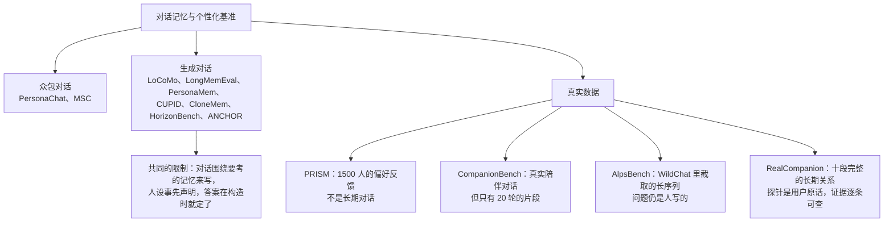
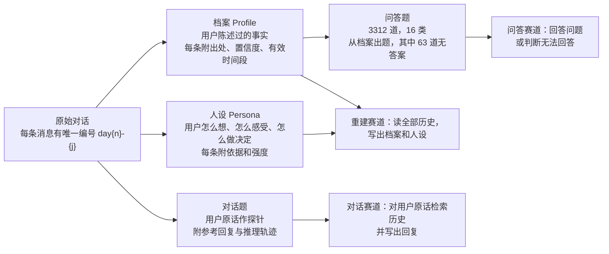
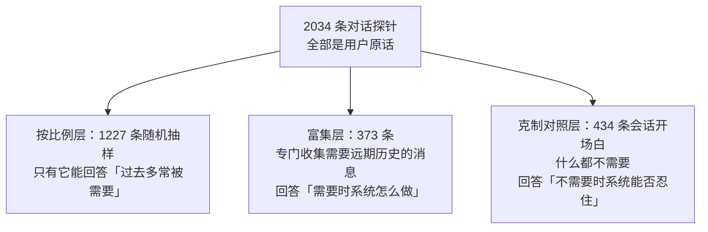
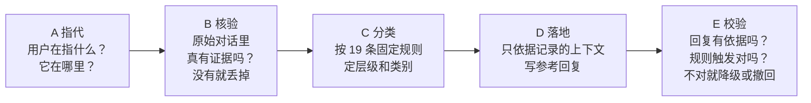
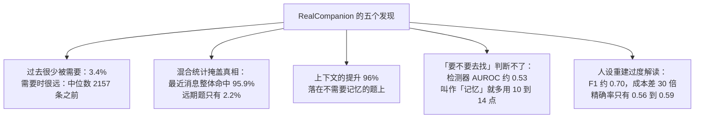

# RealCompanion：用真实的长期对话检验 AI 陪伴者是否真的理解一个人

> **原题**：RealCompanion: Benchmarking Human Understanding from Reasoning over Longitudinal Real-World Conversations
> **作者**：Arman Behnam, Sunglyoung Kim, Liangwei Yang
> **机构**：Quis Lab（一家 AI 陪伴应用的运营方）
> **年份**：2026（arxiv ID 2610.01780）
> **分类**：cs.AI
> **链接**：https://arxiv.org/abs/2610.01780
> **精读日期**：2026-10-06

## 阅读须知

### 这篇在领域里的位置

大模型做成聊天产品以后，有一类用法增长得很快：人们每天回到同一个 AI 陪伴者那里，连续聊上几个月。这种关系的价值在于「被记住」和「被理解」，于是过去两年出现了一大批「长期记忆」与「个性化」的研究，以及与之配套的评测基准。

这些基准几乎都建立在合成数据上。LoCoMo、LongMemEval 这样的工作生成很长的虚构对话，在末尾提一个问题，考系统能不能把埋在前面的事实找回来；PersonaChat、PersonaMem 一类工作则先写好一个人设，再让模型按人设说话，最后考系统能否还原人设。合成数据的好处是可控、可扩展，坏处是它从构造上就决定了答案：对话是围绕要考的记忆写出来的，人设是事先声明好的。

RealCompanion 位于这条脉络的转折点上。它第一次公开了十段人与 AI 陪伴者之间真实发生的长期关系，最长一段持续 120 天、一万两千多条消息，并且围绕这些真实对话构建了可以逐条追溯证据的标注。论文的主要贡献不是一个新方法，而是用真实数据推翻了合成基准里几个习以为常的假设。

### 读完能回答什么

1. 在真实的长期对话里，一个人发出的消息有多大比例真正需要用到很久以前说过的内容？这个比例和合成基准里的比例差多少？
2. 为什么「看最近的几条消息」在整体统计上能找到 95.9% 的所需内容，却在真正需要远期记忆的情况下只有 2.2%？
3. 为什么作者说现有系统真正失败的地方不是「找不到」，而是「不知道什么时候该去找」？
4. 把同样的十条历史消息标成「记忆」而不是「之前的对话」，为什么会让模型更频繁地提起过去，哪怕当下根本不需要？
5. 三个智能体系统重建用户人设时准确率相近、成本相差三十倍，它们共同的毛病是什么？

### 阅读前置

假定读者熟悉大语言模型的基本用法，大致了解检索增强生成（先检索再生成）的思路，知道精确率、召回率、F1 和 ROC 曲线下面积这些常见指标。不预设读者做过对话系统或个性化研究，相关术语在第一次出现时会先铺垫。

### 首次出现的缩写表

- **RAG**（Retrieval-Augmented Generation，检索增强生成）：先从外部资料里检索相关片段，再交给模型生成回答的做法。AI 陪伴者的「记忆模块」大多就是一种 RAG。
- **BM25**：一种经典的关键词检索打分方法，按词频和稀有程度给文档排序，是检索领域最常用的基线。
- **hit@k**：检索结果排名前 k 位中至少命中一条正确答案的比例。本文主要看 hit@5。
- **MRR**（Mean Reciprocal Rank，平均倒数排名）：第一条正确答案排在第几位的倒数的平均值，越接近 1 说明越靠前。
- **AUROC**（Area Under the ROC Curve，ROC 曲线下面积）：衡量一个二分类打分能不能把两类样本分开，0.5 相当于随机猜，1.0 是完美区分。
- **F1**：精确率和召回率的调和平均。
- **GDPR**（General Data Protection Regulation，欧盟《通用数据保护条例》）：本文的伦理声明里多次提到其中关于健康等特殊类别数据的条款。

## 一、问题

AI 陪伴者如果和一个人聊了几个月，它理应慢慢理解这个人：知道对方是谁，记得对方说过什么，并且能在恰当的时候意识到「过去的某件事和现在有关」。这件事做不好的代价是具体的。用户会觉得自己在对一个金鱼说话，或者更糟，被一个自以为了解自己的系统错误地揣度。

检验这种能力需要真实的对话，而真实对话是高度私密的，掌握在开发陪伴产品的公司手里。于是研究界退而求其次，用模型生成的对话来做基准。作者认为，这种替代并不是无伤大雅的近似，它从三个方面预先决定了测量结果。

第一，生成的对话是围绕它要考的记忆写出来的，所以几乎每一条消息都需要用到过去。第二，事先写好的人设把性格特征直接声明出来，关于这个人的问题只要读声明就能答对。第三，脚本化的历史不会自我修正，第九个月说的话不会改变第四个月确立的事实。

论文开头用一个小例子把要考的能力讲得很清楚。一位用户三月说公司在招一个要管六个人的组长，四月说自己申请了、但其实不确定想不想要、只是不想以后后悔，六月说「我拿到了」。陪伴者有三种回法。

第一种是「恭喜！正是你想要的」。它用了一条错误的推断，以为用户想要这个职位，而用户明明说过不确定。第二种是「你四月申请的时候还不太确定」。这句话事实正确，但只是把用户自己说过的话还给用户，没有理解。第三种是「虽然当时不太确定，你还是拿到了，现在感觉怎么样？」，它既用到了用户陈述的事实，也用到了一条正确的推断：用户申请是为了不留遗憾。

作者据此把「理解一个人」拆成四个挑战：

1. **知道过去什么时候重要**。大多数消息根本不需要过去。
2. **知道所有消息加起来说明了什么**。一个人是谁，是从全部对话里慢慢浮现出来的。
3. **同时用上所有东西**。只看最近几条，会错过对方几个月来一直挂在心上的事；只用对方陈述的事实，会把事实原样还回去；用了一条错误推断，就会自信地说错。
4. **判断做得对不对**。这需要这个人自己的记录作为依据。

现有基准的分布可以用下图概括：

其中有两项工作已经从侧面说明「判断该不该调取记忆」很难。CUPID 构造了偏好只在特定情境下成立的历史，发现没有一个模型在「识别当前请求依赖哪段过去」上的精确率超过 50%。HorizonBench 让偏好随时间演变，发现被测的 25 个模型都倾向于选择变化之前的旧值，并自称是在等待真实纵向数据之前的预备工作。RealCompanion 可以看作就是那份真实纵向数据。

## 二、方法

这篇论文的「方法」是数据集与评测协议的构建方法。它的核心设计目标是：每一个标签都能追溯到原始对话中的具体消息，读者如果不同意某个标签，可以顺着证据找到出错的那一步。

### 数据从哪里来

数据来自一款 AI 陪伴应用的生产数据库，十位用户同意将其用于研究并公开发布。这些人没有被招募进任何实验流程，对话就是他们日常使用产品时自然产生的。

发布前，每一条消息都由模型改写了措辞，姓名、联系方式等直接标识被替换成前后一致的替代词；措辞变了，但说了什么、为什么说、回应的是什么上下文都保留下来。作者还专门测了匿名化的效果，这一点留到局限部分再谈。

十位用户的规模差异很大，下表摘录了几个代表：

| 用户 | 跨度（天） | 活跃天数 | 消息数 | 对话题数 | 问答题数 |
|---|---|---|---|---|---|
| U01 | 36 | 9 | 115 | 28 | 23 |
| U05 | 46 | 23 | 420 | 37 | 47 |
| U08 | 68 | 50 | 2,918 | 221 | 304 |
| U09 | 111 | 111 | 7,243 | 434 | 991 |
| U10 | 115 | 95 | 12,627 | 482 | 1,257 |
| 合计 |  | 430 | 27,218 | 1,533 | 3,235 |

最重的两位用户贡献了全部消息的 73%，几乎是其余八人加起来的三倍。作者特意强调，这个数据集是「按关系设计」的：每个人都是一个独立的评测实例，深度不能跨人相加，结果也可以按单个人报告。

### 每个人的五个文件与三个评测赛道

对每位用户，数据集发布五个文件。原始对话是唯一的源头，其余四个都从它派生出来。

**档案**记录用户明确说过的事情。每条主张都指向确立它的消息，附带置信度和它成立的时间窗口。抽取过程对自己的产出是「对抗性」的：提出的主张有三分之一以上被丢弃，后来审计不通过的主张也保留在文件里并标明审计结论，这样审计本身也能被审计。最终有 3,580 条主张、6,784 处消息引用。

**人设**记录用户怎么想、怎么感受、怎么做决定。作者说这在以往工作中没有对应物：每一条对人的解读都附带它依据的消息和被持有的强度，连「工作假设」都写明了理由和把握程度。人设只记录这十个人真正透露过的东西，比如家庭、健康、担心的事，而几乎不包括人口统计类别，因为人们很少对陪伴者说自己属于哪个人口统计群体。

**对话题**的探针（probe，即用来测试系统的那条用户消息）全部是用户原话，一个字都不改写。每道题还附带一条参考回复，以及这条回复「可以依据哪些上下文」。

### 题目的分层与抽样

对话题按「参考回复依据什么上下文」分成四个层级（tier）。只依据前几条消息的是基础层；用到档案里某条主张的是中级；用到某段更早对话的是困难层；什么都不依据的是边缘层。层级可以从记录的上下文列表直接重新计算出来，不需要相信标签本身。

这里有一个抽样难题：真正需要过去的消息非常少，随机抽样只能得到很少的样本。作者因此把探针分成三个层次，每层回答一个问题：

克制对照层的设计很关键。一个只考「检索有没有帮助」的基准，永远发现不了一个检索过度的系统；只有放进一批明确什么都不需要的消息，才能看出系统会不会无中生有地提起过去。

### 可追溯的标注流程

每一条对话题的标签都经过五个阶段生成，每个阶段在同一次调用里写下决定和理由，因此理由不是事后补写的。

阶段 A 判断这条消息指向什么、那个东西存在哪里：在当前话题里、在档案里、在某段早先的对话里，还是在陪伴者自己过去的行为里。阶段 B 把候选证据拿回原始对话逐条核对，核不上的丢掉。阶段 C 按规则定层级。阶段 D 只根据记录下来的上下文写参考回复，因此回复所需的一切都在题目里写明了。阶段 E 检查回复是否有依据。

作者论证了这个顺序能封住三种错误。第一，编造的档案主张过不了阶段 B，所以不会被当成系统「应该记得」的记忆。第二，阶段 D 只看记录的上下文，所以「给系统标准答案上下文」和「让系统自己检索」之间的差距，纯粹衡量的是检索能力。第三，核验只会删除引用、不会增加引用，因此核验出错只会让「需要记忆的比例」被低估，不会被高估；论文报告的需求比例因此是真实比例的下界。

这个流程也删掉了大量最初的猜测。阶段 A 为 806 条消息提出了远期指代，阶段 B 只确认了 422 条。最终层级与核验前的表面猜测在 1,533 道题里有 685 道不一致，接近一半。那个表面猜测，正是一个廉价的「要不要检索」开关会做出的判断。

### 评测怎么做

三个赛道分别测试「这个人是谁」和「他说过的哪些话现在要紧」两个问题。

检索方面比较了五种方法：随机、最近消息（取探针前面的 k 条，不做检索）、只取用户自己的最近消息、BM25 关键词检索，以及直接给出标注证据的「神谕」。另有几组对照，比如「坏神谕」专门给出确定不在证据集里的消息，它必须得零分，用来检验评分本身没有漏洞。

生成方面做了一个上下文消融实验：同一个模型在五种条件下回答每道题，条件之间只差在探针前面放了什么。C0 什么都不放，C1 放前三条消息，C2 放标注的所需消息（神谕条件），C3 放 BM25 检索出的十条，C4 放前十条。为了排除标题措辞和排列顺序的干扰，作者还加了一对匹配条件 C3m 和 C4m，用同样中性的标题、按时间顺序排列。

人设重建方面，三个智能体系统（Claude Opus 5.5、Codex GPT-5.6-sol、运行 Gemini 3.8 Flash 的 Antigravity）各自读每位用户的全部历史，写出人设文件，每人跑三次。

## 三、实验

### 发现一：过去很少被需要，而一旦需要，往往在很远的地方

在按比例随机抽样的消息里，只有 3.4%（置信区间 2.5% 到 4.6%）真正需要当前话题之外的内容；如果再排除「所指内容其实还显示在屏幕上」的情况，只剩 1.3%。另外两种估计方法在样本之外的一万一千多条消息上得到 3.2% 和 1.73%，结论一致。而在合成基准里，几乎每条消息都需要过去。

这种需求还很不均匀。十个人里有三个人在宽口径下一条需要记忆的消息都没有，严格口径下是五个人。作者的结论是：记忆需求是关系深度的属性，聊得越久越深，越可能需要。

当需要的时候，所需内容通常在很远的地方。一条需要记忆的消息，它要用到的最远那条消息中位数在 2,157 条之前，上四分位数 5,114 条，最远 12,542 条；就连最近的那条所需消息，中位数也在 450 条之前。

### 发现二：整体平均掩盖了一切

这是论文里最值得记住的统计教训。下表是只看远期题目时，各方法在前五条里命中所需消息的比例：

| 方法 | 全部远期题 | 按用户平均 | 依赖型题目 |
|---|---|---|---|
| 随机 | 0.005 | 0.004 | 0.000 |
| 只取用户自己的最近消息 | 0.015 | 0.014 | 0.006 |
| 最近消息 | 0.022 | 0.029 | 0.024 |
| BM25 | 0.248 | 0.424 | 0.347 |
| 神谕 | 1.000 | 1.000 | 1.000 |
| 坏神谕 | 0.000 | 0.000 | 0.000 |

在远期题目上，「看最近的消息」，也就是滑动上下文窗口天然给出的顺序，只能命中 2.2%，几乎和随机一样；BM25 好了十一倍，但仍然四次里错过三次。

然而把所有题目混在一起统计，排名就完全反过来了。在 1,477 道有参考证据的对话题里，72.6% 的答案就在最近的对话中，于是「最近消息」的命中率高达 95.9%，BM25 反而只有 23.6%。BM25 在两个人群之间几乎不变，「最近消息」却相差四十倍。作者的判断是：一个混合统计出来的检索分数，报告的更多是语料的构成，而不是方法的能力。

上下文预算也决定了能不能看到所需内容：8k token 的窗口只能覆盖 10.9% 的所需消息，128k 覆盖 45.3%，一百万 token 能装下全部历史，覆盖 100%。

### 发现三：给上下文有用，但帮助大多落在不需要记忆的题上

上下文消融实验的结果（内容匹配分，0 到 2 分）：

| 条件 | 提供的上下文 | 全部题目 | 按用户平均 |
|---|---|---|---|
| C0 | 无 | 1.431 | 1.286 |
| C1 | 前三条消息 | 1.622 | 1.587 |
| C2 | 标注的所需消息（神谕） | 1.763 | 1.736 |
| C3 | BM25 检索的十条 | 1.426 | 1.352 |
| C4 | 前十条消息 | 1.625 | 1.584 |

把前三条消息换成标注的所需消息，内容匹配平均提高 0.140。但在按比例抽样的题目里，把这个提升拆开看：真正需要记忆的题只贡献了 0.004，不需要记忆的题贡献了 0.104，也就是说 96% 的提升落在根本不需要记忆的题上。只看那 167 道「参考回复确实依赖记忆」的题，同样的替换能提高 0.455。

给哪些消息比给多少条更重要。在控制了数量、标题和排列顺序之后，BM25 选出的十条比最近的十条低 0.189 分；在主表里，BM25 的十条和什么都不给（1.426 对 1.431）几乎一样。

### 发现四：系统失败在「要不要去找」这个决定上

这是论文认为最根本的问题。在按自然比例抽样的题目上，一个读取探针和前三条消息的检测器，区分「需要记忆」和「不需要记忆」的能力和随机差不多，AUROC 只有 0.530 到 0.548。用它自己最优的阈值，在 40 道真正需要记忆的题里只抓到 6 道，同时误报了 40 次。

相比之下，对人写的问题做同样的判断就容易得多：同样的检测器在问答赛道上 AUROC 达到 0.802。原因是人写的问题和它的证据共享更多的词，而人在聊天中自然发出的消息不会这样。这正说明合成或人写的基准会高估系统的能力。

另一个现象是「无中生有」。不给任何上下文时，模型从不提起不存在的过去，误调用率为零。一旦给了上下文，在那些明确不需要记忆的消息上，误调用率升到 29.2%（上下文是针对探针挑选的）乃至 60.8%（十条与探针无关的消息）。

最反直觉的结果是标题的作用。把同样十条消息的标题从「本次聊天中之前的对话」改成「检索到的记忆」，模型在所有人群上调用过去的频率都提高了 10 到 14 个百分点，包括那些根本不需要记忆的消息。换句话说，模型会因为东西被叫作「记忆」就觉得应该用上它。

### 发现五：重建人设时，系统看到了人，然后想象得更多

| 系统 | F1 | 精确率 | 召回率 | 处理的 token 数 | 自身多次运行的一致性 |
|---|---|---|---|---|---|
| Claude Opus 5.5 | 0.686 | 0.557 | 0.893 | 5.46 亿 | 0.935 |
| Codex GPT-5.6-sol | 0.688 | 0.573 | 0.861 | 1,800 万 | 0.932 |
| Antigravity（Gemini 3.8 Flash） | 0.701 | 0.591 | 0.861 | 3,600 万 | 0.946 |

三个系统的 F1 几乎相同，在 0.69 到 0.70 之间，而它们处理的 token 数相差约三十倍。召回率 0.86 到 0.89 说明人设文件里有的东西它们基本都找到了；精确率只有 0.56 到 0.59，说明它们每找回一百条正确的，还会额外写出七八十条文件里没有的内容。

更有意思的是，三个系统彼此之间的一致性是 0.86 到 0.88，远高于它们与标准人设文件的一致性，而且旗舰模型和轻量模型一样。作者据此认为，这种「过度解读」是系统性的，不是随机噪声，也不会随模型规模增大而消失。

## 四、局限

### 作者承认的局限

第一是规模与代表性。数据只有十段关系，来自同一款陪伴应用，每段持续 36 到 120 天。两位重度用户占了七成以上的消息，三个人在宽口径下没有一条需要记忆的消息。作者明确表示这是按关系设计的基准，深度不能跨人相加，但这也意味着很多统计结论主要由少数几位用户决定。

第二是评测范围。作者说明本文不评测共情、对未来行为的预测以及一个人的价值观，只评测「克制、检索、应用」三个决定。人设重建也只涵盖这十个人实际透露过的内容。

第三是标注的来源。大部分派生标签由语言模型生成、再由人工审计，作者报告了两者的一致程度，也承认档案审计中有相当比例的主张被判为「可修复」「不受支持」或「待复查」，并把这些结论原样发布。上下文消融中 C1 与 C2 的标题不同，作者承认这两者的差异里包含了标题本身的影响，没有单独拆开。

第四是隐私。作者用一个不看实词的文体分类器测试，给它一段某位用户的写作样本，它能在十份历史中以 83% 的准确率认出是谁，语言模型更是达到 98%，而随机猜是 10%。作者坦率地写道，去掉标识符并不能去掉作者身份，这是对话文本本身的性质；发布条款因此禁止任何画像、识别或针对个人的使用以及商业用途。

### 读者能看出的潜在问题

首先是利益与独立性。数据来自作者所在公司的产品，伦理审批由数据运营方内部的伦理委员会完成，作者自己也写明这个委员会并不独立于运营方，没有机构审查委员会参与。数据中包含健康等特殊类别信息，又已被证明可以通过文体识别出作者，这种情况下仅凭内部审批发布，读者有理由保持审慎。

其次，「需要记忆的比例只有 3.4%」这个结论可能和产品形态有关。这款应用的交互设计、用户群体和使用习惯会影响人们多常回顾过去；换一个产品、一种文化或者一类更依赖长期叙事的用户，比例可能不同。仅凭一款应用的十位用户，很难把这个数字推广成「人类聊天的普遍规律」。

第三，评分高度依赖模型裁判。内容匹配由一个裁判模型打分，作者报告了它与人工裁决的一致性，但 0 到 2 分的匹配分在几个条件之间的差距不大（比如 1.622 对 1.625），而参考回复本身也是由模型依据记录的上下文写出来的。参考回复与被测模型风格相近时，分数可能偏高，这一点在论文中没有充分讨论。

第四是摘要与正文的小出入。摘要说三个系统重建人设的 F1 是 0.71，正文表格里是 0.686 到 0.701。差别不大，但对一篇以「每个数字都可追溯」为卖点的论文来说，值得留意。

最后是可复现性。三个重建系统都依赖闭源的商业模型和智能体框架，处理的 token 数动辄数千万到数亿，独立复现成本不低；而作为语料来源的那款产品与其数据库并不公开，读者只能信任发布出来的这份经过改写的版本。

## 一句话

用十段真实的长期 AI 陪伴对话证明：记忆很少被需要但一旦需要就很远，而现有系统最欠缺的是判断何时该回顾过去。
