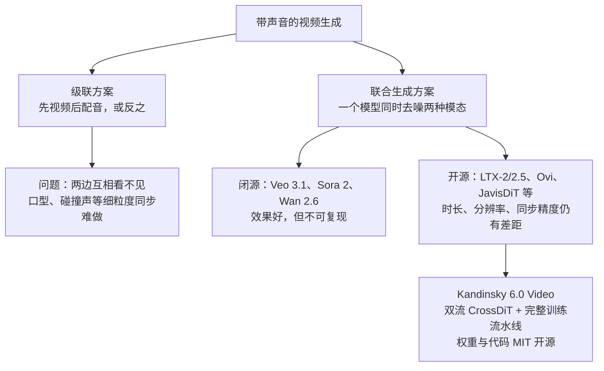
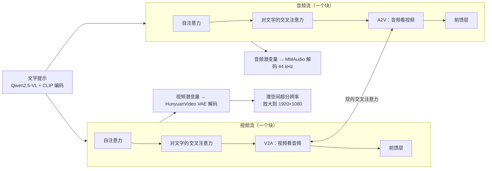
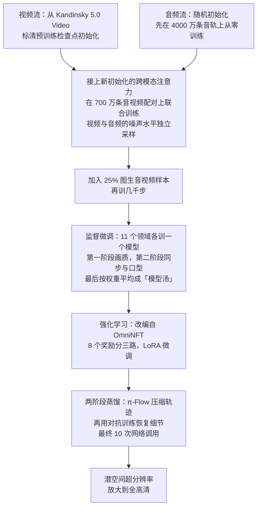
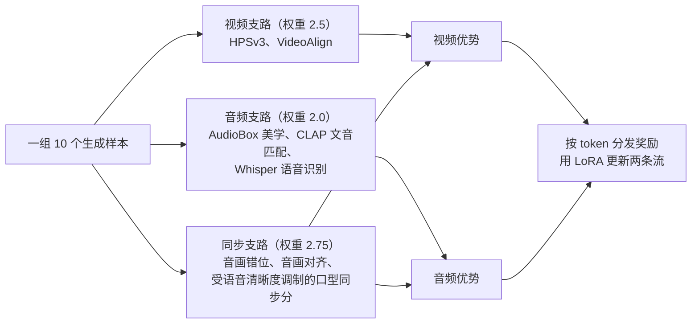

# Kandinsky 6.0 Video：开源的音画同步视频生成基础模型

> **原题**：Kandinsky 6.0 Video: Foundation Models for Synchronized Video and Audio Generation
> **作者**：Team Kandinsky（Julia Agafonova, Bulat Akhmatov, Vladimir Arkhipkin, Denis Dimitrov 等数十人）
> **机构**：Sber AI（Kandinsky 团队）
> **年份**：2026（arxiv ID 2610.05608）
> **分类**：cs.CV / cs.AI / cs.LG / cs.MM
> **链接**：https://arxiv.org/abs/2610.05608
> **精读日期**：2026-10-07

## 阅读须知

### 这篇在领域里的位置

视频生成在过去三年里经历了两次跃迁。第一次是「能生成像样的视频」：以扩散模型和扩散 Transformer 为骨架，Sora、Veo 这样的闭源系统和 HunyuanVideo、Wan、Kandinsky 5.0 这样的开源系统，把文字生成几秒钟连贯视频变成了常规能力。第二次是「视频自带声音」：Veo 3、Sora 2 等闭源系统开始在同一次生成里输出画面和与之同步的声音，包括说话时的口型、脚步声、环境音和背景音乐。

第二次跃迁在开源侧来得晚，而且差距明显。LTX-2、Ovi 等开源工作已经尝试把音频和视频放进同一个模型，但在时长、分辨率和同步精度上仍落后于闭源系统。

Kandinsky 6.0 Video 是这条开源路线上的一份完整技术报告。它没有提出全新的范式，价值在于把一整条工业级流水线公开出来：数据怎么准备、音频分支怎么从零训练再接到已有的视频模型上、监督微调和强化学习怎么做、怎么蒸馏到十步出图、怎么放大到全高清、怎么塞进消费级显卡，并且以 MIT 许可证开放了全部权重和代码。

### 读完能回答什么

1. 为什么音画同步生成比单独生成视频或单独生成音频难得多？
2. 「双流 CrossDiT」是什么结构，视频流和音频流之间靠什么交换信息？
3. 为什么要先单独从零训练音频流、再和已有的视频流接起来联合训练，而不是一开始就一起训？
4. 强化学习阶段的八个奖励是怎么分到视频、音频两条支路上的，为什么能把语音错字率降低近一半？
5. 和 Kling、Veo、MiniMax、Seedance 这些闭源系统相比，它强在哪里、弱在哪里？

### 阅读前置

假定读者了解扩散模型的基本思想（从噪声一步步去噪得到样本），知道 Transformer 的自注意力和交叉注意力，并对强化学习里「奖励」和「策略更新」有大致概念。不预设读者做过视频或音频生成，相关术语会先铺垫再展开。

### 首次出现的缩写表

- **DiT**（Diffusion Transformer，扩散 Transformer）：用 Transformer 代替 U-Net 作为扩散模型去噪网络的架构，是当前视频生成模型的主流骨架。
- **T2V / T2A / T2AV**：文生视频、文生音频、文生「音频加视频」。
- **I2AV**（Image-to-Audio-Video）：给定一张起始图片和文字，生成带声音的视频。
- **VAE**（Variational Autoencoder，变分自编码器）：把像素或波形压缩成低维潜变量的编解码器，扩散模型在潜空间里工作以节省计算。
- **RoPE**（Rotary Position Embedding，旋转位置编码）：一种把位置信息写进注意力计算的方法。
- **SFT**（Supervised Fine-Tuning，监督微调）：在高质量标注数据上继续训练。
- **RL**（Reinforcement Learning，强化学习）：这里指用奖励模型给生成结果打分，再据此更新模型。
- **GRPO**（Group Relative Policy Optimization，组内相对策略优化）：对同一个提示生成一组样本，用组内平均作基准计算每个样本的「优势」。
- **LoRA**（Low-Rank Adaptation，低秩适配）：只训练插入的小矩阵、冻结原模型的高效微调方法。
- **NFE**（Number of Function Evaluations，网络调用次数）：生成一个样本要调用去噪网络多少次，大致对应采样步数。
- **SBS**（Side-by-Side，并排对比）：把两个模型的结果并排给评估者，让他选更好的一个。
- **WER**（Word Error Rate，字错率）：语音识别转写结果与目标文字之间的错误比例，这里用来衡量生成的说话是否清楚、念对。

## 一、问题

单独生成一段视频已经不容易，而让视频同时「发出正确的声音」，难度又上了一个台阶。原因在于，音画同步要求两种模态在三个层面上同时一致：语义上，画面里是一只狗，声音就得是狗叫而不是猫叫；时间上，杯子落地的那一帧，碰撞声必须恰好响起，人物开口的每个音节都要对得上嘴型；情绪上，悲伤的场景不能配欢快的音乐。

传统做法是分两步走：先生成视频，再用一个「视频配音」模型根据画面补声音，或者反过来先有声音再生成画面。这种级联方式的问题是两边互相看不见：先生成的那一方不知道后面要配什么，后生成的一方只能被动迁就，口型同步这种要求两边逐帧配合的任务尤其难做好。

于是近两年的趋势是把音频和视频放进同一个模型、在同一次去噪过程中一起生成。闭源侧，Veo 3.1、Sora 2、Wan 2.6 已经能做到自然的口型同步和多语种对白；开源侧，ALIVE、SyncFlow、JavisDiT、3MDiT、LTX-2 及其后续 LTX-2.5、MiniMax-H3、NVIDIA Cosmos 3 等工作各自提出了不同的跨模态对齐机制。

作者认为，开源方案在片段时长、分辨率和同步精度上仍落后于闭源系统，这正是这份工作要缩小的差距。与此同时，模型规模已经被推到三百亿参数左右，围绕音画同步也出现了 VABench、T2AV-Compass、AVGen-Bench 等标准化评测。

## 二、方法

### 产出是什么

Kandinsky 6.0 Video 是一个模型家族，包括两个尺寸：Lite 有 30 亿参数，Pro 有 290 亿参数。两者都生成 5 秒的视频片段，同时输出 44 kHz 的同步音频，包含口型同步；都支持文生音视频（T2AV）和图生音视频（I2AV）两种模式。基础生成是标清分辨率，再由一个内置的超分辨率模型放大到 1920×1080 的全高清。

### 编码器与整体结构

在进入核心网络之前，三种输入各自被编码到潜空间：

- 视频用 HunyuanVideo 的 VAE 编码和解码；
- 音频用 MMAudio 的自编码器，支持 44 kHz 采样率；
- 文字同时用 Qwen2.5-VL-7B-Instruct 和 CLIP ViT-L/14 两个编码器编码。

核心网络叫双流 CrossDiT。所谓「双流」，是指视频和音频各有一条自己的 Transformer 主干，两条主干的层数相同，但隐藏维度和前馈层维度不同，因而参数量不对称；两条主干在每一个块里通过双向的交叉注意力互相交换信息。这种设计和 Ovi、LTX-2 属于同一类。

每个块里，视频流依次做四件事：对自身的自注意力、对文字的交叉注意力、对音频的跨模态注意力、前馈层。音频流做对称的四件事。跨模态注意力那一层是关键：在视频那一侧，视频的查询向量去看音频的键和值；在音频那一侧，反过来。每条流还有自己的扩散时间步嵌入，通过缩放、平移和门控参数调制每一个子层。

参数在两条流和连接层之间的分配如下：

| 版本 | 视频流 | 音频流 | 跨模态注意力 | 合计 | 视频块数 |
|---|---|---|---|---|---|
| Lite | 20 亿 | 6 亿 | 4 亿 | 30 亿 | 32 |
| Pro | 190 亿 | 50 亿 | 50 亿 | 290 亿 | 60 |

### 时间怎么对齐

音画同步的前提是两种模态知道彼此的「时间坐标」。作者用旋转位置编码给每个 token 标上位置：视频 token 按帧号编号，音频 token 按时间位置编号；跨模态注意力里视频用三维的 RoPE，音频用一维的 RoPE。

为了让不同帧率的视频共享同一把时间尺子，视频的帧号会按帧率归一化到每秒 24 帧：

$$\text{RoPE}\left(\frac{N_{\text{frame}}}{\text{fps}/24}\right)$$

- $N_{\text{frame}}$ 是输入视频的帧序号。
- $\text{fps}$ 是这段视频的实际帧率。

这样一来，一段 30 帧每秒的视频和一段 24 帧每秒的视频，在同一个真实时刻上会得到相近的位置编码，模型就更容易学到「这一帧对应声音的哪一段」。

### 数据

数据工作的规模本身就说明了这类模型的门槛。作者在 Kandinsky 5.0 的数据基础上扩出了一整套多模态数据集：

- **图像**：5,000 万张，从 Kandinsky 5.0 的图像库中筛选，用 Qwen3-235B 重新生成俄英双语描述，并改写成长、中、短、最短四档。
- **视频**：2,000 万个单镜头片段，额外剔除了帧率不标准和带转场的片段。
- **音频**：4,000 万条 5 到 20 秒的音轨，从视频库中抽出，用 Qwen3-30B 写描述，涵盖声音、音乐、说话和环境音。
- **音视频配对**：700 万条，用于联合训练。
- 另外还有图生视频的起始帧数据、按 11 个领域划分的监督微调数据、强化学习用的在线提示集、超分辨率数据，以及一个专门的「俄罗斯文化代码」数据集，用来让模型理解俄罗斯文化相关的内容。

### 训练流水线

训练分成预训练、监督微调、强化学习、蒸馏四大阶段，预训练内部又分三步。

**为什么先分开训、再接起来**。视频流已经有 Kandinsky 5.0 打下的基础，音频流则是全新的。如果一开始就把两者绑在一起训练，一个已经很强、一个还很弱，弱的一方会拖累强的一方，甚至破坏已经学会的视频能力。先让音频流在大规模音频数据上自己学会「怎么生成好听的声音」，再接上跨模态注意力联合训练，能在学会对齐的同时保住两边各自的单模态质量。以 Pro 为例，音频流先训了 3 万步，再在音视频描述上续训 4 千步；视频流并行地在音视频描述上续训 1.4 万步；联合训练共 4.9 万步。

**噪声水平独立采样**。联合训练时，作者让视频和音频各自独立地抽取扩散时间，于是同一个样本里两种模态可能被加了不同程度的噪声。这样做的好处是，模型学会了在一方很清楚、另一方很模糊时依然能互相参考，从而天然支持「根据音频生成视频」和「根据视频配音」这类任务。训练批次里还会混入只有音频、只有视频、只有图片的样本。

**模型汤**。监督微调时，作者没有把 11 个领域的数据混在一起训一个模型，而是每个领域单独训一个，两阶段都训完后再把这些模型的权重直接平均。这种「模型汤」的做法能在不同领域的专长之间取得平衡，而且比混合训练更容易调。

### 强化学习：八个奖励分三路

强化学习阶段改编自 OmniNFT 方法（原本是为 LTX-2 设计的）。它的核心想法是：对同一个提示生成一组样本，用一组奖励模型给每个样本打分，然后让模型朝高分样本的方向调整。难点在于音视频有两种模态，一个奖励到底该用来更新视频部分还是音频部分？

作者的做法是「按模态路由优势」：视频支路的奖励只计入视频的优势，音频支路的只计入音频的优势，而衡量同步的三个奖励同时计入两边。每个原始奖励先在组内减去均值、再除以全批次的标准差（下限 0.1，防止组内分数几乎相同时除出极端值），加权求和成两个分模态的优势，截断到正负 5 之间，最后广播到对应模态的每一个 token 上。

口型同步那一项设计得很细：口型分数会乘上一个由语音识别准确率决定的系数，

$$s_{\text{LS}}\cdot(0.5+0.5\,s_{\text{ASR}}),\qquad s_{\text{ASR}}=\max(0,\,1-\text{WER})$$

- $s_{\text{LS}}$ 是口型同步分数。
- $s_{\text{ASR}}$ 是语音识别得分，由字错率换算而来。

这样，嘴型对上了但说的是听不清的胡话，得分也会被打折。

具体训练上，每个提示生成 10 个样本（Lite 是 8 个），在 512×768 分辨率、121 帧下采样；只用 LoRA 微调，冻结监督微调后的模型，LoRA 只占 Pro 参数的 0.69%。损失函数用「当前 LoRA」和「旧 LoRA」的预测构造正负样本，按 token 的奖励在两者之间插值，再加一个约束模型别偏离原模型太远的 KL 项。此外还有两项配合措施：一是逐层的梯度手术，二是按 A2V 交叉注意力权重给画面区域重新加权，让和声音相关的区域（比如说话的人脸）得到更多关注。最终检查点不取最后一轮，而是取滑动窗口内平均奖励最高的那一轮，避免选到偶然的好运气。

### 蒸馏：从几十步压到十步

扩散模型生成一个样本要反复调用网络几十次，对视频来说非常慢。蒸馏的目标是训练一个「学生」模型，用很少的步数复现「老师」模型的效果。

作者比较了多种方法后选择了两阶段方案。分布匹配类方法（DMD、DMD2、SID）在他们的实验里容易模式坍缩，也就是生成结果变得单一，而且需要大量 GPU；一致性和 CFG 蒸馏会改变老师原本的运动风格。最终选中的 π-Flow 让学生在自己实际走过的状态上模仿老师每一步的局部决策，收敛最稳、最能保留老师的生成轨迹。

但只压缩轨迹还不够：步数越少，画面越平滑、细节越少。于是第二阶段引入对抗训练来恢复细节。作者在 LADD 的基础上提出了 Sim-LADD：判别器看到的中间状态不是对真实数据加噪得到的，而是学生自己去噪过程中真正经过的状态，从而缩小训练和推理之间的差距；对抗梯度只回传最后 5 步，在效果和显存之间取得平衡。最终学生只需 10 次网络调用。

### 超分辨率与消费级显卡部署

基础模型输出标清视频，超分辨率在潜空间里完成：先用一个「潜空间放大器」把低清潜变量放大到工作分辨率，再用一个不需要文字条件、并已蒸馏到 2 次网络调用的 SR-DiT 补出细节，最后解码成全高清。

为了让模型能在普通显卡上跑，作者实现了按块卸载（只把当前要算的那几层放进显存）和针对 16、24、32 GB 显存的预设配置。下表摘录了完整基础模型（未蒸馏）生成一段 5 秒片段所需的秒数：

| 配置 | RTX 4090 | RTX 5060 Ti | RTX 5080 | RTX 5090 | RTX PRO 6000 | A100 80GB | H100 |
|---|---|---|---|---|---|---|---|
| Lite 标清 | 437 | 1310 | 577 | 309 | 242 | 532 | 239 |
| Lite 全高清 | 578 | 1774 | 770 | 406 | 387 | 664 | — |

也就是说，即便是 30 亿参数的 Lite 版本，在一张 RTX 4090 上用完整模型生成 5 秒全高清片段也要近十分钟；蒸馏版本会快很多。

## 三、实验

### 自动评测：VABench

作者在专门评测文生音视频的 VABench 上，把强化学习后的 Lite 和 Pro（512×768 分辨率）与开源的 LTX 2.5（两阶段全高清配置）做了比较。字错率不属于 VABench，是作者另外在说话类样本上用 Qwen3-ASR 转写后计算的。

| 指标 | LTX 2.5 | Kandinsky 6.0 Lite | Kandinsky 6.0 Pro |
|---|---|---|---|
| 语音质量 speech_qn | 1.427 | 1.477 | **1.496** |
| 音频美学 audio_aes | 3.307 | 3.323 | **3.345** |
| 文字与视频对齐 tv_align | 0.185 | 0.227 | **0.229** |
| 文字与音频对齐 ta_align | 0.307 | **0.374** | 0.367 |
| 音视频对齐 av_align | 0.258 | 0.245 | **0.268** |
| 口型同步 lipsync | 1.567 | 1.761 | **2.072** |
| 音画错位 desync（越低越好） | 0.521 | 0.474 | **0.396** |
| 综合对齐（模型裁判） | **4.527** | 4.351 | 4.329 |
| 表现力（模型裁判） | **4.360** | 4.334 | 4.312 |
| 画面真实感 | 4.366 | 4.459 | **4.485** |
| 声音真实感 | 3.663 | **3.900** | 3.893 |
| 字错率 WER（越低越好） | **0.099** | 0.103 | 0.117 |

Pro 在语音质量、音频美学、文字和音视频对齐、口型同步、音画错位和画面真实感上领先；LTX 2.5 则在由视觉语言模型打分的对齐和表现力，以及字错率上更好。值得注意的是，在口型同步这一项上 Pro 比 LTX 2.5 高出约三成，音画错位也低了约四分之一，这正是这类模型最难做的部分。

### 人工并排评测

人工评测采用并排对比：同一个提示由两个模型生成，评估者看到匿名、左右随机的两段视频，可以反复播放、暂停、放大。先静音回答五个画面问题（画质、瑕疵、运动真实感、画面是否符合提示、镜头运动），再打开声音回答五个音频问题（语音质量、音画同步、整体音质、声音是否符合提示、整体完成度），图生视频还多一题「是否保留了参考图」。每项标准收集约 200 组以上的对比，多数投票汇总。

| 对手 | 结论 |
|---|---|
| Kandinsky 5.0 Video Pro（上一代） | 在所有画面与语义标准上全面领先，画质和遵循提示的优势最大 |
| LTX 2.5（开源） | 画面明显更好，语音质量显著更好；整体音质、音画同步等略输但不显著 |
| Kling 2.6（闭源） | 互有胜负：Kling 画质和音质更好，Kandinsky 在声音是否符合提示上更好 |
| Veo 3.1 Fast（闭源） | 明显分工：Kandinsky 画面更干净、更能保留参考图；Veo 更会遵循提示、音频更强 |
| MiniMax H3（闭源） | H3 在多数标准上显著更强；Kandinsky 只在语音、镜头运动、音画同步上接近 |
| Seedance 2.0（闭源） | Seedance 画面明显更强；Kandinsky 语音质量更好，音画同步接近持平 |

综合来看，Kandinsky 6.0 Video Pro 在开源模型里处于领先位置，和第一梯队之后的闭源模型互有胜负；面对最强的 MiniMax H3 和 Seedance 2.0，它在画面上仍有明显差距，但语音质量和同步一直是它的长处。

### 强化学习和蒸馏有没有用

作者报告，强化学习让 Pro 生成语音的字错率下降了 47%（这里用的是作为奖励模型之一的 Whisper 计算的字错率，和上面 VABench 表里用 Qwen3-ASR 算的数字口径不同，作者特意提醒二者不能直接比较）。论文还做了强化学习对监督微调、蒸馏版对完整模型的并排对比消融，用来说明这两个阶段分别带来的收益和代价。

### 值得单独拎出来的现象

最反直觉的一点是 Lite 和 Pro 的关系。参数量相差近十倍，Pro 在大多数指标上确实更好，但 Lite 在文字与音频对齐、声音真实感、音频和画面的质量评分上反而略胜一筹，字错率也比 Pro 低。这说明在音视频联合生成里，单纯把模型做大并不能同等地提升每一个维度，尤其是音频相关的指标。

另一个值得注意的是字错率：LTX 2.5 的字错率最低，Kandinsky 两个版本都略高，Pro 更高。也就是说，Kandinsky 的说话「听起来更自然、嘴型更对」，但「念得是否一字不差」反而稍逊，这两件事并不完全一致。

## 四、局限

### 作者承认的局限

作者在结论里列了三点：第一，每次只能生成最长 5 秒的片段；第二，基础生成是标清分辨率，全高清靠后置的超分辨率得到，而不是原生生成；第三，在画面质量和整体音质上，与最强的闭源系统仍有差距。未来方向是更长的片段、更高的原生分辨率和更多基于参考的条件输入。

强化学习部分作者也说明，它是在 512×768 的较低分辨率下进行的，低于最终全高清推理时的分辨率，奖励带来的改进能否完整迁移到高分辨率输出上，是一个开放问题。

### 读者能看出的潜在问题

首先是评测的透明度。人工并排评测的结论在正文里以「显著领先」「接近持平」等文字描述，具体的胜负比例主要画在图里；每项标准约 200 组对比，对比数量不算多，且评估者的背景、人数和一致性没有在正文中充分交代。由于是团队自己组织的评测，读者很难独立复核。

其次，自动评测只拿 LTX 2.5 做了对比，没有把 Ovi、MiniMax-H3、Cosmos 3 等其他开源或可调用的音视频模型放进同一张 VABench 表里，「开源领先」的结论覆盖面有限。而且比较时 Kandinsky 用的是 512×768，LTX 2.5 用的是两阶段全高清配置，分辨率不完全对等。

第三，5 秒的片段长度对实际应用是很大的限制。一句完整的台词、一个有起承转合的镜头，往往都超过 5 秒；在更长的时长上，音画同步和人物一致性能否保持，这份报告没有回答。

第四，部署成本。虽然作者努力让模型能在 16 到 32 GB 显存的消费级显卡上运行，但完整模型在 RTX 4090 上生成一段 5 秒标清片段仍需 7 分钟以上，Pro 版本更慢。对个人开发者而言，能跑起来和好用之间还有不小距离，实际体验很大程度上要依赖蒸馏版本。

最后是数据的来源与版权。报告详细描述了数据过滤和标注流程，但对这些图像、视频、音频的原始来源和授权情况着墨不多；对一个以 MIT 许可证开放权重、可能被广泛商用的模型来说，训练数据的合规性是使用者需要自己评估的风险。

## 一句话

Kandinsky 6.0 Video 公开完整的音画同步生成流水线，开源中语音与口型领先，画面仍落后顶级闭源。
