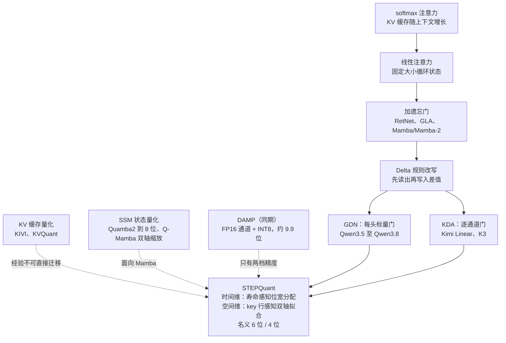
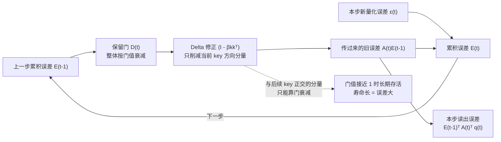
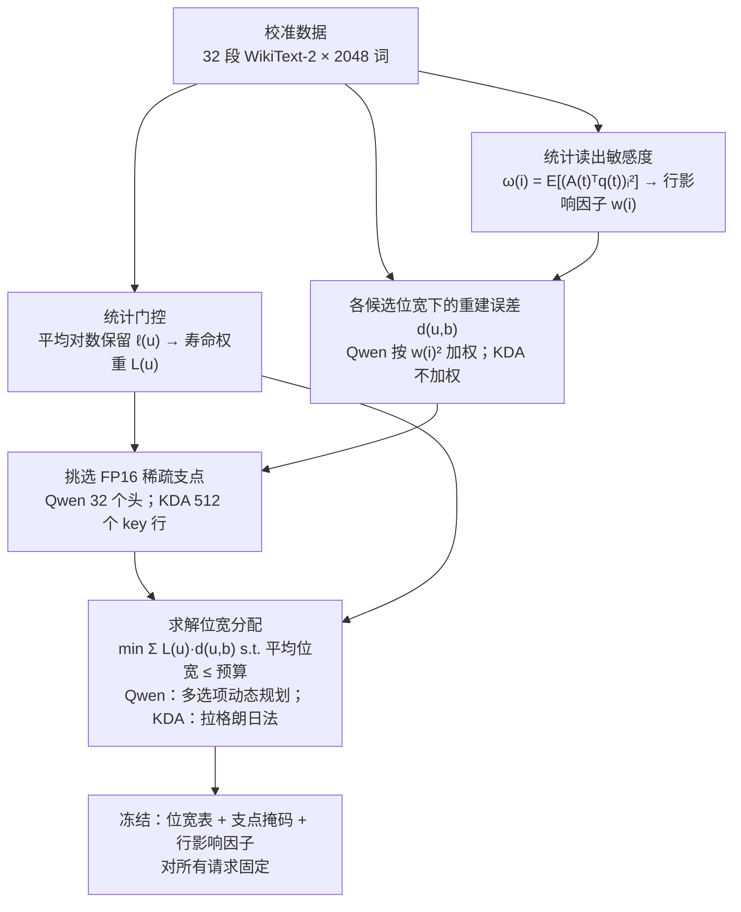
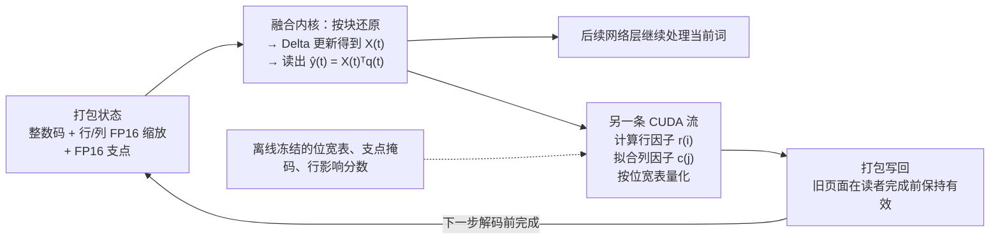
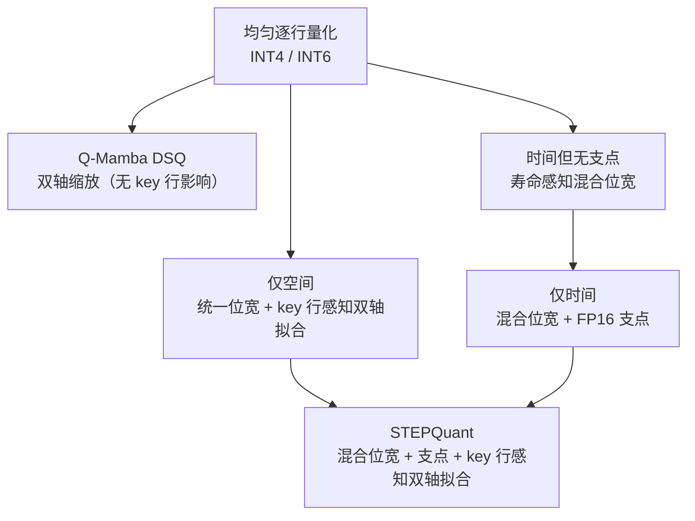

# STEPQuant：Delta 规则循环状态量化中，误差在何时、何处最要紧

> **原题**：STEPQuant: When and Where Errors Matter in Delta-Rule Recurrent State Quantization
> **作者**：Bingchen Yao, Haobo Xu, Haokun Lin, Yichen Wu, Ziyu Guo, Renrui Zhang, Zhichao Lu, Zhenan Sun, Ying Wei
> **机构**：香港城市大学、清华大学、哈佛大学、浙江大学、中国科学院自动化研究所（NLPR & MAIS）、香港中文大学
> **年份**：2026（arxiv ID 2609.38169，技术报告）
> **分类**：cs.CL / cs.AI / cs.LG
> **链接**：https://arxiv.org/abs/2609.38169
> **精读日期**：2026-10-08

## 阅读须知

### 这篇在领域里的位置

这篇论文落在两条研究线的交汇处。第一条是线性注意力与状态空间模型：从 RetNet、门控线性注意力（GLA）、Mamba 到 Gated DeltaNet 和 Kimi Delta Attention，这一类架构用一个大小固定的「循环状态」代替随上下文增长的 KV 缓存。到了 2025 至 2026 年，Qwen3.5 以后的 Qwen 系列、Kimi Linear 和 Kimi K3 都采用了「少量标准注意力层加大量 Delta 规则线性注意力层」的混合结构，这类模型已经成为开源大模型的主流形态之一。

第二条是训练后量化。过去几年，权重量化（GPTQ、AWQ）、激活量化（SmoothQuant、QuaRot）和 KV 缓存量化（KIVI、KVQuant）已经发展得相当成熟。针对 Mamba 一类状态空间模型，Quamba、MambaQuant、Quamba2 和 Q-Mamba 也做过权重、激活乃至状态缓存的量化，但 Quamba2 对状态只做到 8 位。

STEPQuant 处在这两条线交汇之后的下一步：它专门研究 Delta 规则模型的循环状态，试图把它压到 8 位以下。与之同期的 DAMP 也在做同一件事，但在 9.9 位左右止步。这篇论文的主要主张是，只要弄清楚量化误差在「什么时候」会长期存活、在「什么位置」会影响输出，循环状态就可以压到名义 6 位甚至 4 位，而精度几乎不受影响。

### 读完能回答什么

1. 线性注意力的循环状态不随上下文变长，为什么在并发服务里反而会比模型权重还占显存？
2. 为什么同样是 INT8，权重量化通常近乎无损，循环状态量化却会让长推理任务的平均准确率下降近 9 个点？
3. Delta 规则的状态更新如何同时「衰减」和「自我纠正」量化误差，为什么门控寿命越长的单元累积的误差越大？
4. STEPQuant 的「寿命感知位宽分配」和「key 行感知双轴拟合」各自解决什么问题，为什么在 4 位预算下两者缺一不可？
5. 名义 6 位的 STEPQuant 实际每个数占多少位、能省多少显存，对解码吞吐有什么影响？

### 阅读前置

假定读者熟悉 Transformer 的注意力机制和 KV 缓存的概念，知道整数量化里「缩放因子」「位宽」「截断」这些基本术语，并大致了解大模型推理服务里「并发请求」「批大小」的含义。

不预设读者专门研究过线性注意力、状态空间模型或 Delta 规则，这些内容会在「问题」一节里从头铺垫。也不预设读者做过混合精度量化，相关的优化问题会在「方法」一节里展开。

### 首次出现的缩写表

- **GLA**（Gated Linear Attention，门控线性注意力）：在线性注意力里加入随输入变化的遗忘门，控制旧信息保留多少。
- **SSM**（State Space Model，状态空间模型）：以 Mamba 为代表、用循环状态处理序列的一类模型，与线性注意力在数学上关系密切。
- **GDN**（Gated DeltaNet）：把「门控遗忘」和「Delta 规则改写」结合起来的线性注意力层，每个注意力头共用一个标量门。Qwen3.8-27B 采用这一结构。
- **KDA**（Kimi Delta Attention）：GDN 的扩展，把标量门换成逐通道的门，即 key 的每一维各有一个遗忘系数。Kimi Linear 采用这一结构。
- **KV 缓存**（Key-Value cache）：标准注意力在解码时缓存的历史 key 与 value，大小随上下文长度线性增长。
- **PTQ**（Post-Training Quantization，训练后量化）：不重新训练模型，只用少量校准数据决定量化参数的做法。
- **INT4 / INT6 / INT8**：4、6、8 位有符号整数格式。**FP32 / FP16 / BF16** 分别是 32 位单精度、16 位半精度和 16 位脑浮点格式。
- **AWQ**（Activation-aware Weight Quantization）：一种常用的 4 位权重量化方法。**W4A16** 指权重 4 位、激活 16 位的部署配置。
- **SGLang**：一个开源的大模型推理服务框架，本文把方法实现进它的状态池。
- **DSQ**（Dual-axis State Quantization，双轴状态量化）：Q-Mamba 中针对 Mamba 状态缓存的量化组件，本文把它改造成基线。
- **DAMP**（Decay-Aware Mixed-Precision）：同期工作，用衰减持续性挑选 FP16 通道、其余量化到 INT8。
- **PPL / NLL**（Perplexity / Negative Log-Likelihood）：困惑度与负对数似然，衡量语言模型预测质量的指标。
- **RMS**（Root Mean Square，均方根）：一组数平方平均后开方，这里用来衡量一行或一列的整体量级。
- **GM**（Geometric Mean，几何平均）：用于归一化行影响因子。
- **DP**（Dynamic Programming，动态规划）：Qwen 上用来求解离散位宽分配的算法。
- **TP**（Tensor Parallelism，张量并行）：把一层的计算切到多张卡上，本文实验用 4 卡张量并行（TP4）。
- **MoE**（Mixture of Experts，混合专家）：Kimi-Linear-48B-A3B 是总参数 480 亿、每个词激活约 30 亿参数的混合专家模型。
- **NVFP4**：英伟达的 4 位浮点格式，DAMP 论文把它作为状态量化基线。
- **C4**（Colossal Clean Crawled Corpus）：一个大规模网页文本语料，本文用它做机制分析。
- **CUDA 流**（CUDA stream）：GPU 上相互独立、可以并行执行的任务队列。
- **LCB / GPQA-D / AIME / HMMT**：LiveCodeBench v6 代码题、GPQA Diamond 研究生级科学问答、AIME 2026 与 HMMT 2026 年 2 月数学竞赛题。

## 一、问题

当一家公司把大模型部署成在线服务时，决定成本的往往不是单个请求跑得多快，而是一张卡能同时服务多少个请求。对标准 Transformer 而言，挡在并发数前面的通常是 KV 缓存：每多一个请求、每多一个词，显存就多占一份。线性注意力和状态空间模型之所以在近两年被大规模采用，一个重要原因正是它们承诺用一个大小固定的状态取代不断增长的 KV 缓存。

然而，「大小固定」并不等于「占用很小」。每个并发请求都需要一份独立的循环状态，服务框架为了前缀缓存和调度还会为每个请求额外预留状态槽位。论文测得，在 SGLang 官方部署配置下，Qwen3.8-27B 的 FP32 状态池在支持 70 个并发请求时，就已经超过了它全部 BF16 权重的显存占用。换句话说，在短上下文、高并发的场景下，这类模型的显存瓶颈从 KV 缓存转移到了循环状态本身。

压缩这份状态的直接思路是量化，也就是把 32 位浮点数换成 8 位、6 位或 4 位整数。过去几年，权重和 KV 缓存的量化已经积累了一整套成熟手段，8 位通常近乎无损，4 位在精心设计下也能保住大部分精度。可是论文的初步实验显示，把同样朴素的逐行量化用在循环状态上，结果要糟糕得多：Qwen3.8-27B 在七个长推理任务上的平均准确率，FP32 状态下是 80.60%，INT8 状态降到 71.86%，INT6 降到 45.04%，INT4 只剩 12.73%。

旧路线卡住的原因在于，循环状态和权重、KV 缓存有一个本质区别：它在每一步解码都会被读出、更新、再写回。权重量化的误差是一次性的，KV 缓存里某个词的量化误差也只停留在那个词上。循环状态的误差却会被带进下一步的更新，再叠加上新一步的量化误差，像滚雪球一样传下去。这篇论文要回答的，就是这团雪球「什么时候」滚得最大、「在哪里」对输出伤害最重，以及如何据此分配有限的比特。

### 从线性注意力到 Delta 规则

要理解循环状态为什么会累积误差，需要先看清它是怎么更新的。标准的 softmax 注意力在生成第 $t$ 个词时，要拿当前的查询向量和之前所有词的 key 逐一比较，所以必须把所有历史 key 和 value 都存下来。线性注意力去掉了 softmax，于是可以把所有历史的「key 乘 value 外积」累加进一个 $d_k \times d_v$ 的矩阵里，这个矩阵就是循环状态，读出时只需要用查询向量乘它一次。

最早的线性注意力只做累加，不会遗忘，状态里很快充满互相干扰的旧信息。门控线性注意力和 Mamba 一类方法于是加入了随输入变化的遗忘门，让旧信息按一定比例衰减。Delta 规则则更进一步：它在写入新的 key-value 对之前，先用当前的 key 从状态里读出「状态目前认为这个 key 对应什么 value」，再只把「真实 value 与读出值之间的差」写回去。这样一来，同一个 key 的旧关联会被新关联改写，而不是简单叠加。

Gated DeltaNet（GDN）把门控遗忘和 Delta 规则结合到一起，Kimi Delta Attention（KDA）又把 GDN 的「每个头一个标量门」细化成「key 的每一维各有一个门」。在论文的记号下，两者都可以写成同一个递推：

$$
S_t = A_t S_{t-1} + B_t,\qquad A_t = (I - \beta_t k_t k_t^\top) D_t,\qquad B_t = \beta_t k_t v_t^\top,\qquad y_t = S_t^\top q_t
$$

其中各个符号的含义如下：

- $S_t$：处理完第 $t$ 个词之后某一层某一个头的循环状态，形状为 $d_k \times d_v$，两款模型里都是 $128 \times 128$。
- $q_t, k_t$：当前词的查询向量和 key 向量，维度为 $d_k$，由该层的输入经线性投影得到。
- $v_t$：当前词的 value 向量，维度为 $d_v$。
- $D_t$：保留门，决定旧状态保留多少。GDN 中它是标量乘单位阵 $\alpha_t I$，KDA 中它是对角阵 $\mathrm{diag}(d_{t,1},\dots,d_{t,d_k})$。
- $\beta_t$：写入强度，取值在 0 到 1 之间，同样由输入决定。
- $A_t$：状态转移矩阵，$d_k \times d_k$，负责「搬运并有选择地修改」旧记忆。
- $B_t$：新写入的内容，$d_k \times d_v$。
- $y_t$：这一头的输出（读出），维度为 $d_v$。

每个头的状态有 $d_k \cdot d_v$ 个元素，与上下文长度无关，但必须为每个活跃请求一直保留。以 Qwen3.8-27B 为例，它有 48 个循环层、每层 48 个状态头，一个请求的循环状态共约 3775 万个数，FP32 下是 144 MiB。

### 前人的量化路线

在这篇论文之前，与循环状态量化相关的工作大体沿着三条路线展开。

第一条是 KV 缓存量化。KIVI 发现 key 和 value 的离群值分布在不同方向上，于是对 key 按通道、对 value 按词元量化；KVQuant 则进一步把上下文推到千万词级别。这些方法做对的地方在于认识到「缓存」和「权重」的统计特性不同，但 KV 缓存里的每个条目写入后就不再改动，误差不会递归传播，因此它们的经验不能直接搬到循环状态上。

第二条是状态空间模型量化。Quamba 和 MambaQuant 主要处理 Mamba 的权重和激活，Quamba2 额外把缓存的循环状态量化到 8 位，Q-Mamba 则用「双轴缩放加选择性重建」处理 Mamba 的状态缓存。这条路线第一次把状态当成量化对象，但它面向的是 Mamba 的状态更新方式，没有考虑 Delta 规则那种「先读后改」的结构。论文在消融实验里把 Q-Mamba 的 DSQ 组件改造后作为基线，结果显示它在 4 位下几乎完全失效。

第三条是与本文同期的 DAMP。它同样针对 Delta 规则模型的状态，用衰减带来的「持续性」挑选一部分 key 通道保留为 FP16，其余通道经 Hadamard 变换后量化到 INT8，在其评测设置下以每个数 9.9 位保住了精度。DAMP 已经意识到「衰减慢的通道更危险」，但它把精度选择限定为「FP16 或 INT8」二选一，也没有利用状态矩阵在空间上的结构。

### 落到一个可验证的技术问题

把上面的背景收拢起来，这篇论文要解决的问题可以表述为：给定一个已经训练好的 GDN 或 KDA 混合模型，在不重新训练、只用少量校准数据的前提下，为每一步解码后的循环状态设计一种量化方案，使得在平均每个数约 6 位乃至 4 位的存储预算下，模型在长推理和短问答任务上的准确率与 FP32 状态基本一致，并且这套方案能在真实的推理服务框架里高效运行。

这个表述里有两个关键约束。其一，量化发生在每一步解码之后，误差会递归传播，所以方案必须对「误差的寿命」负责。其二，方案要进入服务框架的热路径，每一步都要重新量化，所以它不能依赖昂贵的在线搜索。

## 二、方法

### 量化之后，解码的一步变成了什么样

在讨论具体设计之前，先要明确量化插在解码流程的哪个位置。论文的设定是：每一步解码时，先把上一步存下的低位宽状态还原成浮点数，在浮点数上做 Delta 更新并计算当前输出，然后再把更新后的状态量化存回去。用记号写出来，就是

- $\hat S_{t-1}$：上一步存储的量化状态还原后的近似值。
- $X_t = A_t \hat S_{t-1} + B_t$：在近似状态上做完更新、尚未量化的浮点状态。
- $\hat y_t = X_t^\top q_t$：这一步的输出，它在量化之前就已经读出。
- $\hat S_t = \mathcal{Q}_t(X_t)$：把 $X_t$ 量化后再还原的结果，作为下一步的输入。

这个顺序有一个直接后果：当前这一步的输出不受「这一步」量化误差的影响，只受「之前各步」累积下来的误差影响。也正因如此，误差的伤害总是延迟显现，并且会在后续很多步里持续存在。

### 时间维度：误差如何沿递推传播

论文的第一个理论结论（命题 1）刻画了累积误差的演化。记 $E_t = \hat S_t - S_t$ 为第 $t$ 步的累积误差，$\varepsilon_t = \mathcal{Q}_t(X_t) - X_t$ 为第 $t$ 步新引入的量化误差，那么在相同输入和门控的条件下：

$$
E_t = A_t E_{t-1} + \varepsilon_t,\qquad \hat y_t - y_t = E_{t-1}^\top A_t^\top q_t
$$

并且只要 key 的范数不超过 1、写入强度在 0 到 1 之间、保留门在 0 和单位阵之间，转移矩阵 $A_t$ 的谱范数就不超过保留门的谱范数，也就不超过 1。换句话说，状态转移本身不会放大误差，误差累积的来源是「每一步都注入新误差，而旧误差衰减得不够快」。

转移矩阵 $A_t$ 通过两种机制削减旧误差。第一种是保留门 $D_t$：它把整个误差矩阵按门值缩小，门值越接近 1，误差衰减越慢。第二种是 Delta 规则自带的修正项 $(I - \beta_t k_t k_t^\top)$：它只削减误差在当前 key 方向 $k_t$ 上的分量，对与 $k_t$ 正交的分量不起作用。

第二种机制需要进一步说明。Delta 规则在写入前要先用当前 key 从状态里读出旧值，再写回「真实值与读出值之差」。如果状态里在 $k_t$ 方向上带着误差，读出值就会偏，写回的差值恰好会把这部分偏差纠正掉。论文在附录里用一个对照实验验证了这一点：在一次性注入量化误差之后，如果强行让 Delta 残差项读取「无误差的参考状态」，切断这种自我纠正，那么后续累积的输出误差在 INT6 下会放大 26.82 倍，在 INT8 下放大 18.65 倍。

由此得到的推论是：那些很少与后续 key 方向对齐的误差分量，基本只能靠门控衰减来消除。一旦门值接近 1，这些误差就会存活很多步。论文把「记忆寿命」定义为门控衰减的半衰期，在 Qwen3.8-27B 的全部 2304 个循环头上做 INT6 均匀量化实验，发现半衰期与累积误差的斯皮尔曼相关系数约为 0.80。按寿命排序后，寿命最长的四分之一单元在 Qwen 上贡献了 52.5% 的总误差，在 KDA 上贡献了 78.8%。

附录中还有一个直观的实验，展示了误差随解码长度的增长。论文先用原生精度跑完 2048 个词的预填充，再强制解码 6144 步。在 Qwen 上使用均匀 INT6 时，前 256 个解码位置的平均额外负对数似然只有 0.102，最后 256 个位置升到 2.102；KDA 上则从 0.0228 升到 0.1422。这组数字解释了为什么短任务往往掩盖状态量化的损伤，而长推理任务会把它暴露出来。

### 寿命感知位宽分配

既然误差的伤害取决于「有多大」和「活多久」两个因素，那么在固定的比特预算下，就应该把更多比特分给误差大且寿命长的单元。这正是混合精度量化的思路：大模型量化里早有给敏感部分多分比特的做法，例如 LLM.int8() 和 SpQR。本文的不同之处在于，敏感程度不仅看单步重建误差，还要乘上误差的寿命。

首先要确定分配比特的粒度，论文称之为「单元」。在 Qwen 上，一个单元是一整个注意力头，因为 GDN 一个头内所有通道共用同一个标量门、寿命相同；在 KDA 上，一个单元是一个 key 行，因为每个 key 通道都有自己的门。于是 Qwen 有 2304 个单元，KDA 有 81920 个单元。

然后估计每个单元的寿命。论文在校准数据上统计单元 $u$ 的平均对数保留系数 $\ell_u$，即门值取对数后的期望。由于门值小于 1，$\ell_u$ 是负数，越接近 0 表示保留越强、寿命越长。只考虑门控衰减时，误差的平方在 $j$ 步之后大约衰减为原来的 $\exp(2j\ell_u)$ 倍，把未来 $H$ 步的衰减因子加起来，就得到寿命权重 $L_u = \sum_{j=0}^{H-1}\exp(2j\ell_u)$。

接着估计每个单元在不同位宽下的重建误差 $d_u(b)$。在 Qwen 上，这个误差已经按后文的 key 行影响因子加权；在 KDA 上，它是普通的逐元素均方误差。有了寿命权重和重建误差，位宽分配就变成一个带预算约束的离散优化问题：

$$
\min_{b_u \in \mathcal{B}_{\bar b}} \sum_u L_u\, d_u(b_u)\quad \text{s.t.}\quad \sum_u n_u b_u \le \bar b \sum_u n_u
$$

其中 $n_u$ 是单元 $u$ 包含的元素个数，$\bar b$ 是平均比特预算，$\mathcal{B}_{\bar b}$ 是候选位宽集合。名义 4 位预算的候选是 {2, 4, 6, 8} 位，名义 6 位预算的候选是 {4, 6, 8} 位。Qwen 单元数少，论文用多选项动态规划精确求解；KDA 单元数多，论文用拉格朗日乘子法逐单元求解，再修补到满足整数预算。

即使做了混合精度分配，仍有极少数单元在 8 位下都难以量化好。论文的处理方式是把风险最高的单元整体保留为 FP16，称为「稀疏支点」（sparse pivots）。Qwen 保留 32 个头，占全部头的 1.39%；KDA 保留 512 个 key 行，占全部 key 行的 0.625%。

所有这些决定，包括每个单元的位宽、哪些单元是支点，都在离线校准时一次性确定，之后对所有请求固定不变。校准数据是 32 段 WikiText-2 训练文本，每段 2048 个词。论文还检验了寿命排序对校准语料是否敏感：用 C4 和 LiveCodeBench 文本重新统计后，与 WikiText 排序的斯皮尔曼相关系数在 Qwen 上分别为 0.989 和 0.985，在 KDA 上为 0.991 和 0.982。

### 空间维度之一：不同 key 行对输出的影响不同

寿命解决的是「误差什么时候要紧」，接下来要回答「误差在哪里要紧」。回到命题 1 的读出误差公式，把它按 key 行展开：

$$
\Delta y_t = E_{t-1}^\top A_t^\top q_t = \sum_i g_{t,i}\, E_{t-1,i,:}^\top,\qquad g_t = A_t^\top q_t
$$

这里 $g_t$ 是一个 $d_k$ 维向量，可以理解为「当前查询经过状态转移之后，在每个 key 行上的读取权重」。$g_{t,i}$ 越大，第 $i$ 行上的误差对当前输出的影响就越大。同样大小的误差，落在 $g_{t,i}$ 大的行上，造成的输出误差就更大。

为了消除单个解码步的随机性，论文在校准数据上取平均，定义行影响分数 $\omega_i = \mathbb{E}_{\mathrm{cal}}[g_{t,i}^2]$。附录证明，这个分数正好是「单行单位误差在下一步造成的输出误差平方」的期望，也就是一步读出误差格拉姆矩阵的对角线。

这一差异在实际模型里相当显著。在 Qwen 的全部 2304 个头上，同一个头内行影响分数的第 90 与第 10 百分位之比，中位数是 15.95。值得注意的是，Qwen 一个头内所有行共用同一个标量门，寿命完全相同，所以这种差异是寿命之外的另一个维度。论文还做了一个直接验证：把每个头内的 key 行按 $\omega_i$ 排序分成八组，每次只把一组量化到 INT4，结果影响分数越高的组造成的困惑度上升越大，两款模型都是如此。

### 空间维度之二：离群值同时出现在行和列两个方向

状态矩阵在空间上的第二个特性与量级有关。常规大模型量化里，离群值通常集中在某一个轴上，例如激活的某几个通道，所以 SmoothQuant、OmniQuant 一类方法只需在一个轴上做平衡。论文观察到，循环状态的大数值同时沿 key 行和 value 列两个方向分布，状态矩阵上会出现横竖交错的「山脊」，交汇处尤其突出。

论文用每行（或每列）的均方根相对于中位数的最大倍数来量化这一现象。在 Qwen 的 C4 采样状态上，key 行方向的最大与中位数之比为 10.3 倍，value 列方向为 19.4 倍，98.6% 的采样状态在两个方向上都超过 3 倍。KDA 上相应的数字是 12.7 倍和 5.4 倍，两个方向同时超过 3 倍的状态占 84.9%。更麻烦的是，这些大量级的行和列在整个解码过程中持续存在，并非偶然出现。

这一观察直接否定了单轴缩放。如果只给每一行一个缩放因子，那么某一列特别大时，这一列所在的每一行都要被迫扩大范围，其他列的分辨率随之下降；只按列缩放则面临对称的问题。

### key 行感知的双轴拟合

把空间维度的两个观察合在一起，论文给每个元素同时配一个行缩放和一个列缩放：

- $\hat X_{ij} = r_i c_j z_{ij}$：第 $i$ 个 key 行、第 $j$ 个 value 列的元素被表示为行因子、列因子和低位整数三者之积。
- $r_i > 0$：第 $i$ 个 key 行的缩放因子，FP16 存储。
- $c_j > 0$：第 $j$ 个 value 列的缩放因子，FP16 存储。
- $z_{ij}$：低位整数码，位宽由该行所属单元的分配结果决定。

行因子要同时照顾两件事：一行的数值越大，就需要越宽的量化范围；一行对输出的影响越大，就需要越细的分辨率。论文先计算这一行的平均绝对值 $m_i$，再把行影响分数 $\omega_i$ 做幂次压缩并在头内按几何平均归一化，得到行影响因子 $w_i$（压缩指数 $\gamma = 0.25$，相当于 $w_i \propto \omega_i^{1/8}$）。最终行因子取

$$
r_i = m_i^{1/2}\, w_i^{-1/2}
$$

这个形式借鉴了 SmoothQuant 的分数幂平滑思想：量级大的行得到更宽的范围，影响大的行得到更小的步长，也就是更细的分辨率。

列因子则通过最小化「按行影响加权的重建误差」来拟合，目标是 $\sum_{i,j} w_i^2 (X_{ij} - r_i c_j z_{ij})^2$。直观地说，列因子要吸收行因子没能解释的列方向差异，同时在高影响行上更严格地控制误差。在整数码固定时，这个目标对每个列因子有闭式的加权最小二乘解。KDA 的一个头内各行位宽可能不同，论文对位宽做了固定的码本归一化，使得一个头只需共享一组列因子；FP16 支点行不参与列因子的拟合。

需要强调的是，这一步是在线进行的：每一步解码后，都要根据新的状态 $X_t$ 重新计算行因子、拟合列因子并量化写回。离线校准只提供行影响分数 $\omega_i$ 和位宽表，缩放因子本身随状态实时变化。

### 在 SGLang 里如何执行一步解码

方法要真正省显存，必须让状态在两个词之间始终以压缩形式存放，这就要求量化和反量化进入推理框架的热路径。论文把 STEPQuant 实现为与 SGLang 循环状态池集成的「打包状态」内核，版本固定在 0.5.12。

解码时，论文用一个融合内核，按块完成「从整数码还原状态、做 Delta 更新、计算当前读出」三件事，避免单独为还原状态再扫描一遍整个矩阵。读出一旦完成，后续网络层就继续处理这个词；与此同时，双轴拟合和打包写回在另一条 CUDA 流上并行执行，让重新量化的开销被模型其余部分的计算所掩盖。写回必须在下一步读取该状态之前完成。

预填充阶段的处理方式不同：框架先解包活跃请求的状态，用原生的分块内核处理整段输入，最后把边界状态打包一次。因此预填充本身不受量化误差影响，误差只在解码阶段逐步累积。

### 名义 6 位实际占多少位

论文报告的「6 位」「4 位」是名义预算，即整数码的平均位宽。真实存储还要加上缩放因子和支点的开销。每个头存一组 128 维的 FP16 行因子和一组 128 维的 FP16 列因子，摊到 $128 \times 128$ 个元素上，各占 0.125 位。支点按「替换掉 8 位单元」计入，Qwen 的 32 个支点头额外摊到每个元素约 0.111 位。

据此计算，Qwen 名义 6 位实际为 6.361 位，名义 4 位按实际打包字节数为 4.621 位；KDA 分别为 6.30 位和 4.30 位。相对 FP32，Qwen 的压缩比是 5.03 倍（6 位）和 6.93 倍（4 位），KDA 是 5.08 倍和 7.44 倍。以 Qwen 6 位为例，每个请求的打包状态从 144 MiB 降到 28.609 MiB。

## 三、实验

### 实验设置

论文评测了两款混合模型。Qwen3.8-27B 有 48 个 GDN 循环层和 16 个全注意力层；Kimi-Linear-48B-A3B-Instruct 有 20 个 KDA 循环层，每层 32 个状态头。权重分别用 BF16 和 4 位 AWQ 两种格式，部署在 SGLang 上，硬件是四张 NVIDIA A800。全精度基线是 SGLang 默认的 FP32 状态，对照组是逐行按绝对值最大值缩放的对称 INT4、INT6 和 INT8 均匀量化。

长生成评测包括七个推理任务：LiveCodeBench v6、EvalPlus、AIME 2026、MATH-500、HMMT 2026 年 2 月、GPQA Diamond 和 IFBench。每题分别采样 5、5、64、4、64、8、4 次，温度 1.0，top-k 为 20，top-p 为 0.95，单次最多生成 65536 个词。短生成评测包括 MMLU、ARC-C、OpenBookQA、HellaSwag、WinoGrande 和 LAMBADA 六项，用贪心解码生成答案后抽取打分，而不是比较候选项的似然，这样能贴合逐词解码的真实场景。

### 主要结果

下表汇总了 BF16 权重下的平均准确率（%），以及三个最难任务上的分项成绩，数字均取自论文表 1 与表 2。

| 状态精度 | Qwen 长生成均值 | Qwen 短生成均值 | Qwen AIME 26 | Qwen HMMT | Kimi 长生成均值 | Kimi 短生成均值 | Kimi AIME 26 | Kimi HMMT |
|---|---|---|---|---|---|---|---|---|
| FP32 | 80.60 | 87.78 | 87.71 | 74.24 | 61.52 | 68.36 | 68.33 | 45.08 |
| INT8 | 71.86 | 86.25 | 78.54 | 58.71 | 56.02 | 67.80 | 51.88 | 35.61 |
| INT6 | 45.04 | 82.49 | 33.96 | 16.67 | 45.70 | 61.35 | 22.71 | 17.42 |
| INT4 | 12.73 | 65.74 | 0.00 | 0.00 | 21.63 | 42.24 | 0.00 | 0.00 |
| STEPQuant@6bit | 80.59 | 87.54 | 87.24 | 73.30 | 61.47 | 68.82 | 67.71 | 46.21 |
| STEPQuant@4bit | 80.51 | 87.63 | 86.25 | 73.86 | 58.52 | 68.11 | 59.17 | 43.56 |

在名义 6 位下，STEPQuant 在两款模型上的长生成均值与 FP32 的差距分别只有 0.01 和 0.05 个点，而均匀 INT6 分别下降了 35.56 和 15.82 个点。在名义 4 位下，Qwen 依然几乎无损，长生成均值 80.51%；Kimi 则下降了 3.00 个点，主要损失集中在 AIME 上，从 68.33% 降到 59.17%。

短生成任务上，4 位 STEPQuant 与 FP32 的差距在 Qwen 上是 0.15 个点，在 Kimi 上是 0.25 个点。与之相对地，均匀 INT4 在短任务上同样大幅下滑，甚至出现格式失控：WinoGrande 是二选一题，均匀 INT4 在 Qwen 上只得到 46.57%，在 KDA 上只有 17.36%，原因是许多生成结果已经给不出可抽取的选项。

论文没有报告多次运行的方差或置信区间。考虑到 AIME 和 HMMT 每题采样 64 次、其他任务采样 4 到 8 次，零点几个点的差距应理解为在采样波动范围之内，而不是方法之间的真实差异。

### 与 4 位权重量化叠加

实际部署中，权重往往也会被量化，此时状态在显存里的占比更高，状态压缩的意义随之更大。论文在 4 位 AWQ 权重上重复了长生成评测（表 3）。Qwen 的 FP32 状态基线为 79.32%，6 位 STEPQuant 为 79.27%，4 位为 78.98%；Kimi 的基线为 58.95%，6 位为 58.62%，4 位为 56.66%。6 位配置与基线的差距分别是 0.05 和 0.33 个点，说明状态量化与权重量化可以叠加使用。

### 消融：两个组件各自贡献多少

论文在 AIME 2026、GPQA Diamond 和 LiveCodeBench v6 三个任务上做了组件消融，对比以下几种变体。「仅空间」保持统一位宽，只用 key 行感知双轴拟合；「仅时间」只用寿命感知位宽分配和 FP16 支点，不做空间拟合；「时间但无支点」再去掉支点；Q-Mamba 是把 Mamba 上的 DSQ 双轴状态量化改造过来的基线。所有变体使用相同的名义位宽。

三任务平均准确率（%）如下，数字取自论文表 4（Qwen）和附录表 E6（Kimi）：

| 变体 | Qwen 6 位 | Qwen 4 位 | Kimi 6 位 | Kimi 4 位 |
|---|---|---|---|---|
| FP32 | 84.61 | 84.61 | 64.18 | 64.18 |
| 均匀 INT6 / INT4 | 38.63 | 3.97 | 40.97 | 14.47 |
| Q-Mamba DSQ | 75.95 | 7.64 | 46.72 | 13.00 |
| 仅空间 | 80.19 | 73.95 | 61.00 | 38.89 |
| 时间但无支点 | 67.13 | 6.17 | 50.06 | 24.56 |
| 仅时间 | 75.63 | 12.87 | 58.91 | 29.08 |
| STEPQuant | 84.51 | 84.72 | 63.67 | 58.87 |

这张表有三处信息最有说服力。第一，同样是双轴缩放，加入 key 行影响之后效果差距悬殊：Qwen 4 位下，仅空间达到 73.95%，Q-Mamba 只有 7.64%。

第二，支点的作用远超它的成本。只保护 Qwen 1.39% 的头，就让 6 位下 AIME 从 60.42% 提升到 74.58%，提高 14.16 个点；4 位下三任务均值从 6.17% 提升到 12.87%，提高 6.70 个点。

第三，两个组件在 4 位下呈现明显的互补。Qwen 上仅时间只有 12.87%，仅空间为 73.95%，两者合起来却达到 84.72%；Kimi 上分别是 29.08%、38.89% 和 58.87%。合并后的效果远高于任何单独一项，说明在低位宽下，位宽分配和单元内部的量化质量是两道必须同时守住的关口。

### 几个反直觉的结果

第一个反直觉的结果是，均匀 INT8 对循环状态并不安全。在权重和 KV 缓存量化里，INT8 通常被视为近乎无损的保守选择；但在 Qwen 的长生成任务上，INT8 状态让平均准确率下降 8.74 个点，HMMT 从 74.24% 降到 58.71%，IFBench 从 53.67% 降到 41.00%。同样的 INT8 在短生成任务上只下降 1.53 个点，这再次说明短任务会掩盖状态量化的累积损伤。

第二个反直觉的结果是，从 Mamba 借来的方法可能比什么都不做还差。在 Kimi 的 4 位设置下，Q-Mamba DSQ 的三任务均值是 13.00%，低于朴素 INT4 的 14.47%。这提示 Delta 规则的状态结构与 Mamba 有实质差异，为 Mamba 设计的缩放策略不能直接迁移。

第三个现象是部分量化结果略高于 FP32。例如 Qwen 4 位在 LiveCodeBench 上为 86.35%，FP32 为 85.31%；Qwen 消融中 4 位 STEPQuant 的三任务均值 84.72% 也略高于 6 位的 84.51% 和 FP32 的 84.61%；KDA 上 6 位 STEPQuant 在 6144 步解码中的平均额外负对数似然是 -0.0120。这些差距都很小，在没有方差报告的情况下，应当视为采样波动，而不是量化带来了增益。

### 生成长度：量化模型会「想得更久却想不对」

已有研究观察到，量化后的推理模型容易「过度思考」，输出更长却并不更准。论文统计了七个长生成任务的平均输出长度（附录表 E4，单位为千词，BF16 权重）：

| 状态精度 | Qwen 平均输出长度 | Kimi 平均输出长度 |
|---|---|---|
| FP32 | 6.52 | 11.87 |
| INT8 | 10.48 | 14.84 |
| INT6 | 16.23 | 17.44 |
| INT4 | 39.16 | 41.07 |
| STEPQuant@6bit | 6.62 | 11.70 |
| STEPQuant@4bit | 7.96 | 11.54 |

均匀 INT4 让输出长度在 Qwen 上膨胀到原来的六倍，在 Kimi 上膨胀到约三倍半。最极端的是 Kimi 在 INT4 下做 AIME 和 HMMT，平均输出分别达到 63.40 千词和 64.22 千词，已经逼近 65536 的上限，准确率却是零。6 位 STEPQuant 的输出长度与 FP32 基本一致。4 位 STEPQuant 在 Qwen 上则出现了可见的变长。BF16 权重下，平均输出从 6.52 千词增至 7.96 千词；4 位权重下，平均输出从 7.22 千词增至 9.50 千词，增幅约 31.6%，而同一设置下的准确率只比 FP32 低 0.34 个点。这意味着在服务成本上，4 位状态省下的显存会被更长的输出部分抵消。

### 服务效率

效率评测在 SGLang 和 A800 上进行，数字取自论文第 5.6 节与附录 F：

| 指标 | Qwen3.8-27B | Kimi-Linear-48B-A3B |
|---|---|---|
| 批大小 512 时的总服务显存 | 419.73 → 131.18 GiB（-68.7%，4 位权重） | 149.70 → 69.36 GiB（-53.7%） |
| 批大小 512 时的循环状态显存 | -80.1%（5.03 倍压缩） | 100.04 → 19.70 GiB（5.08 倍压缩） |
| 状态更新耗时 | -65.6%（快 2.91 倍） | 8.48 → 4.76 ms（快 1.78 倍） |
| 解码吞吐，批大小 32（BF16 权重） | 1,656 → 1,727 词/秒（+4.32%） | 5,248 → 5,356 词/秒（+2.06%） |
| 解码吞吐，批大小 512（BF16 权重） | 6,040 → 7,280 词/秒（+20.53%） | 21,241 → 23,748 词/秒（+11.80%） |

状态更新反而变快，看似与「每一步多了拟合和量化」相矛盾，原因在于这一步是访存受限的：读写 6 位的打包状态比读写 32 位浮点状态节省了大量显存带宽，节省下来的时间超过了额外的计算。吞吐提升随批大小增加而增大，因为批越大，状态读写在每一步总时间里的占比越高。

在显存容量方面，论文按 SGLang 前缀缓存配置（每个请求预留五个状态槽，外加一个全局哨兵槽）计算，Qwen 在 64 个并发请求时，FP32 状态池需要 46.02 GiB，6 位 STEPQuant 只需 9.85 GiB。作为对照，Qwen 的 BF16 文本权重约 53.8 GB，4 位权重约 17.8 GB。

### 与同期工作 DAMP 的对比

由于 DAMP 的代码不可得、两者生成设置也不同，论文只能做跨论文的相对比较：在两篇论文共有的三个 KDA 任务（AIME 2026、HMMT 2026 年 2 月、LiveCodeBench v6）上，把各方法的三任务均值除以各自论文中的 FP32 基线。

| 方法 | 平均每个数的位数 | 相对 FP32 的精度保持率（%） |
|---|---|---|
| DAMP | 9.9 | 100.99 |
| STEPQuant@6bit | 6.3 | 100.51 |
| STEPQuant@4bit | 4.3 | 92.91 |
| INT8（DAMP 报告） | 9.0 | 83.54 |
| INT4（DAMP 报告） | 5.0 | 6.66 |
| NVFP4（DAMP 报告） | 4.5 | 6.74 |

在保持率相当的前提下，STEPQuant 用 6.3 位做到了 DAMP 用 9.9 位才达到的效果。不过作者自己也指出，评测设置的差异使这一比较无法做到严格对照。

## 四、局限

### 作者承认的局限

第一，寿命权重只用门控衰减来近似误差的持续性，没有完整建模随时间变化、依赖 key 的状态转移。前文提到 Delta 修正会削减当前 key 方向上的误差，这部分效应在位宽分配的目标函数里没有体现，因此寿命权重对误差长期影响的刻画并不完整。

第二，4 位预算下仍有可见的代价。Kimi 在 BF16 权重下的长生成均值从 61.52% 降到 58.52%；Qwen 虽然平均准确率几乎不变，输出却明显变长。

第三，评测范围有限。论文只覆盖了两款 GDN/KDA 模型、固定的硬件和固定的负载设置，在其他架构和动态服务负载下的精度与系统收益尚待验证。与 DAMP 的比较也因评测设置不同而无法严格对照。

### 读者能看出的潜在问题

其一是基线的选择。论文的压缩比和显存节省都以 SGLang 默认的 FP32 状态为基准，没有报告 BF16 状态的精度。如果 BF16 状态在这两款模型上也能保住精度，那么相对 BF16 的压缩比大约只有 5 倍的一半，「超过 5 倍压缩」这一数字的实际意义会相应缩小。

其二是几个超参数缺少消融。行影响因子的压缩指数 $\gamma = 0.25$、行因子中的平方根形式、寿命权重的求和步数 $H$、支点的数量（Qwen 32 个头、KDA 512 个 key 行），论文都给出了取值或形式，但没有展示这些选择对结果的敏感程度。在一个新模型上复现时，使用者可能需要重新调这些参数。

其三是统计可靠性。长生成任务的采样温度为 1.0，部分任务每题只采样 4 到 5 次，而论文没有报告方差或置信区间。表中许多「与 FP32 相差零点几个点」的结论在这样的采样量下无法区分方法差异与随机波动，部分量化结果高于 FP32 也印证了这一点。

其四是名义位宽与实际位宽的口径。STEPQuant 的「6 位」实际是 6.30 至 6.36 位，支点开销按「替换 8 位单元」的约定计入；论文的计数还排除了张量并行的页面填充和分配器开销。与之对比的均匀 INT6 基线使用逐行缩放，元数据开销更少。两者的比较在精度差距如此悬殊的情况下并不影响结论，但在与其他工作横向比较位宽时需要留意口径。

其五是适用范围。位宽分配与支点都依赖每个检查点单独校准，并在 SGLang 0.5.12 上做了针对检查点的适配；效率数字只在 A800 和 TP4 上测得。批大小较小时吞吐提升只有 2% 到 5%，方法的主要收益集中在高并发场景。此外，4 位配置让 Qwen 的输出变长约三成，在按输出词数计费或对时延敏感的服务里，这部分代价需要与显存节省一并权衡。

## 一句话

STEPQuant 按误差寿命分配位宽、按 key 行影响做双轴缩放，把 Delta 规则循环状态压到 6 位且精度几近无损。
